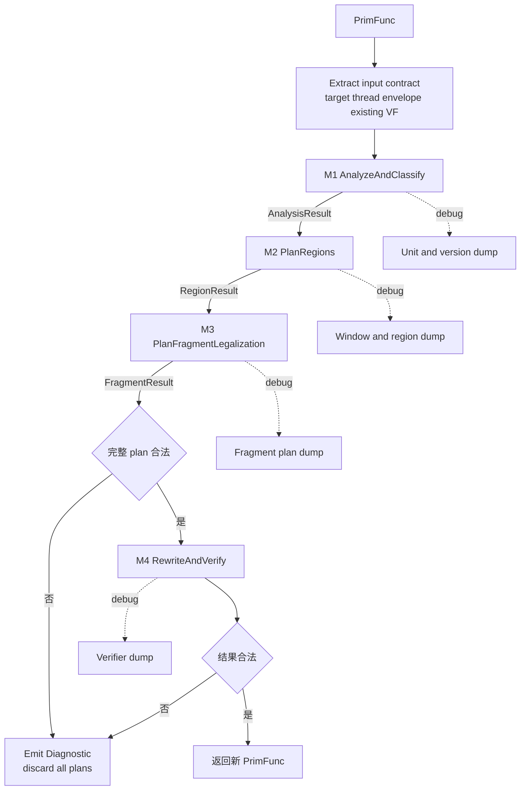
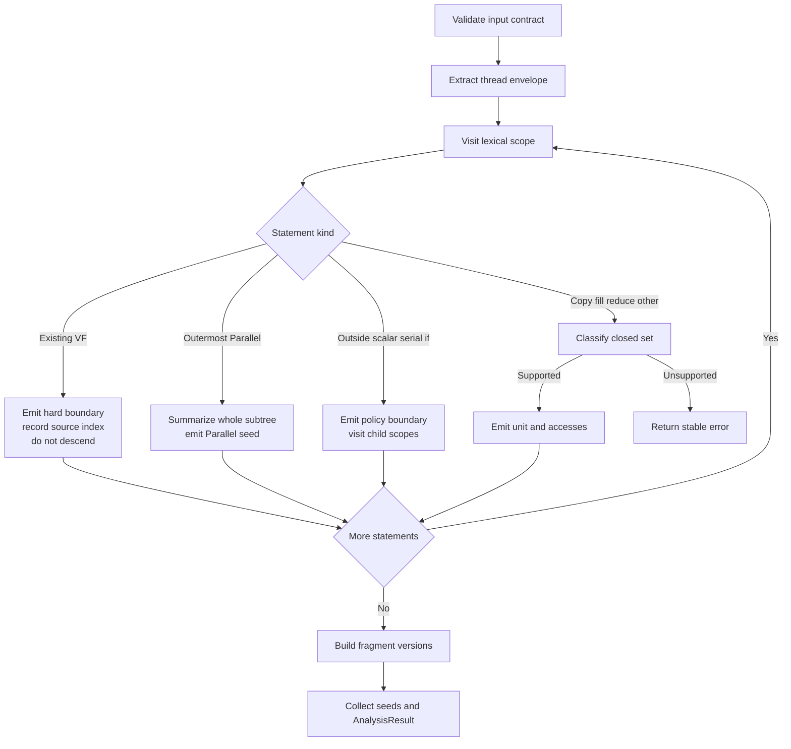
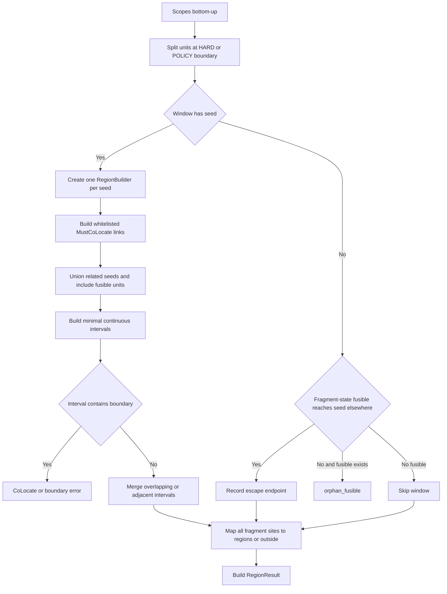
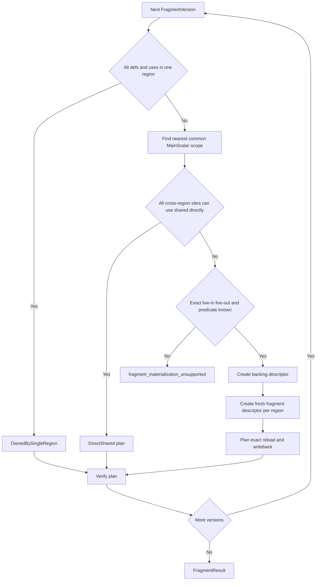
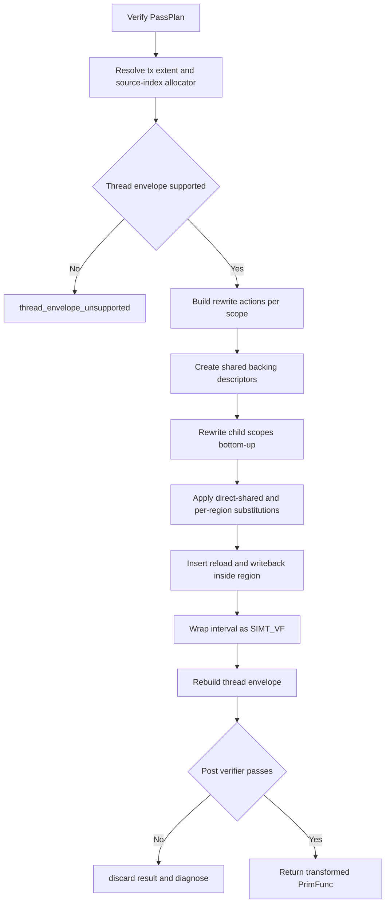

# AutoSimtVF Pass Stage1 详细设计

> 功能基线：[AutoSimtVF_pass_design_lite.md](/home/dangy/workspace/Private-ascend/mhc_stage1/docs/AutoSimtVF_pass_design_lite.md)  
> 参考文件状态：本地 [SimdVF_Codegen_Design.md](/home/dangy/workspace/Private-ascend/mhc_stage1/docs/SimdVF_Codegen_Design.md) 当前是 GitHub `Page not found` 的 HTML 保存页，不含 SimdVF Codegen 设计正文，因此本文不能引用其中的技术内容。后续若补齐真实文件，可再对齐其排版和代码风格。  
> 本文只给出实现设计与接近 C++ 的代码骨架，不修改代码仓。未从现有信息确认的 TIR 构造、TileOp 识别、Pass 注册及诊断接口均标为【待确认】。

## 1. 设计目标

AutoSimtVF 位于 Ascend TIR pipeline 的 `VerifyBufferInit` 与 `UnrollLoopSkipVF` 之间。它把满足 Stage1 规则的 Parallel 计算和相关 fragment 数据链组织成合法 `SIMT_VF`，同时保持 MTE/CV、Cube、同步以及外层 scalar control 在 VF 外。

Stage1 的目标不是寻找性能最优划分，而是输出唯一、可验证、可 debug 的合法划分：

1. 每个受支持的最外层 Parallel 子树恰好进入一个 VF；
2. region 是同一 lexical scope 内的连续 statement interval；
3. 每个 fragment version 只有一个 VF owner，或已通过 shared backing 显式传递；
4. 已有 VF 保持 opaque，不生成 nested VF；
5. 任一阶段失败均不提交部分 IR；
6. 相同输入产生相同 region、source index 和诊断。

Stage1 不实现 cost model、SIMD、scalar profitability、loop interchange/fold、通用调度 DAG、跨 Cube/Gemm 融合、Parallel scalarization 或任意 partial/dynamic fragment 证明。

## 2. Pipeline 与 IR 契约

### 2.1 Pipeline 位置


输入阶段仍保留 Parallel、serial 以及 TileLang copy/fill/reduce，适合做 statement 级分类；输出 VF 又能成为后续 unroll 和 layout 的明确 scope。

### 2.2 输入契约

输入是一个 Ascend `PrimFunc`，预期满足：

- kernel frame 已物化；
- `blockIdx.x/y/z` 和 `threadIdx.x/y/z` 已能从 TIR 中识别；
- copy 仍表现为通用 TileLang copy，没有可复用的 MTE/CV 注解；
- buffer scope 至少可归一化为 GM、UB/shared、fragment、L1/L0/NZ；
- 已有 `SIMT_VF`/`SIMD_VF` 可能与待转换 statement 并存；
- 不支持的 CUDA/PTX intrinsic 或无法识别的 thread envelope 必须诊断。

### 2.3 输出契约

输出 `PrimFunc` 必须满足：

- 没有 VF 外的受支持 Parallel；
- 没有 nested VF；
- `SIMT_VF` 内含合法 `threadIdx.x/y/z`、`tl.simtvf_scope`、唯一 `tl.vf_source_index`；
- hard boundary 不在自动生成 VF 内；
- fragment allocation 只归属一个 VF；跨 VF/scope 值经 shared backing 传递；
- statement 顺序、serial/if nesting、predicate、dtype、shape 和有效 `BufferRegion` 不变；
- 失败时原 `PrimFunc` 保持 structural equal。

### 2.4 Thread envelope 特别约束

轻量设计已确认 thread 数继承输入顶层 `threadIdx.x` extent，缺失时回退 128。但尚未给出“输入 thread binding 是全函数 wrapper 还是 metadata-like envelope”的精确 AST 形态。

因此实现必须先抽象出 `ThreadBindingPlan`，并遵守以下不变量：

1. 只读取输入 x extent，不重新推导 blockDim；
2. 输出不能同时保留全局 `threadIdx.x` wrapper 又在每个 VF 内重复绑定同一 thread var；
3. 已有 VF 内的 thread binding 不移动；
4. 无法识别 envelope 时返回 `thread_envelope_unsupported`，不能猜测性改写。

具体 peel/rehome 规则为【待确认】，需要用真实 13 IR 补一个结构 golden 后锁定。

## 3. 总体架构

### 3.1 单一外部 interface

AutoSimtVF 是一个 deep module。pipeline 只依赖一个 Pass interface，内部分析对象不进入公共 header：

```text
AutoSimtVFPass(PrimFunc) -> transformed PrimFunc
                            or compiler Diagnostic
```

TVM PrimFunc pass 的真实返回类型通常不直接表达 sum type；本文中的 `StepResult<T>` 是私有控制流。Pass 入口在失败时通过现有诊断机制终止当前 PrimFunc 编译，其具体接口为【待确认】。

### 3.2 内部 workflow



### 3.3 建议代码组织

Stage1 首版建议集中在一个 C++ implementation 文件中，避免过早拆分浅模块：

```text
src/ascend/transform/
  auto_simtvf.cc              # Pass 入口、私有数据结构、M1-M4 实现

tests/...
  auto_simtvf_test.*          # 精确目录与测试框架【待确认】
```

如果 Pass factory 必须声明在公共 header，只公开 factory；所有 planner、plan 和 helper 留在 implementation 的匿名 namespace。具体文件名、namespace 和注册宏以 `pass注册指南.md` 为准，本文不虚构。

### 3.4 顶层实现骨架

```cpp
// 说明：以下类型/函数均为建议的 Pass 私有实现。
// TVM/TileLang 的具体 include、namespace、Diagnostic 接口需在落代码时对齐。
template <typename T>
struct StepResult;  // 定义见 4.2。
struct AnalysisResult;
struct RegionResult;
struct FragmentResult;
struct PassPlan;

class AutoSimtVFPlanner {
 public:
  explicit AutoSimtVFPlanner(const PrimFunc& func) : original_(func) {}
  StepResult<PrimFunc> TryRun();

 private:
  PrimFunc original_;

  StepResult<AnalysisResult> AnalyzeAndClassify();
  StepResult<RegionResult> PlanRegions(const AnalysisResult& analysis);
  StepResult<FragmentResult> PlanFragmentLegalization(
      const AnalysisResult& analysis, const RegionResult& regions);
  StepResult<PrimFunc> RewriteAndVerify(
      const AnalysisResult& analysis, const PassPlan& plan);

};
```

## 4. Pass 私有数据模型

### 4.1 基础枚举

```cpp
enum class UnitRole {
  kSimtSeed,
  kSimtFusible,
  kRegionBoundary,
  kUnsupported,
};

enum class BoundaryKind {
  kNone,
  kHard,
  kStage1Policy,
};

enum class CopyClass {
  kNone,
  kFragmentDataflow,
  kSimtCast,
  kEngineBoundary,
  kUnsupported,
};

enum class SeedKind {
  kParallelSubtree,
  kFillOrClear,
  kSimtCast,
};

enum class FragmentPlanKind {
  kOwnedBySingleRegion,
  kDirectShared,
  kPerRegionFragment,
};

enum class AccessKind {
  kRead,
  kWrite,
  kReadWrite,
};
```

### 4.2 ID 与错误对象

所有 ID 均按 PrimFunc 的确定性 lexical walk 分配，不使用对象地址作为 dump 或测试断言。

```cpp
using NodeId = int64_t;
using ScopeId = int64_t;
using SeedId = int64_t;
using RegionId = int64_t;
using FragmentVersionId = int64_t;

enum class ErrorCode {
  kInputContractViolation,
  kThreadEnvelopeUnsupported,
  kCopyUnsupported,
  kReduceUnsupported,
  kUnsupportedInsideParallel,
  kOrphanFusible,
  kRegionCrossesBoundary,
  kCoLocateConflict,
  kFragmentMaterializationUnsupported,
  kPlanInvariantBroken,
  kRewriteInvariantBroken,
};

struct AutoSimtVFError {
  ErrorCode code;
  Span location;
  NodeId node_id{-1};
  ScopeId scope_id{-1};
  std::string detail;       // 只写确定事实，例如具体 scope-pair。
  std::string suggestion;   // 可选；不能暗示存在未实现的 scalar fallback。
};

template <typename T>
struct StepResult {
  std::optional<T> result;
  std::optional<AutoSimtVFError> failure;

  bool ok() const { return result.has_value(); }
  const T& value() const { return *result; }
  T& value() { return *result; }
  const T& get() const { return value(); }
  T TakeValue() { return std::move(*result); }
  const AutoSimtVFError& error() const { return *failure; }
};

template <>
struct StepResult<void> {
  std::optional<AutoSimtVFError> failure;

  bool ok() const { return !failure.has_value(); }
  const AutoSimtVFError& error() const { return *failure; }
};
```

`ValueResult`、`ErrorResult`、`VoidSuccess`、`VoidError` 是上述私有 result 的概念构造 helper。落代码时优先替换为仓内已有 result/diagnostic 惯例，不要为它新增公共依赖。

### 4.3 分析对象

```cpp
struct BufferAccessInfo {
  Buffer buffer;
  BufferRegion region;
  AccessKind kind;
  PrimExpr predicate;  // 无 predicate 时保存 true。
};

struct UnitInfo {
  NodeId id;
  ScopeId scope_id;
  int lexical_index;          // 当前直接父 scope 内的位置。
  Stmt stmt;                  // Parallel unit 保存完整子树。
  UnitRole role;
  BoundaryKind boundary;
  CopyClass copy_class{CopyClass::kNone};
  std::optional<SeedKind> seed_kind;
  std::vector<BufferAccessInfo> accesses;
  Span location;
};

enum class ScopeOwnerSlot {
  kRoot,
  kLoopBody,
  kThenBranch,
  kElseBranch,
};

struct LexicalScopeInfo {
  ScopeId id;
  std::optional<ScopeId> parent_id;
  Stmt owner;                  // root logical body，或持有该 child 的 parent control statement。
  ScopeOwnerSlot owner_slot;   // 区分同一 If owner 的 then/else child。
  std::vector<NodeId> units;   // 严格 lexical order。
};

struct BufferDeclInfo {
  Buffer buffer;
  ScopeId declaration_scope;
  bool is_fragment;
  Span location;
};

struct FragmentAccessSite {
  NodeId unit_id;
  ScopeId scope_id;
  BufferRegion region;
  AccessKind kind;
  PrimExpr predicate;
};

struct FragmentVersion {
  FragmentVersionId id;
  Buffer original_buffer;
  std::vector<FragmentAccessSite> defs;
  std::vector<FragmentAccessSite> uses;
  bool has_loop_carried_state{false};
};

struct SeedInfo {
  SeedId id;
  NodeId unit_id;
  ScopeId scope_id;
  SeedKind kind;
};
```

IO 中的 `T.sblock_alloc_buffer` 属于 block 的 allocation metadata，不一定是独立 `Stmt`。因此实现不应强行把所有 fragment allocation 伪装成可包裹的 lexical unit；用 `BufferDeclInfo` 单独记录声明位置，再由 owner 分析决定 allocation 最终归属。

### 4.4 Plan 对象

```cpp
struct RegionPlan {
  RegionId id;
  ScopeId scope_id;
  int begin_index;
  int end_index;                    // 闭区间，禁止带洞。
  std::vector<SeedId> seeds;
  std::vector<NodeId> members;
  // M2 证明闭合在本 region 的 version 候选；最终 allocation owner 以 M3 plan 为准。
  std::vector<FragmentVersionId> owned_fragments;
};

enum class SiteKind { kOutsideRegion, kRegion };

struct FragmentSite {
  SiteKind kind;
  NodeId unit_id;
  std::optional<RegionId> region_id;
};

struct FragmentEscape {
  FragmentVersionId version_id;
  // RMW/reduce 链可能有多个定义点，不把 producer 错简化为单值。
  std::vector<FragmentSite> producers;
  std::vector<FragmentSite> consumers;
  BufferRegion live_region;
};

enum class TransferDirection { kSharedToFragment, kFragmentToShared };

struct TransferPlan {
  RegionId region_id;
  TransferDirection direction;
  BufferRegion region;
  PrimExpr predicate;
};

struct FragmentPlan {
  FragmentVersionId version_id;
  FragmentPlanKind kind;
  std::optional<RegionId> owner_region;  // 仅 kOwnedBySingleRegion 使用。
  std::optional<ScopeId> backing_scope;
  std::optional<Buffer> shared_backing;
  std::unordered_map<RegionId, Buffer> local_fragments;
  std::vector<TransferPlan> transfers;
  std::vector<NodeId> direct_shared_rewrite_units;
};

struct ThreadBindingPlan {
  PrimExpr tx_extent;
  PrimExpr ty_extent;
  PrimExpr tz_extent;
  std::vector<Stmt> original_thread_wrappers;
  bool requires_rehome{false};      // 精确判定规则【待确认】。
};

struct AnalysisResult {
  Stmt logical_body;
  ScopeId root_scope_id;
  std::vector<LexicalScopeInfo> scopes;
  std::vector<UnitInfo> units;
  std::vector<BufferDeclInfo> buffer_decls;
  std::vector<FragmentVersion> fragment_versions;
  std::vector<SeedInfo> seeds;
  ThreadBindingPlan thread_plan;
  std::unordered_set<int64_t> occupied_vf_source_indices;
};

struct RegionResult {
  std::vector<RegionPlan> regions;
  std::vector<FragmentEscape> escapes;
};

struct FragmentResult {
  std::vector<FragmentPlan> plans;
};

struct PassPlan {
  std::vector<RegionPlan> regions;
  std::vector<FragmentPlan> fragment_plans;
  ThreadBindingPlan thread_plan;
};
```

### 4.5 Planner 串联实现

`TryRun` 在所有数据类型完整定义后实现，避免 C++ 中在 incomplete type 上实例化局部对象：

```cpp
StepResult<PrimFunc> AutoSimtVFPlanner::TryRun() {
  // 所有步骤先生成只读 plan；任何一步失败都不会改写 original_。
  auto analysis = AnalyzeAndClassify();
  if (!analysis.ok()) return ErrorResult(analysis.error());

  auto regions = PlanRegions(analysis.value());
  if (!regions.ok()) return ErrorResult(regions.error());

  auto fragments = PlanFragmentLegalization(analysis.value(), regions.value());
  if (!fragments.ok()) return ErrorResult(fragments.error());

  PassPlan plan{/*regions=*/regions.value().regions,
                /*fragment_plans=*/fragments.value().plans,
                /*thread_plan=*/analysis.value().thread_plan};

  auto result = RewriteAndVerify(analysis.value(), plan);
  if (!result.ok()) return ErrorResult(result.error());
  return result;
}
```

## 5. M1：分析与分类模块

### 5.1 职责与设计逻辑

M1 在一次受控的 lexical traversal 中完成四件事：

1. 校验 target、kernel frame、thread envelope 和已有 VF；
2. 建立 lexical scope tree 与稳定 NodeId；
3. 把每个 statement unit 分类为 seed、fusible、boundary 或 unsupported；
4. 收集 buffer access、fragment declaration 和 fragment version。

分类只在 M1 做一次。M2-M4 不再通过 AST 类型重新猜测 statement role，只消费 `UnitInfo`。

输入：原始 `PrimFunc`。输出：完整 `AnalysisResult`，或带位置的首个输入/分类诊断。

### 5.2 模块流程



### 5.3 Statement unit 收集

`SeqStmt` 的直接 child 是 region interval 的索引空间。serial/pipelined/if 的控制节点属于父 scope 的 policy boundary，它们的 body/branch 建独立 child scope。最外层 Parallel 命中后整棵子树作为一个 unit，不再把内部 serial/scalar/Parallel 单独加入父 scope。

```cpp
StepResult<std::vector<NodeId>> VisitScope(
    const Stmt& scope_body, ScopeId scope_id, AnalysisBuilder* out) {
  std::vector<NodeId> unit_ids;
  // alloc_buffers/sblock_alloc_buffer 是 scope metadata，先单独记录。
  out->RecordAllocationMetadata(scope_body, scope_id);
  const std::vector<Stmt> children = FlattenDirectSeqChildren(scope_body);

  for (int index = 0; index < static_cast<int>(children.size()); ++index) {
    const Stmt& stmt = children[index];

    if (IsExistingVF(stmt)) {
      // 已有 VF 是 opaque hard boundary：记录但绝不进入内部，保证幂等。
      UnitInfo unit = MakeBoundaryUnit(stmt, scope_id, index, BoundaryKind::kHard);
      RecordExistingVFSourceIndex(stmt, out);
      unit_ids.push_back(out->AddUnit(std::move(unit)));
      continue;
    }

    if (IsOutermostParallel(stmt)) {
      auto summary = SummarizeParallelSubtree(stmt);
      if (!summary.ok()) return ErrorResult(summary.error());

      // 整棵 Parallel 子树不可拆。内部 hard effect 不能通过移动语句规避。
      UnitInfo unit = MakeUnit(stmt, scope_id, index, UnitRole::kSimtSeed);
      unit.seed_kind = SeedKind::kParallelSubtree;
      unit.accesses = summary.get().accesses;
      unit_ids.push_back(out->AddUnit(std::move(unit)));
      continue;
    }

    if (IsSerialOrPipelinedLoop(stmt) || IsIfThenElse(stmt)) {
      // 控制节点留在 MainScalar；每个 body/branch 单独建立 child lexical scope。
      unit_ids.push_back(out->AddUnit(
          MakeBoundaryUnit(stmt, scope_id, index, BoundaryKind::kStage1Policy)));
      for (const Stmt& child : GetControlChildBodies(stmt)) {
        ScopeId child_id = out->AddScope(
            /*parent=*/scope_id,
            /*owner=*/stmt,
            /*owner_slot=*/GetControlChildSlot(stmt, child));
        auto child_result = VisitScope(child, child_id, out);
        if (!child_result.ok()) return child_result;
        out->SetScopeUnits(child_id, child_result.TakeValue());
      }
      continue;
    }

    if (IsPlainOutsideScalarLeaf(stmt)) {
      // 只匹配已证明无特殊 memory effect 的 scalar leaf。
      unit_ids.push_back(out->AddUnit(
          MakeBoundaryUnit(stmt, scope_id, index, BoundaryKind::kStage1Policy)));
      continue;
    }

    auto classified = ClassifyLeafUnit(stmt, scope_id, index);
    if (!classified.ok()) return ErrorResult(classified.error());
    unit_ids.push_back(out->AddUnit(classified.get()));
  }
  return ValueResult(unit_ids);
}
```

`IsPlainOutsideScalarLeaf` 必须排除 TileCopy/fill/reduce、engine/sync、dtype-changing direct store 和任何未知 memory effect；后者必须进入 `ClassifyLeafUnit` 并分类或诊断，不能藏在 scalar boundary 里。`IsExistingVF`、`GetControlChildBodies` 及各 TileOp AST predicate 的具体实现为【待确认】，但必须集中在 M1 私有 helper 中，不能散落到 planner 和 rewriter。

### 5.4 Copy 分类实现

Copy 分类严格按优先级首个命中返回，默认是 unsupported，不存在“其它 copy 先放进 VF 再试”的开放分支。

```cpp
bool IsDedicatedEnginePair(MemoryScope src, MemoryScope dst) {
  // 严格闭集：不用“等等”扩张方向。GM<->UB 由后续 dtype 分支单独处理。
  return IsGmToL1(src, dst) ||
         IsL1ToL0AOrL0B(src, dst) ||
         IsL0CToUbOrGm(src, dst) ||
         IsUbToL1OrNz(src, dst);
}

StepResult<CopyClassification> ClassifyCopy(const CopyInfo& copy) {
  const MemoryScope src = NormalizeScope(copy.src_buffer);
  const MemoryScope dst = NormalizeScope(copy.dst_buffer);

  // 1. 专用 L1/L0/NZ 路径优先。它们不能被普通 fragment 规则抢先命中。
  if (IsDedicatedEnginePair(src, dst)) {
    if (!CanConservativelyLowerEngineCopy(copy)) {
      return CopyError(ErrorCode::kCopyUnsupported, copy,
                       "dedicated engine copy is not statically representable");
    }
    return CopyValue(CopyClass::kEngineBoundary,
                     UnitRole::kRegionBoundary,
                     BoundaryKind::kHard);
  }

  // 2. 普通 fragment<->UB/GM 跟随 fragment version 和相关 seed。
  if (HasOrdinaryFragmentEndpoint(src, dst)) {
    if (!HasSupportedRegionAndPredicate(copy)) {
      return CopyError(ErrorCode::kCopyUnsupported, copy,
                       "fragment copy has unsupported region or predicate");
    }
    return CopyValue(CopyClass::kFragmentDataflow,
                     UnitRole::kSimtFusible,
                     BoundaryKind::kNone);
  }

  // 3. UB<->GM 的 dtype conversion 不能按普通 DMA 处理，自身成为 SIMT seed。
  if (IsUbGmPair(src, dst) && copy.src_dtype != copy.dst_dtype) {
    return CopyValue(CopyClass::kSimtCast,
                     UnitRole::kSimtSeed,
                     BoundaryKind::kNone,
                     SeedKind::kSimtCast);
  }

  // 4. 同 dtype GM<->UB 仅在静态完整 lowering 条件满足时作为 hard boundary。
  if (IsUbGmPair(src, dst) && copy.src_dtype == copy.dst_dtype &&
      CanConservativelyLowerEngineCopy(copy)) {
    return CopyValue(CopyClass::kEngineBoundary,
                     UnitRole::kRegionBoundary,
                     BoundaryKind::kHard);
  }

  return CopyError(ErrorCode::kCopyUnsupported, copy,
                   "copy scope-pair is outside the Stage1 closed set");
}
```

`CanConservativelyLowerEngineCopy` 是本 Pass 的保守判定，不代表下游真正 MTE/CV 选择。13 IR 尚无 engine annotation，因此它至少检查：

- scope-pair 在闭集中；
- dtype 满足对应路径；
- region shape 和 stride 可静态解释；
- predicate 缺失或能证明为全幅静态 predicate；
- Stage1 不支持的 partial/dynamic 情形返回 false。

### 5.5 Fill、reduce 与其它 statement

```cpp
StepResult<UnitInfo> ClassifyLeafUnit(
    const Stmt& stmt, ScopeId scope_id, int index) {
  if (auto copy = MatchTileCopy(stmt)) {
    auto classification = ClassifyCopy(*copy);
    if (!classification.ok()) return ErrorResult(classification.error());
    return BuildCopyUnit(stmt, scope_id, index, classification.get());
  }

  if (auto cast_store = MatchDtypeChangingUbGmDirectStore(stmt)) {
    // 等价 direct store 与 dtype-changing T.copy 使用同一 seed 语义。
    return UnitValue(MakeSeedUnit(
        stmt, scope_id, index, SeedKind::kSimtCast));
  }

  if (auto fill = MatchTileFillOrClear(stmt)) {
    if (IsL1ZeroFill(*fill)) {
      return UnitValue(MakeBoundaryUnit(
          stmt, scope_id, index, BoundaryKind::kHard));
    }
    if (!IsSupportedFill(*fill)) {
      return UnitError(stmt, ErrorCode::kInputContractViolation,
                       "unsupported fill/clear scope or predicate");
    }
    return UnitValue(MakeSeedUnit(
        stmt, scope_id, index, SeedKind::kFillOrClear));
  }

  if (auto reduce = MatchTileReduce(stmt)) {
    if (!IsFloat32SumOrMaxWithStaticAxis(*reduce) ||
        !HasStaticallyResolvableRegion(*reduce)) {
      return UnitError(stmt, ErrorCode::kReduceUnsupported,
                       "reduce is outside the Stage1 whitelist");
    }
    return UnitValue(MakeFusibleUnit(stmt, scope_id, index));
  }

  if (IsGemmCubeEngineSyncOrL1Special(stmt)) {
    return UnitValue(MakeBoundaryUnit(
        stmt, scope_id, index, BoundaryKind::kHard));
  }

  return UnitError(stmt, ErrorCode::kInputContractViolation,
                   "statement kind is outside the Stage1 closed set");
}
```

Parallel 子树内部允许普通 scalar、inner serial/if/Parallel、受支持 fill/copy/reduce 和已知 SIMT-local barrier。若匹配 hard boundary 或 unsupported effect，`SummarizeParallelSubtree` 返回 `kUnsupportedInsideParallel`。

### 5.6 Read/write 与 fragment version

优先复用轻量设计列出的 `GetSBlockReadWriteRegion`、`MemoryAccessDetector` 和 region-conflict 能力；具体 interface 未确认时，可用一个最小 visitor 收集 `BufferLoad`、`BufferStore` 和已识别 TileOp 的显式 region。不要在 Stage1 自研通用 alias engine。

```cpp
StepResult<std::vector<FragmentVersion>> BuildFragmentVersions(
    const AnalysisBuilder& analysis) {
  std::vector<FragmentVersion> versions;

  for (const BufferDeclInfo& decl : analysis.buffer_decls()) {
    if (!decl.is_fragment) continue;

    auto accesses = CollectAccessesInLexicalTreeOrder(decl.buffer, analysis);
    if (!accesses.ok()) return ErrorResult(accesses.error());
    FragmentVersion current = NewVersion(decl.buffer);

    for (const FragmentAccessSite& access : accesses.get()) {
      if (IsUnsupportedPartialOrDynamicAccess(access)) {
        return VersionError(access, "fragment access cannot be proven exact");
      }

      // full write-only definition 开启新版本；read-modify-write 仍属于当前版本。
      if (IsFullWriteOnlyDefinition(access) && !current.defs.empty()) {
        versions.push_back(std::move(current));
        current = NewVersion(decl.buffer);
      }

      if (Reads(access.kind)) current.uses.push_back(access);
      if (Writes(access.kind)) current.defs.push_back(access);
      if (IsLoopCarriedReadWrite(access, analysis)) {
        current.has_loop_carried_state = true;
      }
    }
    versions.push_back(std::move(current));
  }
  return ValueResult(versions);
}
```

这里的“lexical tree order”不能简单把不同 if branch 或 loop body 扁平为全序。`CollectAccessesInLexicalTreeOrder` 必须保留 scope id、parent scope 和 control owner；对无法证明先后关系的分支定义直接返回 unsupported，不伪造全序。

### 5.7 M1 总入口

```cpp
StepResult<ThreadBindingPlan> ExtractThreadBindingPlan(const PrimFunc& func) {
  ThreadBindingPlan plan;
  auto envelope = MatchKernelThreadEnvelope(func->body);  // 【待确认】

  if (!envelope.has_value()) {
    plan.tx_extent = IntImm(DataType::Int(32), 128);
    plan.ty_extent = IntImm(DataType::Int(32), 1);
    plan.tz_extent = IntImm(DataType::Int(32), 1);
    return ValueResult(plan);
  }

  if (!IsSupportedThreadEnvelope(*envelope)) {
    return ThreadError(ErrorCode::kThreadEnvelopeUnsupported,
                       "unexpected thread binding topology");
  }

  plan.tx_extent = envelope->tx_extent;
  plan.ty_extent = 1;  // Stage1 VF 只使用一维有效 extent。
  plan.tz_extent = 1;
  plan.original_thread_wrappers = envelope->thread_wrappers;
  plan.requires_rehome = envelope->requires_rehome;
  return ValueResult(plan);
}

StepResult<AnalysisResult> AutoSimtVFPlanner::AnalyzeAndClassify() {
  auto input_ok = ValidateAscendInputContract(original_);
  if (!input_ok.ok()) return ErrorResult(input_ok.error());

  auto thread_plan = ExtractThreadBindingPlan(original_);
  if (!thread_plan.ok()) return ErrorResult(thread_plan.error());

  // logical_body 只在确认需要 rehome 时剔除全局 thread wrapper；
  // blockIdx 和 kernel frame 不属于 region 规划对象。
  auto logical_body = ExtractLogicalBody(
      original_->body, thread_plan.get());  // 精确 topology【待确认】
  if (!logical_body.ok()) return ErrorResult(logical_body.error());

  AnalysisBuilder builder;
  ScopeId root = builder.AddRootScope(logical_body.get());
  auto root_units = VisitScope(logical_body.get(), root, &builder);
  if (!root_units.ok()) return ErrorResult(root_units.error());
  builder.SetScopeUnits(root, root_units.TakeValue());

  auto versions = BuildFragmentVersions(builder);
  if (!versions.ok()) return ErrorResult(versions.error());

  AnalysisResult result = builder.Finish(
      /*logical_body=*/logical_body.get(),
      /*root_scope_id=*/root,
      /*fragment_versions=*/versions.TakeValue(),
      /*thread_plan=*/thread_plan.TakeValue());
  auto verified = VerifyAnalysisResult(result);
  if (!verified.ok()) return ErrorResult(verified.error());
  DumpAnalysisIfEnabled(result);
  return ValueResult(std::move(result));
}
```

`AnalysisBuilder::Finish` 按 unit 的 `seed_kind` 生成 `SeedInfo`，并按 lexical walk 结果建立 ID 索引；不再做第二轮分类。

### 5.8 M1 输出验证与 debug

M1 返回前检查：

- 每个 executable unit 恰有一个 role；
- 每个 seed 有唯一 unit；
- existing VF 未被下降遍历；
- NodeId、ScopeId、lexical index 稳定且无重复；
- fragment access 均能关联到 declaration；
- thread extent 为静态正整数，或走缺失回退路径。

建议 debug dump：

```text
[AutoSimtVF][M1][Scope 2 parent=1]
  U7 idx=0 role=BOUNDARY(HARD) copy=ENGINE GM->UB reads=[b] writes=[b_ub]
  U8 idx=1 role=SEED(PARALLEL) reads=[b_ub,c] writes=[frag_x]
  U9 idx=2 role=FUSIBLE copy=FRAGMENT frag_x->UB
[AutoSimtVF][M1][FragmentVersion 3 buffer=frag_x]
  defs=[U8] uses=[U9] loop_carried=false
```

实际日志宏和 dump 开关接入仓内已有机制【待确认】，不新增独立命令行配置。

## 6. M2：Region 规划模块

### 6.1 职责与设计逻辑

M2 只决定 partition，不改写 IR：

1. 每个 lexical scope 按 hard/policy boundary 切成 window；
2. 每个 seed 在所在 window 内创建初始 region；
3. 只沿白名单 MustCoLocate 关系吸收 fusible unit；
4. 每个 region 扩为包含成员的最小连续 interval；
5. 同 window 中重叠或相邻 region 无条件合并；
6. 跨 region/scope 的 fragment version 记录为 `FragmentEscape`。

Stage1 的策略是“合法即融合”，没有候选枚举和 cost model。M2 输出后 partition 固定，M3 不得反向修改。

输入：`AnalysisResult`。输出：互不重叠的 `RegionPlan[]` 与跨区 `FragmentEscape[]`，或共址/边界/孤立单元诊断。

### 6.2 模块流程



### 6.3 Window 表示

```cpp
struct Window {
  ScopeId scope_id;
  int begin_index;
  int end_index;
  std::vector<NodeId> units;  // 不包含两侧 boundary。
};

std::vector<Window> SplitAtBoundaries(
    const LexicalScopeInfo& scope,
    const std::unordered_map<NodeId, UnitInfo>& unit_map) {
  std::vector<Window> windows;
  Window current{/*scope_id=*/scope.id};

  auto flush = [&]() {
    if (!current.units.empty()) {
      current.begin_index = unit_map.at(current.units.front()).lexical_index;
      current.end_index = unit_map.at(current.units.back()).lexical_index;
      windows.push_back(std::move(current));
      current = Window{/*scope_id=*/scope.id};
    }
  };

  for (NodeId id : scope.units) {
    const UnitInfo& unit = unit_map.at(id);
    if (unit.role == UnitRole::kRegionBoundary) {
      // policy boundary 在 Stage1 同样切 window；Stage2 才能重选。
      flush();
      continue;
    }
    current.units.push_back(id);
  }
  flush();
  return windows;
}
```

`UNSUPPORTED` 不应进入 M2；若出现说明 M1 后置验证失效，返回 `kPlanInvariantBroken`。

### 6.4 MustCoLocate 关系

MustCoLocate 不是普通 dependency 的别名，仅为以下情况建立：

- `FRAGMENT_DATAFLOW` copy 与同 window 内读写同一 version 的 seed；
- fill/clear seed 与其初始化 fragment 的后续 seed；
- 白名单 reduce 与读取其结果或更新同一 reduce state 的 seed；
- Parallel subtree 内部的 lane-private scalar 已包含在 seed unit 内，无需额外 edge。

```cpp
struct CoLocateLink {
  SeedId seed_id;
  // member 通常是 fusible unit；fill/clear 连接两个 seed 时也可是 seed unit。
  NodeId member_unit_id;
  std::optional<FragmentVersionId> version_id;
};

StepResult<std::vector<CoLocateLink>> BuildMustCoLocateLinks(
    const Window& window,
    const AnalysisResult& analysis) {
  std::vector<CoLocateLink> links;

  for (NodeId unit_id : window.units) {
    const UnitInfo& unit = GetUnit(analysis, unit_id);
    std::vector<SeedId> related;

    if (unit.role == UnitRole::kSimtFusible) {
      if (unit.copy_class == CopyClass::kFragmentDataflow ||
          UnitTouchesFragmentState(unit)) {
        AppendUnique(&related,
            SeedsTouchingSameFragmentVersion(unit, window, analysis));
      }
      // reduce 可能同时读写 fragment，因此不能写成 else-if。
      if (IsWhitelistedReduceUnit(unit)) {
        AppendUnique(&related,
            SeedsConsumingReduceState(unit, window, analysis));
      }
    } else if (unit.role == UnitRole::kSimtSeed &&
               IsStateInitializingFillSeed(unit)) {
      // fill 自身已是 seed；把它与同 version 的消费 seed 连成一组。
      related.push_back(SeedForUnit(unit.id, analysis));
      AppendUnique(&related,
          SeedsTouchingSameFragmentVersion(unit, window, analysis));
    } else {
      continue;
    }

    if (related.empty()) {
      // 这里先不报错。Case 03 的 producer 可能连到 child scope seed，
      // 由 RecordExternalFusibleOrReject/escape 分析判断是否为合法 endpoint。
      continue;
    }

    for (SeedId seed_id : related) {
      links.push_back(CoLocateLink{seed_id, unit_id,
                                  FragmentVersionFor(unit, analysis)});
    }
  }
  return ValueResult(links);
}
```

普通 producer/consumer 不自动产生共址，否则 MTE producer、scalar control 或其它合法 boundary 会被依赖闭包错误吸入 VF。

### 6.5 RegionBuilder 与 group 合并

Stage1 可以使用一个极小的 seed 并查集，或直接合并 `RegionBuilder`。它只是 M2 私有实现，不应演化成公共 fusion graph。

```cpp
struct RegionBuilder {
  ScopeId scope_id;
  std::unordered_set<SeedId> seeds;
  std::unordered_set<NodeId> explicit_members;
  int begin_index;
  int end_index;
};

StepResult<void> RecordExternalFusibleOrReject(
    const Window& window,
    const std::vector<RegionPlan>& local_regions,
    const AnalysisResult& analysis,
    std::vector<NodeId>* escape_endpoints);

std::vector<RegionPlan> MergeOverlappingOrAdjacent(
    std::vector<RegionPlan> regions);

StepResult<std::vector<RegionPlan>> PlanOneWindow(
    const Window& window,
    const AnalysisResult& analysis,
    std::vector<NodeId>* escape_endpoints) {
  const std::vector<SeedId> seeds = SeedsInside(window, analysis);

  if (seeds.empty()) {
    std::vector<RegionPlan> no_regions;
    auto assigned = RecordExternalFusibleOrReject(
        window, no_regions, analysis, escape_endpoints);
    if (!assigned.ok()) return ErrorResult(assigned.error());
    return ValueResult(std::move(no_regions));
  }

  SeedDisjointSet groups(seeds);  // 私有轻量 helper。
  const auto links = BuildMustCoLocateLinks(window, analysis);
  if (!links.ok()) return ErrorResult(links.error());

  // 同一 fusible unit 连到多个 seed 时，这些 seed 必须位于同一 region。
  for (const auto& [member, linked_seeds] : GroupLinksByMember(links.get())) {
    for (size_t i = 1; i < linked_seeds.size(); ++i) {
      groups.Union(linked_seeds[0], linked_seeds[i]);
    }
  }

  std::vector<RegionBuilder> builders = MakeBuilders(groups, seeds, analysis);
  for (const CoLocateLink& link : links.get()) {
    RegionBuilder& builder = BuilderForSeed(builders, groups.Find(link.seed_id));
    builder.explicit_members.insert(link.member_unit_id);
  }

  std::vector<RegionPlan> plans;
  for (RegionBuilder& builder : builders) {
    IncludeSeedUnitsAndComputeConvexInterval(&builder, analysis);
    auto checked = ValidateAndFillInterval(builder, window, analysis);
    if (!checked.ok()) return ErrorResult(checked.error());
    plans.push_back(ToRegionPlan(builder, analysis));
  }
  plans = MergeOverlappingOrAdjacent(std::move(plans));
  auto assigned = RecordExternalFusibleOrReject(
      window, plans, analysis, escape_endpoints);
  if (!assigned.ok()) return ErrorResult(assigned.error());
  return ValueResult(std::move(plans));
}
```

`RecordExternalFusibleOrReject` 不只在 seedless window 运行。有本地 seed 的 window 也可能存在与它无关、但连向 child/sibling scope seed 的 fragment producer：

```cpp
StepResult<void> RecordExternalFusibleOrReject(
    const Window& window,
    const std::vector<RegionPlan>& local_regions,
    const AnalysisResult& analysis,
    std::vector<NodeId>* escape_endpoints) {
  for (NodeId id : FusibleUnitsInside(window, analysis)) {
    if (AnyRegionContains(local_regions, id)) continue;

    if (BelongsToFragmentVersion(id, analysis) &&
        FragmentVersionReachesAnySeed(id, analysis)) {
      AppendUnique(escape_endpoints, id);
      continue;
    }
    return VoidError(ErrorCode::kOrphanFusible, GetUnit(analysis, id),
                     "fusible unit belongs to neither a local region nor an external seed chain");
  }
  return VoidSuccess();
}
```

seedless 分支也调用该 helper，避免 Case 03 例外出现两份实现。

### 6.6 连续 interval 验证

凸包 `[min(member.index), max(member.index)]` 中的所有 statement 都会实际进入 VF。实现必须逐个检查，不能只验证显式 MustCoLocate 成员。

```cpp
StepResult<void> ValidateAndFillInterval(
    RegionBuilder& region,
    const Window& window,
    const AnalysisResult& analysis) {
  for (NodeId id : UnitsInIndexRange(
           window, region.begin_index, region.end_index, analysis)) {
    const UnitInfo& unit = GetUnit(analysis, id);

    if (unit.role == UnitRole::kRegionBoundary ||
        unit.role == UnitRole::kUnsupported) {
      return VoidError(ErrorCode::kRegionCrossesBoundary, unit,
                       "continuous region would contain a boundary");
    }

    // seed 或支持在 SIMT 中执行的 fusible unit 均可作为 interval 成员。
    if (unit.role != UnitRole::kSimtSeed &&
        unit.role != UnitRole::kSimtFusible) {
      return VoidError(ErrorCode::kPlanInvariantBroken, unit,
                       "unexpected role inside region interval");
    }
    region.explicit_members.insert(id);
  }
  return VoidSuccess();
}
```

### 6.7 相邻 region 融合

同 window 的 region 按 begin index 排序，重叠或 `next.begin == current.end + 1` 时合并。两个输入 interval 已通过验证，且相邻合并不会新增中间 unit，因此不需重复扫描。

```cpp
std::vector<RegionPlan> MergeOverlappingOrAdjacent(
    std::vector<RegionPlan> regions) {
  SortByBeginThenEnd(&regions);
  std::vector<RegionPlan> merged;

  for (RegionPlan& next : regions) {
    if (merged.empty() ||
        next.scope_id != merged.back().scope_id ||
        next.begin_index > merged.back().end_index + 1) {
      merged.push_back(std::move(next));
      continue;
    }

    RegionPlan& current = merged.back();
    current.end_index = std::max(current.end_index, next.end_index);
    AppendUnique(&current.seeds, next.seeds);
    AppendUnique(&current.members, next.members);
    AppendUnique(&current.owned_fragments, next.owned_fragments);
  }
  return merged;
}
```

### 6.8 FragmentEscape 收集

```cpp
StepResult<std::vector<FragmentEscape>> CollectFragmentEscapes(
    const AnalysisResult& analysis,
    RegionResult* region_result,
    const std::vector<NodeId>& escape_endpoints) {
  const UnitRegionMap membership = BuildUnitRegionMap(region_result->regions);
  std::vector<FragmentEscape> escapes;

  for (const FragmentVersion& version : analysis.fragment_versions) {
    const std::vector<FragmentSite> sites =
        MapVersionSites(version, membership, escape_endpoints);

    if (AllSitesInOneRegion(sites)) {
      // version 完全闭合，直接归属该 region。
      RecordSingleRegionFragmentCandidate(
          version.id, SingleRegion(sites), &region_result->regions);
      continue;
    }

    if (!HasAnyRegionConsumerOrProducer(sites)) {
      return EscapeError(ErrorCode::kOrphanFusible, version,
                         "fragment version is not connected to a region");
    }

    auto live_region = ComputeExactLiveRegion(version);
    if (!live_region.ok()) return ErrorResult(live_region.error());
    escapes.push_back(MakeEscape(version, sites, live_region.get()));
  }
  return ValueResult(escapes);
}
```

`MapVersionSites` 按 access kind 分别放入 producers/consumers；RMW site 同时出现在两侧。`MakeEscape` 保留全部 producer，不使用“最后一个 writer”之类未经 control-flow 证明的简化。

### 6.9 M2 总入口

```cpp
StepResult<RegionResult> AutoSimtVFPlanner::PlanRegions(
    const AnalysisResult& analysis) {
  RegionResult result;
  std::vector<NodeId> escape_endpoints;

  for (const LexicalScopeInfo& scope : ScopesBottomUp(analysis.scopes)) {
    for (const Window& window : SplitAtBoundaries(scope, UnitMap(analysis))) {
      auto local = PlanOneWindow(window, analysis, &escape_endpoints);
      if (!local.ok()) return ErrorResult(local.error());
      Append(&result.regions, local.get());
    }
  }

  RenumberRegionsInLexicalOrder(&result.regions);
  auto escapes = CollectFragmentEscapes(
      analysis, &result, escape_endpoints);
  if (!escapes.ok()) return ErrorResult(escapes.error());
  result.escapes = escapes.TakeValue();

  auto verified = VerifyRegionResult(analysis, result);
  if (!verified.ok()) return ErrorResult(verified.error());
  DumpRegionResultIfEnabled(result);
  return ValueResult(std::move(result));
}
```

### 6.10 M2 不变量与 debug

`VerifyRegionResult` 至少检查：

- region interval 非空、同 scope、互不重叠；
- 每个 seed 恰属于一个 region；
- interval 内无 boundary/unsupported；
- 每个 fusible 要么在 region，要么是已记录的 fragment escape endpoint；
- region ID 与 lexical order 确定；
- escape 引用的 version/site 均存在。

建议 dump：

```text
[AutoSimtVF][M2][Scope 2][Window 0..5]
  seeds=[S1@U8,S2@U11]
  colocate=[U7->S1(version=3),U10->S2(version=3)]
  region=R0 interval=[0,5] members=[U7,U8,U9,U10,U11]
[AutoSimtVF][M2][Escape version=4]
  producers=[outside(U3,scope=1)] consumers=[R0] live_region=[0:32,0:128]
```

## 7. M3：Fragment 合法化模块

### 7.1 职责与设计逻辑

M3 在 M2 partition 已固定后，为每个 fragment version 选择以下唯一方案：

1. `kOwnedBySingleRegion`：全部 def/use 位于一个 region，allocation 归属该 VF；
2. `kDirectShared`：跨区相关 op 均可保持语义地直接访问 shared；
3. `kPerRegionFragment`：shared backing 保存跨区状态，每个相关 VF 使用 fresh fragment 和精确 transfer；
4. 无法证明时返回 `kFragmentMaterializationUnsupported`。

M3 只生成 `FragmentPlan`。它可创建未挂接到 IR 的 Buffer descriptor，但不插 allocation/copy、不改 statement、不改 region。

输入：`AnalysisResult` 与已固定的 `RegionResult`。输出：每个 fragment version 唯一 `FragmentPlan`，或精确物化诊断。

### 7.2 模块流程



### 7.3 Site 与 owner 判定

```cpp
std::optional<RegionId> FindSingleOwnerRegion(
    const FragmentVersion& version,
    const UnitRegionMap& membership) {
  std::optional<RegionId> owner;

  for (const FragmentAccessSite& site : AllSites(version)) {
    auto region = membership.Lookup(site.unit_id);
    if (!region.has_value()) return std::nullopt;
    if (!owner.has_value()) owner = region;
    if (*owner != *region) return std::nullopt;
  }
  return owner;
}
```

若 version 只有 declaration 而没有 use，应在 M1 或 M3 作为 dead fragment 处理【待确认】；Stage1 不应为它生成空 VF。

### 7.4 Direct-shared 判定

Case 03 是典型 direct-shared：原 GM→fragment producer 位于 seed 外，子 serial scope 中的 Parallel 只读该 fragment。合法化把 declaration 改为 shared、producer 改为 GM→shared，consumer 直接读 shared。

```cpp
bool CanUseDirectShared(
    const FragmentVersion& version,
    const FragmentEscape& escape,
    const AnalysisResult& analysis) {
  if (!IsStaticWholeBufferVersion(version)) return false;
  if (!IsExactStaticWholeBufferRegion(
          escape.live_region, version.original_buffer)) return false;
  if (!AllPredicatesAbsentOrStaticallyFull(version)) return false;

  for (const FragmentAccessSite& site : AllSites(version)) {
    const UnitInfo& unit = GetUnit(analysis, site.unit_id);

    // reduce 或其它明确要求 local.fragment layout 的 op 不能直接改为 shared。
    if (OperationRequiresFragment(unit)) return false;

    if (IsCopyUnit(unit)) {
      // 改写 endpoint 后仍须落入 Stage1 copy 闭集。
      if (!CopyRemainsSupportedAfterReplacingFragmentWithShared(unit)) return false;
    } else if (!IsPlainBufferLoadStoreInsideParallel(unit)) {
      return false;
    }
  }
  return PreservesShapeStrideIndexAndDType(version);
}

FragmentPlan BuildDirectSharedPlan(
    const FragmentVersion& version,
    ScopeId common_scope,
    const AnalysisResult& analysis) {
  FragmentPlan plan;
  plan.version_id = version.id;
  plan.kind = FragmentPlanKind::kDirectShared;
  plan.backing_scope = common_scope;

  // 此处只创建 descriptor；真正 Buffer 由 M4 用仓内 TIR 构造接口创建。
  plan.shared_backing = MakeSharedBufferDescriptor(
      version.original_buffer, common_scope);

  for (const FragmentAccessSite& site : AllSites(version)) {
    AppendUnique(&plan.direct_shared_rewrite_units, site.unit_id);
  }
  return plan;
}
```

`MakeSharedBufferDescriptor` 保留原 buffer 的 dtype、shape、strides、element offset 和可观察 index mapping，只创建新 data var/名称并把 storage scope 改为 shared/UB。`MakeFreshFragmentDescriptor` 使用同样 metadata，但 storage scope 保持 local.fragment。任一 metadata 无法等价复制时诊断，不使用默认 contiguous layout 代替。

### 7.5 Per-region fragment 判定

需要 fragment 的典型情况包括 reduce、依赖 fragment layout 的 copy，以及跨 serial 的累加状态。shared backing 维持原逻辑 dtype；例如 Case 05 的累加状态保持 float32，最终 UB→GM cast 仍是独立 SIMT seed。

#### 7.5.1 Live-in

region 在第一次完整定义前读取该 version，则需要 shared→fragment reload。

```cpp
bool IsLiveIn(
    const FragmentVersion& version,
    RegionId region,
    const UnitRegionMap& membership) {
  for (const FragmentAccessSite& site : SitesInRegion(version, region, membership)) {
    if (Reads(site.kind)) return true;
    if (IsFullWriteOnlyDefinition(site)) return false;
    // partial write 或不能证明 full definition 的情况保守视为 read-before-write。
    if (Writes(site.kind)) return true;
  }
  return false;
}
```

#### 7.5.2 Live-out

region 内产生的值在 region 外仍被读取，或属于 loop-carried state，则需要 fragment→shared writeback。

```cpp
bool IsLiveOut(
    const FragmentVersion& version,
    RegionId region,
    const UnitRegionMap& membership) {
  bool defined_in_region = false;
  for (const FragmentAccessSite& site : AllSites(version)) {
    const auto site_region = membership.Lookup(site.unit_id);
    if (site_region == region && Writes(site.kind)) {
      defined_in_region = true;
      continue;
    }
    if (defined_in_region && Reads(site.kind) && site_region != region) return true;
  }
  return defined_in_region && version.has_loop_carried_state;
}
```

不同 branch/loop 不能仅靠扁平顺序判断 live-out。最终实现需使用 scope tree 和 control owner 修正上述扫描，或对无法证明的 control flow 返回 unsupported；首版推荐后者。

#### 7.5.3 Plan 构造

```cpp
StepResult<FragmentPlan> BuildPerRegionFragmentPlan(
    const FragmentVersion& version,
    const FragmentEscape& escape,
    ScopeId common_scope,
    const AnalysisResult& analysis,
    const RegionResult& regions) {
  if (!HasExactStaticLiveRegion(version) ||
      !IsExactStaticWholeBufferRegion(
          escape.live_region, version.original_buffer) ||
      !AllPredicatesAbsentOrStaticallyFull(version)) {
    return FragmentError(
        ErrorCode::kFragmentMaterializationUnsupported,
        version,
        "live region or predicate is not statically exact");
  }

  FragmentPlan plan;
  plan.version_id = version.id;
  plan.kind = FragmentPlanKind::kPerRegionFragment;
  plan.backing_scope = common_scope;
  plan.shared_backing = MakeSharedBufferDescriptor(
      version.original_buffer, common_scope);

  const UnitRegionMap membership = BuildUnitRegionMap(regions.regions);
  for (RegionId region : RegionsTouching(version, membership)) {
    // 每个 VF 使用不同 fragment，禁止跨 VF 复用同一 local.fragment allocation。
    plan.local_fragments.emplace(
        region, MakeFreshFragmentDescriptor(version.original_buffer, region));

    if (IsLiveIn(version, region, membership)) {
      plan.transfers.push_back(TransferPlan{
          region, TransferDirection::kSharedToFragment,
          escape.live_region, TBoolTrue()});
    }
    if (IsLiveOut(version, region, membership)) {
      plan.transfers.push_back(TransferPlan{
          region, TransferDirection::kFragmentToShared,
          escape.live_region, TBoolTrue()});
    }
  }
  return ValueResult(std::move(plan));
}
```

`TBoolTrue()` 仅表达 predicate=true；实际 PrimExpr 构造接口【待确认】。

### 7.6 Backing allocation scope

backing 必须放在所有 def/use 的最近公共 MainScalar scope，不能放入某个 VF，也不能错误提升到跨 kernel 的 scope。

```cpp
StepResult<ScopeId> FindBackingScope(
    const FragmentVersion& version,
    const AnalysisResult& analysis) {
  std::vector<ScopeId> site_scopes;
  for (const auto& site : AllSites(version)) site_scopes.push_back(site.scope_id);

  ScopeId lca = NearestCommonAncestor(site_scopes, analysis.scopes);

  if (version.has_loop_carried_state) {
    // backing 必须比携带状态的 loop 长寿，否则每次迭代都会重新分配。
    auto outside = FirstScopeOutsideCarryingLoop(lca, version, analysis);
    if (!outside.has_value()) {
      return ScopeError(version, "cannot place backing outside carrying loop");
    }
    lca = *outside;
  }

  while (!IsMainScalarAllocationScope(lca, analysis)) {
    auto parent = ParentScope(lca, analysis);
    if (!parent.has_value()) {
      return ScopeError(version, "no legal MainScalar backing scope");
    }
    lca = *parent;
  }
  return ValueResult(lca);
}
```

Case 04 的 a/c backing 位于 pipelined loop 外；每次 loop iteration 的 VF reload。Case 06 的 comb backing 位于外层算法 serial 可见的 scope。

### 7.7 Buffer allocation owner 归一

`FragmentVersion` 是数据流单位，但 TIR allocation 属于 `Buffer`。同一原 buffer 的两个 version 若分别归属两个 region，不能把同一 allocation 同时移入两个 VF。M3 在单 version 决策后做一次 buffer-level 归一：

```cpp
StepResult<void> ReconcileFragmentAllocationOwners(
    const AnalysisResult& analysis,
    FragmentResult* result) {
  for (const auto& group : GroupPlansByOriginalBuffer(
           analysis.fragment_versions, result->plans)) {
    const bool has_non_owned = AnyPlanIsNotOwned(group.plans);
    const std::vector<RegionId> owners = DistinctOwnedRegions(group.plans);

    if (!has_non_owned && owners.size() <= 1) {
      // 所有 version 都闭合在同一 VF，可共用原 fragment allocation。
      continue;
    }

    for (FragmentPlan* plan : group.plans) {
      if (plan->kind != FragmentPlanKind::kOwnedBySingleRegion) continue;
      const RegionId owner = *plan->owner_region;
      const FragmentVersion& version =
          GetFragmentVersion(analysis, plan->version_id);

      // 该 version 内没有跨区 live edge，因此只需创建 region-local fresh
      // fragment，不需 shared backing/reload/writeback。
      plan->kind = FragmentPlanKind::kPerRegionFragment;
      plan->owner_region.reset();
      plan->local_fragments.emplace(
          owner, MakeFreshFragmentDescriptor(version.original_buffer, owner));
    }
  }
  return VoidSuccess();
}
```

这不改变 partition，也不引入新数据 copy；只是把“一个 Buffer 有多个 allocation owner”改写为“每个 region 一个 fresh fragment”。

### 7.8 M3 总入口

```cpp
StepResult<FragmentResult> AutoSimtVFPlanner::PlanFragmentLegalization(
    const AnalysisResult& analysis,
    const RegionResult& regions) {
  FragmentResult result;
  const UnitRegionMap membership = BuildUnitRegionMap(regions.regions);

  for (const FragmentVersion& version : analysis.fragment_versions) {
    if (auto owner = FindSingleOwnerRegion(version, membership)) {
      result.plans.push_back(MakeOwnedPlan(version, *owner));  // 写入 owner_region。
      continue;
    }

    const FragmentEscape* escape = FindEscape(version.id, regions.escapes);
    if (escape == nullptr) {
      return FragmentError(ErrorCode::kPlanInvariantBroken, version,
                           "cross-region version has no FragmentEscape");
    }

    auto common_scope = FindBackingScope(version, analysis);
    if (!common_scope.ok()) return ErrorResult(common_scope.error());

    if (CanUseDirectShared(version, *escape, analysis)) {
      result.plans.push_back(
          BuildDirectSharedPlan(version, common_scope.get(), analysis));
    } else {
      auto plan = BuildPerRegionFragmentPlan(
          version, *escape, common_scope.get(), analysis, regions);
      if (!plan.ok()) return ErrorResult(plan.error());
      result.plans.push_back(plan.TakeValue());
    }
  }

  auto reconciled = ReconcileFragmentAllocationOwners(analysis, &result);
  if (!reconciled.ok()) return ErrorResult(reconciled.error());

  auto verified = VerifyFragmentPlans(analysis, regions, result);
  if (!verified.ok()) return ErrorResult(verified.error());
  DumpFragmentPlansIfEnabled(result);
  return ValueResult(std::move(result));
}
```

### 7.9 M3 不变量与 debug

`VerifyFragmentPlans` 检查：

- 每个 fragment version 恰有一个 plan；
- owned plan 的所有 site 确实在同一 region；
- direct-shared 的所有 rewrite unit 支持 shared scope；
- per-region plan 每个 fresh fragment 只属于一个 region；
- 同一原 Buffer 最多一个 allocation owner；多 region 时已拆成 fresh fragment；
- transfer region/predicate/dtype 与 version 一致；
- 不存在无 live-in/out 依据的冗余 transfer；
- plan 没有改变 region interval。

建议 dump：

```text
[AutoSimtVF][M3][Version 4 buffer=xl]
  mode=DIRECT_SHARED backing_scope=Scope1
  rewrite_units=[U3,U8] transfers=[]
[AutoSimtVF][M3][Version 7 buffer=acc]
  mode=PER_REGION backing=acc_shared dtype=float32
  R1 fresh=acc_r1 reload=[0:128] writeback=[0:128]
  R2 fresh=acc_r2 reload=[0:128] writeback=[0:128]
```

## 8. M4：事务式改写与验证模块

### 8.1 职责与设计逻辑

M4 是唯一创建新 TIR 的模块：

1. 验证完整 `PassPlan`；
2. 消费 M1 已解析的 thread extent，创建 source index allocator；
3. 在局部 body 上创建 shared/fresh fragment、buffer rewrite 和 transfer；
4. 按 child scope 优先顺序重建 lexical tree；
5. 将每个连续 interval 包成 `SIMT_VF`；
6. 运行专用 verifier；全部成功后返回新 `PrimFunc`。

TIR 是持久化对象，但“构造了局部新节点”不等价于“提交”。只有最终 `PrimFunc` 返回给调用方才视为提交。

输入：原 `PrimFunc`、`AnalysisResult` 和完整 `PassPlan`。输出：经专用 verifier 验证的新 `PrimFunc`，或不提交任何局部结果的诊断。

### 8.2 模块流程



### 8.3 Rewrite action

不要在遍历中临时重新做分析。M3 plan 先编译为按 scope/region 索引的 rewrite action：

```cpp
struct BufferSubstitution {
  Buffer from;
  Buffer to;
};

// 不假设 Buffer 存在 std::hash；Stage1 替换集很小，线性查找即可。
using BufferSubstitutions = std::vector<BufferSubstitution>;

struct ScopeRewriteAction {
  // 在该 block/scope 的 allocation metadata 中新增或移除 buffer。
  std::vector<Buffer> add_shared_allocations;
  std::vector<Buffer> remove_fragment_allocations;

  // direct-shared：原 buffer 在指定 unit 中替换为 backing。
  std::unordered_map<NodeId, BufferSubstitutions> unit_buffer_map;

  // region-local fresh fragment 替换与 transfer。
  std::unordered_map<RegionId, BufferSubstitutions> region_buffer_map;
  std::unordered_map<RegionId, std::vector<Buffer>> region_fragment_allocations;
  std::unordered_map<RegionId, std::vector<Stmt>> region_prologue;
  std::unordered_map<RegionId, std::vector<Stmt>> region_epilogue;
};

struct RewriteContext {
  std::unordered_map<ScopeId, ScopeRewriteAction> actions;
  std::unordered_map<ScopeId, std::vector<RegionPlan>> regions_by_scope;
};
```

下面的编译步骤是 fragment plan 与 AST rewrite 之间的唯一 seam。它一次性物化 Buffer descriptor，并把每个 access 的替换目标固定下来：

```cpp
Stmt BuildTransferCopy(
    const Buffer& backing,
    const Buffer& local,
    const TransferPlan& transfer) {
  Buffer src = transfer.direction == TransferDirection::kSharedToFragment
                   ? backing
                   : local;
  Buffer dst = transfer.direction == TransferDirection::kSharedToFragment
                   ? local
                   : backing;

  BufferRegion src_region =
      RemapRegionToBuffer(transfer.region, src);  // index/extent 保持。
  BufferRegion dst_region =
      RemapRegionToBuffer(transfer.region, dst);
  return MakeTileCopy(src_region, dst_region, transfer.predicate);
         // 真实 TileOp constructor【待确认】
}

StepResult<RewriteContext> CompileRewriteActions(
    const AnalysisResult& analysis,
    const PassPlan& plan) {
  RewriteContext ctx;
  ctx.regions_by_scope = IndexRegionsByScope(plan.regions);
  const UnitRegionMap membership = BuildUnitRegionMap(plan.regions);

  for (const FragmentPlan& fragment_plan : plan.fragment_plans) {
    const FragmentVersion& version =
        GetFragmentVersion(analysis, fragment_plan.version_id);
    const BufferDeclInfo& decl =
        GetBufferDeclaration(analysis, version.original_buffer);

    if (fragment_plan.kind == FragmentPlanKind::kOwnedBySingleRegion) {
      if (!fragment_plan.owner_region.has_value()) {
        return RewritePlanError(fragment_plan, "owned plan has no owner_region");
      }
      const RegionPlan& region = GetRegion(plan, *fragment_plan.owner_region);
      // 原 allocation 从 MainScalar owner 移到唯一 VF；BufferLoad/Store 无需改名。
      AppendUnique(&ctx.actions[decl.declaration_scope].remove_fragment_allocations,
                   version.original_buffer);
      AppendUnique(
          &ctx.actions[region.scope_id].region_fragment_allocations[region.id],
          version.original_buffer);
      continue;
    }

    // direct-shared 和 split fragment 都不再保留原 fragment allocation。
    AppendUnique(&ctx.actions[decl.declaration_scope].remove_fragment_allocations,
                 version.original_buffer);

    std::optional<Buffer> backing;
    if (fragment_plan.shared_backing.has_value()) {
      if (!fragment_plan.backing_scope.has_value()) {
        return RewritePlanError(fragment_plan, "backing buffer has no allocation scope");
      }
      backing = MaterializePlannedBuffer(*fragment_plan.shared_backing);
      AppendUnique(&ctx.actions[*fragment_plan.backing_scope].add_shared_allocations,
                   *backing);
    }

    // M3 reconciliation 可产生无 backing 的纯 region-local fresh fragment。
    std::unordered_map<RegionId, Buffer> local_buffers;
    for (const auto& [region_id, descriptor] : fragment_plan.local_fragments) {
      Buffer local = MaterializePlannedBuffer(descriptor);
      local_buffers.emplace(region_id, local);
      const RegionPlan& region = GetRegion(plan, region_id);
      AppendUnique(
          &ctx.actions[region.scope_id].region_fragment_allocations[region_id],
          local);
    }

    for (const FragmentAccessSite& site : AllSites(version)) {
      const UnitInfo& unit = GetUnit(analysis, site.unit_id);
      if (fragment_plan.kind == FragmentPlanKind::kDirectShared &&
          !Contains(fragment_plan.direct_shared_rewrite_units, unit.id)) {
        return RewritePlanError(
            fragment_plan, "direct-shared site is missing from explicit rewrite set");
      }
      const auto region_id = membership.Lookup(site.unit_id);
      auto local = region_id.has_value() ? local_buffers.find(*region_id)
                                         : local_buffers.end();

      if (local != local_buffers.end()) {
        ctx.actions[unit.scope_id].region_buffer_map[*region_id].push_back(
            BufferSubstitution{version.original_buffer, local->second});
      } else if (backing.has_value()) {
        ctx.actions[unit.scope_id].unit_buffer_map[unit.id].push_back(
            BufferSubstitution{version.original_buffer, *backing});
      } else {
        return RewritePlanError(
            fragment_plan,
            "site is outside a fresh-fragment region but plan has no backing");
      }
    }

    for (const TransferPlan& transfer : fragment_plan.transfers) {
      auto local = local_buffers.find(transfer.region_id);
      if (!backing.has_value() || local == local_buffers.end()) {
        return RewritePlanError(fragment_plan, "transfer endpoints are missing");
      }
      const RegionPlan& region = GetRegion(plan, transfer.region_id);
      Stmt copy = BuildTransferCopy(
          /*backing=*/ *backing,
          /*local=*/local->second,
          transfer);
      auto& action = ctx.actions[region.scope_id];
      if (transfer.direction == TransferDirection::kSharedToFragment) {
        action.region_prologue[region.id].push_back(copy);
      } else {
        action.region_epilogue[region.id].push_back(copy);
      }
    }
  }

  CanonicalizeAndDeduplicateActions(&ctx);  // 按 stable ID/region/direction 排序。
  return ValueResult(std::move(ctx));
}
```

`BuildTransferCopy` 只允许已由 M3 证明的静态整 buffer、full predicate transfer。它不重新做 live-in/out 决策；若实际 TileOp 构造接口不能表达 plan，返回 rewrite 诊断。

`MaterializePlannedBuffer` 用原 buffer 稳定 ID + version/region ID 生成可读名称（例如 `acc_simtvf_v7_shared`、`acc_simtvf_v7_r1`），碰到已有名称时按确定性后缀避让。`CanonicalizeAndDeduplicateActions` 除去重外，还必须拒绝同一 unit/region 内同一 `from` 对应两个不同 `to` 的冲突 plan。

### 8.4 Source index allocator

```cpp
class SourceIndexAllocator {
 public:
  explicit SourceIndexAllocator(std::unordered_set<int64_t> occupied)
      : occupied_(std::move(occupied)) {}

  int64_t Next() {
    // 新 region 按最终 lexical order 调用 Next；跳过已有 VF 占用值。
    while (occupied_.count(next_) != 0) ++next_;
    int64_t result = next_++;
    occupied_.insert(result);
    return result;
  }

 private:
  int64_t next_{0};
  std::unordered_set<int64_t> occupied_;
};
```

已有 VF 的 source index 保持原值。如果已有 index 缺失或重复，Pass 是保持、补齐还是诊断为【待确认】；首版建议诊断，避免改变用户 scope。

### 8.5 Fragment rewrite

```cpp
Stmt RewriteStmtBuffers(
    const Stmt& stmt,
    const BufferSubstitutions& replacements) {
  if (replacements.empty()) return stmt;  // existing VF/ordinary boundary 保持原对象。

  class LocalBufferRewriter : public StmtExprMutator {
   public:
    explicit LocalBufferRewriter(const BufferSubstitutions& replacements)
        : replacements_(replacements) {}

    PrimExpr VisitExpr_(const BufferLoadNode* op) final {
      BufferLoad load = Downcast<BufferLoad>(StmtExprMutator::VisitExpr_(op));
      std::optional<Buffer> replacement = Lookup(load->buffer);
      if (!replacement.has_value()) return load;
      // 只替换 buffer，indices/predicate/span 保持不变。
      return RebuildBufferLoad(load, *replacement);  // 具体构造接口【待确认】。
    }

    Stmt VisitStmt_(const BufferStoreNode* op) final {
      BufferStore store = Downcast<BufferStore>(StmtExprMutator::VisitStmt_(op));
      std::optional<Buffer> replacement = Lookup(store->buffer);
      if (!replacement.has_value()) return store;
      return RebuildBufferStore(store, *replacement);  // 【待确认】
    }

    PrimExpr VisitExpr_(const CallNode* op) final {
      Call call = Downcast<Call>(StmtExprMutator::VisitExpr_(op));
      if (!IsRecognizedTileCopyFillOrReduce(call)) return call;

      // TileOp 中的 BufferRegion/handle 参数不一定表现为 BufferLoad。
      return RebuildTileOpBufferArguments(
          call, [&](const BufferRegion& region) { return MapRegion(region); });
          // 真实 Call/region 表示与 constructor【待确认】
    }

    Stmt VisitStmt_(const BlockNode* op) final {
      Block block = Downcast<Block>(StmtExprMutator::VisitStmt_(op));
      // 保持 block reads/writes 与实际 body 一致；allocation 归属由 ScopeRewriteAction 处理。
      return RebuildBlockReadWriteRegions(
          block, [&](const BufferRegion& region) { return MapRegion(region); });
          // 具体 Block constructor【待确认】
    }

   private:
    BufferRegion MapRegion(const BufferRegion& region) const {
      std::optional<Buffer> replacement = Lookup(region->buffer);
      if (!replacement.has_value()) return region;
      return BufferRegion(*replacement, region->region);
    }

    std::optional<Buffer> Lookup(const Buffer& buffer) const {
      for (const BufferSubstitution& substitution : replacements_) {
        // ObjectRef 按节点同一性匹配，不按 name 匹配。
        if (substitution.from.same_as(buffer)) return substitution.to;
      }
      return std::nullopt;
    }

    const BufferSubstitutions& replacements_;
  };

  return LocalBufferRewriter(replacements)(stmt);
}

Stmt RewriteUnitBuffers(
    const UnitInfo& unit,
    const BufferSubstitutions& replacements) {
  return RewriteStmtBuffers(unit.stmt, replacements);
}
```

TileOp copy/reduce 的 buffer 可能位于 Call 参数中的 `BufferRegion`，不能只重写 `BufferLoad/Store`。实际 rewriter 必须覆盖 M1 能识别的全部 access 表达形式，并在 rewrite 后重新抽取 access 做一致性检查。

### 8.6 Scope 重建与 region 包裹

Region 使用原 scope direct-child lexical index 标识。M4 在同一个 scope 重建时消费这些 index，避免先改写节点后依赖对象地址匹配。

```cpp
StepResult<Stmt> RewriteNonRegionUnitAndChildren(
    const UnitInfo& unit,
    const AnalysisResult& analysis,
    const PassPlan& plan,
    RewriteContext* ctx,
    SourceIndexAllocator* source_indices);

StepResult<Stmt> RewriteScope(
    ScopeId scope_id,
    const AnalysisResult& analysis,
    const PassPlan& plan,
    RewriteContext* ctx,
    SourceIndexAllocator* source_indices) {
  const LexicalScopeInfo& scope = GetScope(analysis, scope_id);
  const auto& regions = ctx->regions_by_scope[scope_id];
  std::unordered_map<int, RegionPlan> region_start = IndexByBegin(regions);
  std::vector<Stmt> output;

  for (size_t cursor = 0; cursor < scope.units.size();) {
    const UnitInfo& current = GetUnit(analysis, scope.units[cursor]);
    const int lexical_index = current.lexical_index;
    auto region_it = region_start.find(lexical_index);
    if (region_it == region_start.end()) {
      auto rewritten = RewriteNonRegionUnitAndChildren(current, analysis, plan, ctx,
                                                       source_indices);
      if (!rewritten.ok()) return ErrorResult(rewritten.error());
      output.push_back(rewritten.get());
      ++cursor;
      continue;
    }

    const RegionPlan& region = region_it->second;
    std::vector<Stmt> vf_statements = ctx->actions[scope_id].region_prologue[region.id];

    for (int i = region.begin_index; i <= region.end_index; ++i) {
      const UnitInfo& unit = GetUnitAtIndex(analysis, scope_id, i);
      const auto replacements =
          MergeReplacementMapsForUnitAndRegion(unit.id, region.id, ctx);
      vf_statements.push_back(RewriteUnitBuffers(unit, replacements));
    }

    Append(&vf_statements, ctx->actions[scope_id].region_epilogue[region.id]);
    Stmt vf_body = MakeSeqOrSingle(vf_statements);
    const auto& owned_buffers =
        ctx->actions[scope_id].region_fragment_allocations[region.id];
    auto wrapped = BuildSimtVF(region, vf_body, owned_buffers, plan.thread_plan,
                               source_indices->Next());
    if (!wrapped.ok()) return ErrorResult(wrapped.error());
    output.push_back(wrapped.get());
    cursor = FirstUnitOffsetAfterLexicalIndex(
        scope, region.end_index, analysis);
  }

  Stmt result = MakeSeqOrSingle(output);
  return ReattachScopeAllocationsAndOwner(scope, result, ctx->actions[scope_id]);
}
```

非 region unit 中，control owner 需要先改写 child scope，再对 owner 本身应用 direct-shared 等 substitution。existing VF 没有登记 child scope，且替换集为空，因此原节点保持 opaque：

```cpp
StepResult<Stmt> RewriteNonRegionUnitAndChildren(
    const UnitInfo& unit,
    const AnalysisResult& analysis,
    const PassPlan& plan,
    RewriteContext* ctx,
    SourceIndexAllocator* source_indices) {
  Stmt rebuilt = unit.stmt;

  for (const LexicalScopeInfo& child : ChildScopesOwnedBy(unit, analysis)) {
    auto child_body = RewriteScope(
        child.id, analysis, plan, ctx, source_indices);
    if (!child_body.ok()) return ErrorResult(child_body.error());

    // child 记录 then/else/loop-body 槽位，不按 Stmt 对象地址猜位置。
    rebuilt = ReplaceOwnedChildBody(
        rebuilt, child, child_body.get());  // 具体 TIR constructor【待确认】
  }

  const auto& replacements =
      ctx->actions[unit.scope_id].unit_buffer_map[unit.id];
  return ValueResult(RewriteStmtBuffers(rebuilt, replacements));
}
```

注意：`scope.units` 保存的是 unit 列表，而 `lexical_index` 是 direct-child index。落代码时二者必须统一；若 boundary 被排除在 window 之外，它仍保留在 scope unit list 中，region begin/end 仍用全 scope index。

### 8.7 SIMT_VF 构造

目标 TIR 结构固定为：

```python
with T.sblock("SIMT_VF", no_realize=True):
    T.sblock_attr({"tl.vf_source_index": source_index})
    tx = T.launch_thread("threadIdx.x", tx_extent)
    ty = T.launch_thread("threadIdx.y", 1)
    tz = T.launch_thread("threadIdx.z", 1)
    T.attr("simtvf", "tl.simtvf_scope", 1)
    # region-owned fragment allocations 挂在该 block
    region_body
```

建议将构造封装为 M4 私有 helper，避免各 case 各写一套：

```cpp
StepResult<Stmt> BuildSimtVF(
    const RegionPlan& region,
    const Stmt& region_body,
    const std::vector<Buffer>& owned_buffers,
    const ThreadBindingPlan& thread_plan,
    int64_t source_index) {
  if (!IsStaticPositiveInt(thread_plan.tx_extent)) {
    return RewriteError(ErrorCode::kThreadEnvelopeUnsupported,
                        "threadIdx.x extent must be a positive static integer");
  }

  // 下列 helper 表示目标结构，具体 TIR constructor/IterVar/AttrStmt 写法【待确认】。
  Stmt body = MakeAttrStmt(/*node=*/"simtvf",
                           /*key=*/"tl.simtvf_scope",
                           /*value=*/1,
                           region_body);
  body = MakeThreadBinding("threadIdx.z", /*extent=*/1, body);
  body = MakeThreadBinding("threadIdx.y", /*extent=*/1, body);
  body = MakeThreadBinding("threadIdx.x", thread_plan.tx_extent, body);

  Block block = MakeNoRealizeBlock(
      /*name=*/"SIMT_VF",
      /*body=*/body,
      /*alloc_buffers=*/owned_buffers,
      /*attrs=*/{{"tl.vf_source_index", source_index}});
  return ValueResult(WrapBlockRealize(block));
}
```

thread binding 的 nesting 顺序必须与现有手写 golden 一致；上例顺序只表达最终 script 外观，具体 C++ 包裹顺序需用 structural golden 确认。

### 8.8 Thread envelope 重建

thread envelope 的识别和回退在 M1 中完成，M4 不再解析 AST。若 `requires_rehome=true`，`AnalysisResult.logical_body` 不含原全局 thread wrappers；M4 仅在新 VF 内重建 binding，再由 `ReattachOuterKernelEnvelope` 保留 blockIdx/kernel-frame wrapper。若为 false，该 helper 不得再外包一层 thread binding。

这一 peel/rehome 精确规则必须在实现前由 13 IR structural golden 确认；未确认前不将 `requires_rehome` 猜为 true。

### 8.9 事务入口

```cpp
StepResult<PrimFunc> AutoSimtVFPlanner::RewriteAndVerify(
    const AnalysisResult& analysis,
    const PassPlan& plan) {
  auto precheck = VerifyPassPlan(analysis, plan);
  if (!precheck.ok()) return ErrorResult(precheck.error());

  auto actions = CompileRewriteActions(analysis, plan);
  if (!actions.ok()) return ErrorResult(actions.error());
  RewriteContext ctx = actions.TakeValue();
  SourceIndexAllocator source_indices(analysis.occupied_vf_source_indices);

  auto new_body = RewriteScope(analysis.root_scope_id, analysis, plan,
                               &ctx, &source_indices);
  if (!new_body.ok()) return ErrorResult(new_body.error());

  Stmt rebuilt = ReattachOuterKernelEnvelope(
      /*logical_body=*/new_body.get(),
      /*original=*/original_,
      /*thread_plan=*/plan.thread_plan);  // 精确 constructor【待确认】
  PrimFunc result = CopyPrimFuncWithBody(original_, rebuilt);

  auto postcheck = VerifyTransformedPrimFunc(result, analysis, plan);
  if (!postcheck.ok()) return ErrorResult(postcheck.error());
  DumpRewriteIfEnabled(result, plan);
  return ValueResult(result);
}
```

### 8.10 前后置 verifier

`VerifyPassPlan`：

- 每个 seed 恰在一个 region；
- region 同 scope、连续、互不重叠；
- region 内无 hard/policy boundary 或 unsupported；
- 每个 fragment version 恰有一个合法 plan；
- backing scope 覆盖全部 site；
- transfer anchor 位于对应 region 内；
- thread extent 为正静态值。

`VerifyTransformedPrimFunc`：

- 所有目标 Parallel 恰有一个 VF ancestor；
- 无 nested VF、无重复 thread binding；
- existing VF 的结构和 source index 未改变；
- 新 source index 唯一且确定；
- hard boundary 位于 VF 外；
- 每个 fragment allocation 只挂在一个 VF；
- shared backing/fresh fragment 的 dtype、shape、region、predicate 与 plan 一致；
- VF 外无 dtype-changing UB↔GM copy；
- 新 IR 可继续通过正式 `VFChecker`。

```cpp
StepResult<void> VerifyTransformedPrimFunc(
    const PrimFunc& result,
    const AnalysisResult& analysis,
    const PassPlan& plan) {
  VerificationState state;
  PostRewriteVerifier verifier(&state);
  verifier(result->body);

  if (state.has_nested_vf) {
    return VerifyError("nested VF generated by AutoSimtVF");
  }
  if (state.parallel_without_vf != 0 ||
      state.parallel_with_multiple_vf_ancestors != 0) {
    return VerifyError("Parallel coverage invariant failed");
  }
  if (!VerifyExistingVFPreserved(state, analysis)) {
    return VerifyError("existing VF changed");
  }
  if (!VerifyFragmentPlansMaterialized(state, plan)) {
    return VerifyError("fragment plan does not match rewritten IR");
  }
  return VoidSuccess();
}
```

### 8.11 M4 debug

建议在失败时总能打印 plan 级上下文，而不是只输出深层 constructor 错误：

```text
[AutoSimtVF][M4][Thread]
  source=input_threadIdx.x tx=128 requires_rehome=true
  occupied_source_indices=[0,2]
[AutoSimtVF][M4][Region R1]
  scope=3 interval=[2,6] source_index=1
  alloc_fragments=[a_r1,c_r1,x_r1]
  prologue=[a_shared->a_r1,c_shared->c_r1]
  epilogue=[x_r1->x_shared]
[AutoSimtVF][M4][Verify]
  parallel_coverage=ok nested_vf=0 fragment_owner=ok hard_boundary=ok
```

## 9. Pass 入口、注册与 pipeline 接入

### 9.1 Pass 入口

轻量设计已确认实现位于 `src/ascend/transform/`，使用 C++。具体 header、namespace、factory 类型和注册宏以 `pass注册指南.md` 为准。

```cpp
// 可单测的内部 interface：只返回结果，不发出外部诊断。
StepResult<PrimFunc> TryAutoSimtVF(const PrimFunc& func) {
  if (!IsAscendTarget(func)) {
    // 非 Ascend 是明确 no-op，直接调用此可测 interface 也保持一致。
    return ValueResult(func);
  }
  AutoSimtVFPlanner planner(func);
  return planner.TryRun();
}

// 概念代码：AutoSimtVFImpl 的错误提交逻辑见 9.3。
PrimFunc AutoSimtVFImpl(const PrimFunc& func);

Pass AutoSimtVF() {
  // 这里只表达需要创建一个 PrimFunc pass；不虚构仓内 factory/opt-level 名称。
  return CreatePrimFuncPass(AutoSimtVFImpl, "AutoSimtVF");  // 【待确认】
}
```

### 9.2 Pipeline 接入顺序

```text
...
VerifyBufferInit
AutoSimtVF          # 新增；输入/输出 dump 编号按最终 pipeline 自动调整
UnrollLoopSkipVF
...
ThreadSync(shared)
ThreadSync(shared.dyn)
VFChecker
LowerTileOp
...
```

AutoSimtVF 不自行插 shared barrier。轻量设计已确认下游存在 shared/shared.dyn `ThreadSync`；本 Pass 只保持 producer/consumer lexical order。若下游要求特定 metadata，补充方式为【待确认】。

### 9.3 错误提交语义

对外 Pass 不能把失败后的原函数当成成功结果继续 lowering，否则 VF 外 Parallel 会在更晚阶段失败或产生误导日志。推荐分两层：

```cpp
// Pipeline wrapper：把内部 error 转成编译诊断并终止当前 PrimFunc。
PrimFunc AutoSimtVFImpl(const PrimFunc& func) {
  auto result = TryAutoSimtVF(func);
  if (!result.ok()) {
    EmitCompilerDiagnostic(result.error());  // 具体 interface【待确认】
    AbortCurrentPrimFuncCompilation();       // 必须是 noreturn；具体 interface【待确认】
  }
  return result.get();
}
```

若仓内 Pass 约定只能抛出 error，也应保留私有 `TryAutoSimtVF`，使单测能直接断言 reason code，而不依赖异常文本。

## 10. 诊断与可调试性设计

### 10.1 稳定 reason code

| Code | 产生模块 | 最少 detail |
|---|---|---|
| `input_contract_violation` | M1 | 未满足的 target/kernel/frame/statement 条件 |
| `thread_envelope_unsupported` | M1/M4 | 识别到的 thread binding topology |
| `copy_unsupported` | M1 | src/dst scope、dtype、region/predicate 原因 |
| `reduce_unsupported` | M1 | reducer、dtype、axis 或 region |
| `unsupported_inside_parallel` | M1 | Parallel seed 内首个非法 unit/effect |
| `orphan_fusible` | M2 | fusible unit 及其 fragment/reduce state |
| `region_crosses_boundary` | M2 | region interval 与命中的 boundary |
| `colocate_conflict` | M2 | 两端 unit/seed、scope/window |
| `fragment_materialization_unsupported` | M3 | version、partial/predicate/control 原因 |
| `plan_invariant_broken` | M1-M4 | 失败 invariant 和相关 ID |
| `rewrite_invariant_broken` | M4 | post-rewrite 检查项 |

错误文本可以改进，但 code、NodeId/ScopeId 和 source location 应稳定，便于 negative golden。

### 10.2 错误构造

```cpp
AutoSimtVFError MakeError(
    ErrorCode code,
    const UnitInfo& unit,
    std::string detail,
    std::string suggestion = "") {
  return AutoSimtVFError{
      /*code=*/code,
      /*location=*/unit.location,
      /*node_id=*/unit.id,
      /*scope_id=*/unit.scope_id,
      /*detail=*/std::move(detail),
      /*suggestion=*/std::move(suggestion),
  };
}
```

不要在 `detail` 中打印对象地址或 unordered container 的自然迭代顺序。buffer、unit、region 列表在输出前按稳定 ID 排序。

### 10.3 分阶段 dump

建议统一前缀，不新增一组 Pass 专用 CLI 参数：

```text
[AutoSimtVF][Input] target=ascend tx=128 scopes=4 existing_vf=0
[AutoSimtVF][M1] ... Unit / FragmentVersion
[AutoSimtVF][M2] ... Window / MustCoLocate / Region / Escape
[AutoSimtVF][M3] ... owner / backing / transfer
[AutoSimtVF][M4] ... rewrite action / verifier
```

每个阶段 dump 都应能回答一个 debug 问题：

| 阶段 | 首要问题 |
|---|---|
| Input | Pass 实际看到了哪个 body、thread extent 和已有 VF？ |
| M1 | statement 为什么被分为 seed/fusible/boundary/unsupported？ |
| M2 | 哪条 MustCoLocate 使 interval 扩张或融合？哪个 boundary 阻止了融合？ |
| M3 | fragment 为什么 owned/direct-shared/materialized？live-in/out 来自哪里？ |
| M4 | 哪些 buffer 被替换、copy 插在哪里、source index 如何分配、哪个 invariant 失败？ |

### 10.4 IR dump 点

至少保留两个正式 IR dump：

1. `Before AutoSimtVF`：与 13 After VerifyBufferInit 对齐；
2. `After AutoSimtVF`：用于 01/03/04 structural golden。

M1-M3 默认只打印 plan 摘要，不为每个步骤构造临时 IR。

## 11. 目标 case 的计划结果

### 11.1 Case 01：单 Parallel

预期：

- M1：一个 Parallel seed；无 fragment version；
- M2：一个 region，interval 只含该 seed；
- M3：空 plan；
- M4：继承 tx extent，构造一个 `SIMT_VF`。

```text
Input scope:  [Parallel]
Role:         [SEED]
Region:       [R0---------]
Output:       [SIMT_VF(Parallel)]
```

### 11.2 Case 03：跨 scope 只读 fragment

预期：

- GM→fragment producer 位于外层 scope，Parallel seed 位于 serial child scope；
- M2 不把 producer 判为 orphan，而是记录 fragment escape endpoint；
- M3 判定全部跨区 consumer 可 direct shared；
- M4 把 fragment declaration 改为 shared，GM→shared 留 VF 外，VF 内 load 指向 shared。


### 11.3 Case 04：pipelined serial 与跨迭代输入

预期：

- a/c 原 fragment version 跨外层 loop，与 loop body VF 共享；
- a/c backing 位于 loop 外，每个 VF prologue reload；
- b/d 的 GM→shared 留 VF 外；shared→fragment、Parallel 计算、fragment→shared 在 VF 内；
- x_shared→GM 留 VF 外；Parallel 内 serial 原样随 seed 入 VF。

```text
a/c GM->shared                       # outer MainScalar/MTE
for pipelined tile:
  b/d GM->shared                     # boundary
  SIMT_VF:
    a/c/b/d shared->fresh fragment   # prologue
    Parallel -> inner serial         # seed body
    x fragment->shared               # epilogue
  x shared->GM                       # boundary
```

### 11.4 Case 05：float32 累加与 cast 输出

预期：跨 serial/VF 的累加 backing 保持 float32；每个 region fresh fragment；最后 dtype-changing UB→GM copy 独立成为 `SIMT_CAST` seed，不能降成 MTE boundary。

### 11.5 Case 06：reduce 链

预期：reduce 与消费 Parallel 通过 reduce/fragment state MustCoLocate；shared handoff 时使用 shared→fragment→reduce→fragment→shared。该链已有手写 VF 形态可参考，但无 VF 的干净 13 IR golden 仍缺失，保持【待确认】。

## 12. 测试设计

### 12.1 测试原则

主要测试面是 Pass interface，而不是四个私有 method。为定位算法问题，可以在同 translation unit 的测试 seam 或 debug build 中直接测试分类表/plan verifier，但不把这些 helper 暴露到公共 header。

每个测试至少断言以下一种可观察结果：

- transformed TIR 的结构；
- stable plan dump；
- reason code + source location；
- 与原函数 structural equal；
- pipeline/设备端数值结果。

### 12.2 M1 单元测试

| 输入 | 预期 |
|---|---|
| 单层/嵌套 Parallel | 只有最外层一个 seed |
| Parallel 内 serial/if/scalar | 都留在 seed body，不成为父 scope unit |
| 非 L1 fill/clear | 独立 seed |
| dtype-changing UB↔GM | `SIMT_CAST` seed |
| 等价 dtype-changing UB↔GM direct store | `SIMT_CAST` seed，不被 scalar leaf 规则抢先 |
| fragment↔UB/GM | fusible |
| 同 dtype GM↔UB | engine hard boundary |
| L1/L0/NZ 专用 scope pair | engine hard boundary，优先于普通 fragment |
| unknown copy/reduce/atomic | stable unsupported error |
| existing VF + sibling Parallel | VF opaque；sibling 仍生成 seed |
| Parallel 内 hard boundary | `unsupported_inside_parallel` |

### 12.3 M2 单元测试

| 输入 | 预期 |
|---|---|
| 单 seed window | 一个相同 interval 的 region |
| 相邻 seed | 自动合并 |
| seed 之间有 policy/hard boundary | 不跨 boundary |
| fragment copy 连接两个同 window seed | MustCoLocate 合并两个 seed |
| reduce 连接消费 Parallel | 同一 region |
| Case 03 外部 fragment producer | escape endpoint，不报 orphan |
| 无任何可达 seed 的 fusible | `orphan_fusible` |
| convex interval 会包含 boundary | `region_crosses_boundary` |

### 12.4 M3 单元测试

| 输入 | 预期 |
|---|---|
| 单 region fragment | owned，无 backing/transfer |
| Case 03 只读 fragment | direct-shared |
| Case 04 a/c | 外层 backing + 每 region reload |
| Case 05 float32 state | backing/fresh fragment 均保持 float32 |
| 无 live-out | 不产生 writeback |
| 无 live-in | 不产生 reload |
| reduce 要求 fragment | per-region fragment，不 direct-shared |
| 同一原 fragment 的两个 full-definition version 落入不同 VF | 生成两个 fresh region-local fragment，不重复挂载原 allocation |
| partial/dynamic/predicate 不可证明 | materialization unsupported |

### 12.5 M4 单元测试

| 输入 | 预期 |
|---|---|
| tx extent=128/256 | VF 继承相同 x extent，y/z 为 1 |
| 无 thread extent | 回退 128 |
| unexpected envelope | `thread_envelope_unsupported` |
| existing source index 0/2 | 新 VF 按 lexical order 使用未占用值 |
| 多 child scope region | child 优先重建，无 nested VF |
| direct-shared TileOp | Call/BufferRegion endpoint 同步替换 |
| 同 unit 出现两个冲突 substitution | plan invariant 诊断，不择一应用 |
| 任一 postcheck 失败 | 不提交原函数 |
| 二次运行 Pass | structural equal |

### 12.6 Structural golden

01/03/04 golden 不逐字比较变量名，至少比较：

- VF 数量与 lexical nesting；
- region begin/end 相对位置；
- copy 在 VF 内/外的归属；
- fragment/shared allocation scope；
- thread extent；
- source index 的唯一性和顺序；
- existing VF 未变化。

```text
run input_13_ir through AutoSimtVF
normalize non-semantic names
assert structural_equal(actual, expected_manual_vf_ir)
run downstream Unroll/Layout/ThreadSync/VFChecker/LowerTileOp
assert no diagnostic
```

### 12.7 端到端

对 01–06：编译、运行、与各 case 的 PyTorch reference 按现有 tolerance 比较。Stage1 验收不引入性能阈值，但记录生成 VF 数、thread extent 和编译诊断，便于后续 Stage2 对照。

### 12.8 模块验证总表

| 模块 | 主要用例 | 关键验证点 |
|---|---|---|
| M1 | 01；copy 闭集；existing VF + sibling；direct cast store | 最外层 Parallel seed、分类优先级、opaque 保持、稳定诊断 |
| M2 | 01/03/04；fill/reduce 链；含本地 seed 的 external endpoint | window 切分、MustCoLocate、无洞 interval、escape 唯一路径 |
| M3 | 03 `xl`；04 `a/c`；05 float32 state；多 version 单 Buffer | direct-shared、loop 外 backing、精确 transfer、allocation owner 唯一 |
| M4 | 01/03/04 structural golden；thread 继承；幂等；冲突 action | Buffer/Call 改写、VF 结构、source index、事务性与 post verifier |

## 13. 建议实现顺序

### 13.1 Milestone 0：Pass 空壳与 dump

- 完成 C++ Pass 注册和 pipeline 插入；
- 非 Ascend 原样返回；
- 打印 input/thread envelope；
- 不做改写。

验收：13/14 dump 之间可见 AutoSimtVF，pipeline 行为不变。

### 13.2 Milestone 1：Case 01 最小闭环

- M1 只识别 existing VF、Parallel、外层 scalar control；
- M2 单 seed region；
- M3 空；
- M4 创建 VF、继承 thread extent、运行 coverage verifier。

验收：01 structural golden + 幂等 + 下游 Pass。

### 13.3 Milestone 2：Copy 闭集与同 scope 融合

- 实现 scope/dtype/region 提取；
- engine boundary、fragment dataflow、SIMT cast；
- 相邻 seed 和 MustCoLocate 融合；
- stable negative diagnostics。

验收：copy 参数化单测和 Case 04 的单迭代缩小构造例。

### 13.4 Milestone 3：Case 03 direct-shared

- 建 fragment declaration/access/version；
- 支持 seedless producer escape endpoint；
- backing scope 与 direct-shared rewrite；
- TileOp Call/BufferRegion 重写验证。

验收：Case 03 golden 和下游 pipeline。

### 13.5 Milestone 4：跨 region materialization

- fresh fragment per region；
- 静态 whole-buffer live-in/out；
- reload/writeback；
- Case 04 a/c、Case 05 float32 state。

验收：04/05 correctness；partial/dynamic 负例稳定拒绝。

### 13.6 Milestone 5：reduce 与六 case 收口

- reduce 白名单与 MustCoLocate；
- shared→fragment→reduce 链；
- 生成 06 的干净无 VF 13 IR golden；
- 01–06 端到端和失败不提交。

## 14. Definition of Done

Stage1 完成需要同时满足：

1. Pass 位于 VerifyBufferInit 和 UnrollLoopSkipVF 之间；
2. 01–06 的规范化输入无需手写 VF；
3. 01/03/04 structural golden 通过；
4. 01–06 与 reference 数值一致；
5. 输出无 VF 外目标 Parallel、无 nested VF、fragment owner 唯一；
6. 下游 Layout、ThreadSync、VFChecker、LowerTileOp 和 codegen 通过；
7. 所有负例返回稳定 reason code 和 location；
8. 失败不提交，重复运行 structural equal；
9. M1-M4 dump 能定位分类、region、fragment 和 rewrite 决策。

## 15. 待确认清单

| ID | 待确认项 | 落代码前动作 |
|---|---|---|
| U1 | `SimdVF_Codegen_Design.md` 真实正文缺失 | 替换当前 GitHub 404 HTML 后再做文档风格对齐 |
| U2 | 13 IR 中全局 `threadIdx` wrapper 的精确 AST topology | 补最小输入 golden，锁定 peel/rehome 规则 |
| U3 | PrimFunc pass factory、注册宏、namespace 和 pipeline callback 真实 interface | 按 `pass注册指南.md` 对齐，不沿用本文概念函数名 |
| U4 | 编译 Diagnostic 与中止当前 PrimFunc 的实际 interface | 选仓内既有惯例，保留私有 `TryAutoSimtVF` 可测试 seam |
| U5 | existing VF、TileOp copy/fill/reduce、dtype-changing direct store、SIMT-local barrier 的实际 AST matcher | 在实现前列出各一个 13 IR 片段并写 matcher 单测 |
| U6 | `GetSBlockReadWriteRegion`、`MemoryAccessDetector`、region conflict 的可复用 interface | 能复用则接入；不能则只实现 Stage1 最小 visitor |
| U7 | Buffer/BufferRegion/Call 的正确 C++ 重建接口 | 用仓内既有构造惯例替换概念 helper；Stage1 substitution 不依赖 ObjectRef hash |
| U8 | shared allocation 加入最近公共 block 的具体 mutator 方式 | 用 Case 03/04 结构 golden 验证 alloc_buffers 归属 |
| U9 | existing VF source index 缺失或重复时的策略 | 建议诊断；需与现有 VF 生成规则确认 |
| U10 | ThreadSync 是否要求新 backing 附加 metadata | 用 Case 03/04 跑后续 sync dump 确认 |
| U11 | Case 06 干净无 VF 输入及 reduce 完整 lowering | 重跑 gpu 版本，生成 13 IR 与预期输出 golden |
| U12 | if/loop 下 partial/dynamic `BufferRegion` 的首版证明边界 | 无法静态证明时维持 unsupported，不扩大 copy |
| U13 | 只有 declaration、没有 def/use 的 dead fragment 处理 | 在保留、删除或诊断中对齐下游约定；不为它创建空 VF |
| U14 | 测试目录、日志宏和 staged dump 开关的仓内接入点 | 复用现有测试/日志机制，不新增 Pass 专用 CLI 参数 |

## 16. 自检

- 未访问或修改 `tilelang-xy`；只新增本文档。
- 设计基线来自更新后的 lite 文档；已反映 VerifyBufferInit 插入点、thread extent 继承/128 回退、多维 grid 已支持和下游 ThreadSync。
- M1-M4 均包含职责、流程、关键数据、带注释 C++ 骨架、不变量、debug 和测试。
- 所有现有代码接口不确定项均使用【待确认】或概念 helper 表达，没有声称代码仓已有同名实现。
- partition 与 rewrite 分离；M3 不修改 region；任一失败不提交；已有 VF 只保持自身而非跳过整个函数。
