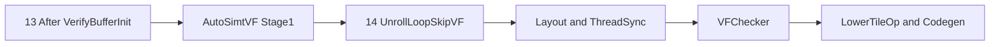
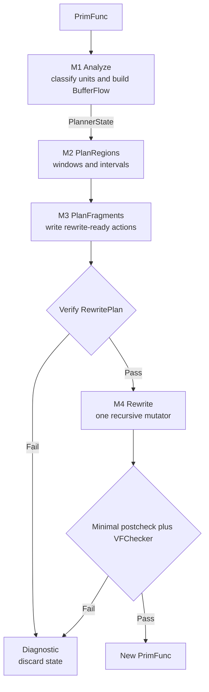
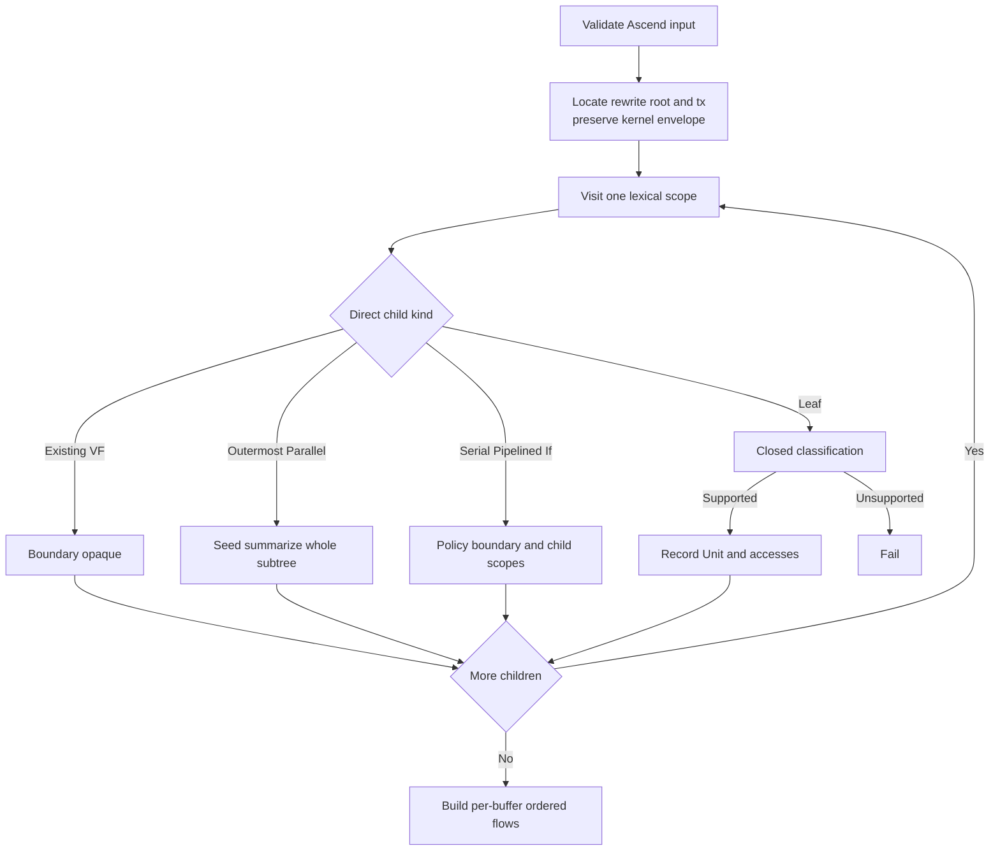
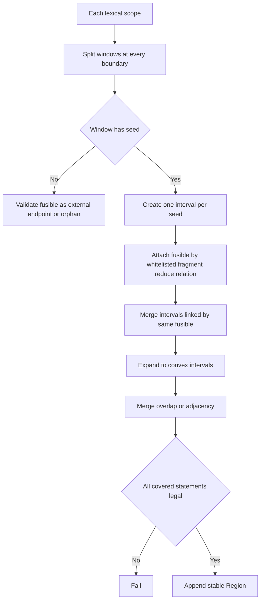
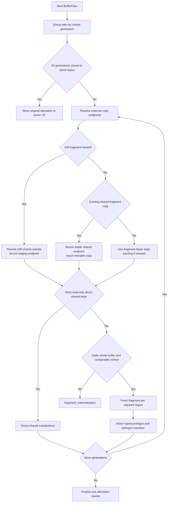
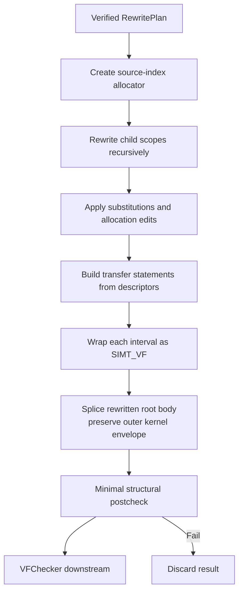

# AutoSimtVF Pass Stage1 轻量实现设计

> 需求基线：[AutoSimtVF_design_demand.md](/home/dangy/workspace/Private-ascend/mhc_stage1/docs/AutoSimtVF_design_demand.md) 的 Stage1 功能范围，以及 [AutoSimtVF_pass_design_lite.md](/home/dangy/workspace/Private-ascend/mhc_stage1/docs/AutoSimtVF_pass_design_lite.md) 中已更新的 pipeline/thread/grid 结论。  
> 扩展备份：[AutoSimtVF_Design.md](/home/dangy/workspace/Private-ascend/mhc_stage1/docs/AutoSimtVF_Design.md) 保留通用 fragment/control-flow 方案，本文不修改它。  
> 本文只是 Pass 实现设计，不修改代码。所有未核实的仓内函数、AST matcher 和 TIR constructor 均标为【待确认】。

## 1. 目标与范围

AutoSimtVF 在规范化的 Ascend TIR 上识别以 `T.Parallel` 为核心的 SIMT 计算，将其与必须共址的 fragment copy/fill/reduce 组成连续 `SIMT_VF` region，并对跨 region/serial 的 fragment 状态做 shared/UB 合法化。

Stage1 的目标是“确定性地生成合法 IR”，不追求最优 partition。实现代码预算是 **1,000–1,400 行 C++**（含必要注释，不含测试）；这是设计约束，不是为了行数牺牲正确性的验收指标。

### 1.1 Stage1 必须完成

- 每个受支持的最外层 Parallel 子树恰好进入一个 VF；
- Parallel 内部 serial/if/scalar/inner Parallel 原样跟随 seed；
- Parallel 外 serial/pipelined/if 保持 MainScalar，递归处理 body/branch；
- copy 闭集分类：fragment dataflow、GM↔fragment handoff、SIMT cast、engine boundary；
- 支持目标 case 中的 fill/clear 和 float32 sum/max reduce；
- 跨 VF/外层 serial 的 fragment 通过 shared backing 和静态整 buffer transfer 传递；
- 保留 existing VF，无 nested VF，重复运行幂等；
- 继承输入 `threadIdx.x` extent，缺失时回退 128；
- 失败返回稳定 reason code + source location，不提交局部 IR。

### 1.2 Stage1 明确不做

- cost model、SIMD 识别、scalar profitability；
- loop interchange/fold 和跨 Gemm/Cube 融合；
- 通用 dependence DAG、alias engine 或 fragment SSA；
- 任意 branch 的 phi/version merge；
- partial/dynamic `BufferRegion` 或通用 predicate 等价证明；
- resource/cost 驱动的 thread 选择；
- 自行插入 shared barrier；交给下游 `ThreadSync("shared")` / `ThreadSync("shared.dyn")`。

## 2. Pipeline 与 IR 契约

### 2.1 Pipeline 位置



AutoSimtVF 不依赖需求旧稿中的 thread hint/default 512，也不负责多维 grid 展平。已确认的 Stage1 契约是：

1. copy 仍是通用 TileLang copy，没有可依赖的 MTE/CV annotation；
2. `blockIdx.x/y/z` 由现有 Ascend 后端保持，region planner 与 grid 维数无关；
3. VF thread extent 继承输入顶层 `threadIdx.x`，缺失回退 128；
4. 外层 `blockIdx/threadIdx` wrapper 原样保留；新 VF 使用自己的内部 thread binding。03 direct-shared 版本已通过 TileLang codegen 到 bisheng 环境检查，证明二者可以共存，因此 Stage1 不 peel、不 rehome 外层 wrapper。

### 2.2 输出不变量

1. 无 VF 外的受支持 Parallel；
2. 无 nested VF；
3. hard boundary 不在新 VF 内；
4. region 是同一 lexical scope 的连续 statement interval；
5. 每个 fragment allocation 只有一个 VF owner，或已替换为 shared backing/per-region fresh fragment；
6. dtype、shape、stride/index mapping、predicate 与可观察 def-use/effect order 不变；纯 copy 只允许在 dominance/stability 证明后下沉或消除；
7. `tl.vf_source_index` 唯一且确定；
8. M3 后候选范围内不存在未合法化的 GM↔fragment copy；existing VF 内节点保持 opaque/unchanged；
9. 外层 kernel thread/grid envelope 与输入结构一致；
10. 失败不返回半改写的 `PrimFunc`。

## 3. 轻量架构

### 3.1 单一外部 interface

```text
AutoSimtVF(PrimFunc) -> transformed PrimFunc | compiler diagnostic
```

Pass 是一个 deep module。pipeline 只依赖这一个 interface；内部 M1–M4 是私有 workflow，不进入公共 header，不为测试制造额外 adapter。

### 3.2 内部 workflow



实现只保留两份长期状态：

- `PlannerState`：M1 生成，保存原 IR 的 scope/unit/access 摘要；
- `RewritePlan`：M2/M3 逐步填充，已经可被 M4 直接执行。

不再建立 `AnalysisResult -> RegionResult -> FragmentResult -> PassPlan -> RewriteContext` 链条。

### 3.3 建议文件与行数预算

Stage1 首版集中在一个 C++ implementation 文件中：

```text
src/ascend/transform/auto_simtvf.cc
  pass entry + private planner + M1-M4 + diagnostics
```

| 部分 | 目标行数 |
|---|---:|
| 数据结构、Pass 入口、诊断 | 120–180 |
| M1 分析与分类 | 300–400 |
| M2 region 规划 | 150–220 |
| M3 fragment 合法化 | 280–380 |
| M4 rewrite 与验证 | 220–320 |
| 合计 | 约 1,000–1,400 |

行数预算成立的前提是复用现有 read/write 摘要、TileOp matcher、VF 构造和 `VFChecker`。若其中多项不可用，应先重新评估，不在本 Pass 中扩展通用分析框架。

## 4. 最小数据模型

### 4.1 数据结构

```cpp
enum class Role { kSeed, kFusible, kBoundary, kUnsupported };
enum class BoundaryKind { kNone, kHard, kPolicy };
enum class StatementKind {
  kOther, kParallel, kCopy, kFillOrClear, kReduce, kControl, kExistingVF
};
enum class CopyKind {
  kNone,
  kFragmentDataflow,   // shared/UB↔fragment，允许受支持的 cast。
  kGmFragmentHandoff, // GM↔fragment：必须由 M3 拆成 GM↔shared + VF transfer。
  kSimtCast,           // dtype-changing UB↔GM，在 VF 中执行。
  kEngine,             // 可直接由 DMA/CV 等 engine lowering。
};

enum class TransferKind { kReload, kWriteback, kForwardedCopy };

enum class ErrorCode {
  kInputContract,
  kThreadEnvelope,
  kUnsupportedStatement,
  kUnsupportedCopy,
  kUnsupportedReduce,
  kOrphanFusible,
  kRegionConflict,
  kFragmentMaterialization,
  kPlanInvariant,
  kRewriteInvariant,
};

struct Failure {
  ErrorCode code;
  Span span;
  std::string detail;
};

// 仅是 ClassifyLeaf 的短生命周期返回值，不进入 PlannerState。
struct ClassifiedLeaf {
  StatementKind kind{StatementKind::kOther};
  Role role{Role::kUnsupported};
  BoundaryKind boundary{BoundaryKind::kNone};
  CopyKind copy{CopyKind::kNone};
  ErrorCode error{ErrorCode::kUnsupportedStatement};
  std::string detail;

  static ClassifiedLeaf Make(StatementKind kind, Role role,
                             BoundaryKind boundary, CopyKind copy) {
    ClassifiedLeaf result;
    result.kind = kind;
    result.role = role;
    result.boundary = boundary;
    result.copy = copy;
    return result;
  }
  static ClassifiedLeaf Seed(StatementKind kind,
                             CopyKind copy = CopyKind::kNone) {
    return Make(kind, Role::kSeed, BoundaryKind::kNone, copy);
  }
  static ClassifiedLeaf Fusible(StatementKind kind,
                                CopyKind copy = CopyKind::kNone) {
    return Make(kind, Role::kFusible, BoundaryKind::kNone, copy);
  }
  static ClassifiedLeaf Boundary(StatementKind kind, CopyKind copy) {
    return Make(kind, Role::kBoundary, BoundaryKind::kHard, copy);
  }
  static ClassifiedLeaf HardBoundary(StatementKind kind) {
    return Make(kind, Role::kBoundary, BoundaryKind::kHard, CopyKind::kNone);
  }
  static ClassifiedLeaf PolicyBoundary() {
    return Make(StatementKind::kOther, Role::kBoundary,
                BoundaryKind::kPolicy, CopyKind::kNone);
  }
  static ClassifiedLeaf Unsupported(ErrorCode error, std::string detail) {
    ClassifiedLeaf result;
    result.error = error;
    result.detail = std::move(detail);
    return result;
  }
};

struct AccessSite {
  int unit{-1};
  Buffer buffer;
  BufferRegion region;
  bool read{false};
  bool write{false};
  bool full_write{false};
  bool requires_fragment{false};
  // 仅 recognized copy 使用。peer 是 copy 的非 fragment endpoint；M3 不重新 match op。
  std::optional<BufferRegion> copy_peer;
  bool fragment_is_dst{false};
  bool copy_allows_cast{false};
  int generation{0};  // 只由静态 full write-only 递增，不是通用 SSA。
  Span span;
};

struct Unit {
  int id{-1};                    // PlannerState.units 的稳定下标。
  int scope{-1};
  int order{-1};                 // direct-child lexical order。
  Stmt stmt;
  StatementKind kind{StatementKind::kOther};
  Role role{Role::kUnsupported};
  BoundaryKind boundary{BoundaryKind::kNone};
  CopyKind copy{CopyKind::kNone};
  std::vector<AccessSite> accesses;
  Span span;
};

enum class ChildSlot { kRoot, kLoopBody, kThen, kElse };

struct Scope {
  int id{-1};                    // PlannerState.scopes 的稳定下标。
  int parent{-1};
  int owner_unit{-1};
  ChildSlot slot{ChildSlot::kRoot};
  std::vector<int> units;
};

struct BufferFlow {
  Buffer original;
  int declaration_scope{-1};
  std::vector<AccessSite> sites; // scope-tree lexical order。
  bool loop_carried{false};
};

struct Region {
  int id{-1};
  int scope{-1};
  int begin{-1};                 // 闭区间 direct-child order。
  int end{-1};
};

struct Substitution {
  int unit{-1};
  Buffer from;
  Buffer to;
};

struct Transfer {
  int region{-1};
  TransferKind kind{TransferKind::kReload};
  BufferRegion src;
  BufferRegion dst;
  bool dtype_cast{false};         // 仅 M1 已确认可 lowering 的 fragment dataflow cast。
};

struct RewritePlan {
  std::vector<Region> regions;
  std::unordered_map<int, std::vector<Substitution>> substitutions_by_unit;
  std::unordered_map<int, std::vector<Buffer>> region_allocations;
  std::unordered_map<int, std::vector<Transfer>> region_prologue;
  std::unordered_map<int, std::vector<Transfer>> region_epilogue;
  std::unordered_map<int, std::vector<Buffer>> add_allocations_by_scope;
  std::unordered_map<int, std::vector<Buffer>> remove_allocations_by_scope;
  std::vector<int> erased_units;  // 仅纯 copy；CanonicalizePlan 后按 unit id 有序唯一。
  PrimExpr tx_extent;
};

struct PlannerState {
  PrimFunc original;
  Stmt logical_body;
  int root_scope{-1};
  std::vector<Unit> units;
  std::vector<Scope> scopes;
  std::vector<BufferFlow> fragment_flows;
  std::unordered_set<int64_t> occupied_source_indices;
  RewritePlan plan;
  std::optional<Failure> failure;
};
```

### 4.2 简化约束

- `int` ID 就是 vector 稳定下标，不再定义 NodeId/ScopeId/SeedId/FragmentVersionId 类型层。
- seed 是 `Unit.role == kSeed`，不再建 `SeedInfo`。
- `StatementKind` 由 M1 一次写入，后续 helper 只读 `Unit.kind/role/copy`，不得重新 match AST。
- fragment generation 只是 `AccessSite` 上的整数，不建持久 `FragmentVersion`/`FragmentEscape`对象。
- M3 直接写 `RewritePlan`，M4 不再生成 `RewriteContext`。
- `Failure` 保存在 planner 中。私有 helper 返回 `bool`/`std::optional<T>`，不引入定制 `StepResult<T>` 类层。

### 4.3 Planner 骨架

```cpp
class AutoSimtVFPlanner {
 public:
  explicit AutoSimtVFPlanner(PrimFunc func) {
    state_.original = std::move(func);
  }

  std::optional<PrimFunc> Run() {
    // M1-M3 只构建内存 plan，不修改 original。
    if (!Analyze()) return std::nullopt;
    if (!PlanRegions()) return std::nullopt;
    if (!PlanFragments()) return std::nullopt;
    if (!VerifyPlan()) return std::nullopt;

    // Rewrite 在新 body 上运行；成功后才返回新 PrimFunc。
    auto result = Rewrite();
    if (!result.has_value()) return std::nullopt;
    if (!VerifyResult(*result)) return std::nullopt;
    return result;
  }

  const Failure& failure() const { return *state_.failure; }

 private:
  bool Analyze();
  bool PlanRegions();
  bool PlanFragments();
  bool VerifyPlan();
  std::optional<PrimFunc> Rewrite();
  bool VerifyResult(const PrimFunc& result);

  bool Fail(ErrorCode code, Span span, std::string detail) {
    if (!state_.failure.has_value()) {
      state_.failure = Failure{code, span, std::move(detail)};
    }
    return false;
  }

  PlannerState state_;
};
```

`Fail` 只记录首个确定错误。对外 wrapper 将 `Failure` 转成仓内 Diagnostic；该 interface 为【待确认】。

## 5. M1：Analyze

### 5.1 职责与输入输出

输入是 Ascend `PrimFunc`；输出是填充的 `Scope[]`、`Unit[]`、`BufferFlow[]`、thread plan 和 existing source indices。M1 是 statement 语义分类的唯一来源；M2/M3 只读分类结果，M4 仅为执行 substitution 按 AST node/已知 TileOp 表示做机械重建，不重新决定 role、copy kind 或 placement。

### 5.2 流程



### 5.3 Statement 分类闭集

| Role | 精确内容 | 行为 |
|---|---|---|
| `kSeed` | 最外层 Parallel 子树；非 L1 fill/clear；dtype-changing UB↔GM copy/direct store | 必须建 VF |
| `kFusible` | shared/UB↔fragment dataflow copy（含受支持 cast）；白名单 reduce | 仅在有合法 seed 数据链时吸收 |
| `kBoundary` | GM↔fragment handoff、engine copy、Gemm/Cube、engine sync、L1 zero-fill、existing VF；外层 scalar/control | 保持 VF 外，切 window；handoff 由 M3 合法化 |
| `kUnsupported` | 未知 copy/reduce/barrier/atomic/opaque/Persistent 等 | 立即诊断 |

Copy 按首个命中分类：

1. `GM->L1`、`L1->L0A/B`、`L0C->UB/GM`、`UB->L1/NZ` 且可完整 lowering：engine boundary；
2. GM↔fragment：`GM_FRAGMENT_HANDOFF` hard boundary，M3 必须拆成合法的两段；
3. 排除 L0/L1/NZ/GM 的 shared/UB↔fragment：fragment dataflow fusible，支持已验证的 dtype cast；
4. dtype-changing UB↔GM copy/direct store：SIMT cast seed；
5. 同 dtype GM↔UB 且可完整 lowering：engine boundary；
6. 其它：unsupported。

```cpp
ClassifiedLeaf ClassifyLeaf(const Stmt& stmt) {
  if (auto copy = MatchTileCopy(stmt)) {  // 【待确认】
    MemoryScope src = NormalizeScope(copy->src);
    MemoryScope dst = NormalizeScope(copy->dst);

    if (IsDedicatedEnginePair(src, dst)) {
      if (!IsStaticFullCopy(*copy)) {
        return ClassifiedLeaf::Unsupported(
            ErrorCode::kUnsupportedCopy, "engine copy must be static and full");
      }
      return ClassifiedLeaf::Boundary(
          StatementKind::kCopy, CopyKind::kEngine);
    }
    if (IsGmFragmentPair(src, dst)) {
      if (!IsStaticFullCopy(*copy)) {
        return ClassifiedLeaf::Unsupported(
            ErrorCode::kUnsupportedCopy,
            "GM-fragment handoff must be static and full");
      }
      return ClassifiedLeaf::Boundary(
          StatementKind::kCopy, CopyKind::kGmFragmentHandoff);
    }
    if (IsFragmentDataflowPair(src, dst)) {
      if (!IsStaticFullCopy(*copy)) {
        return ClassifiedLeaf::Unsupported(
            ErrorCode::kUnsupportedCopy, "fragment copy must be static and full");
      }
      if (!IsSupportedFragmentTransfer(*copy)) {
        return ClassifiedLeaf::Unsupported(
            ErrorCode::kUnsupportedCopy,
            "unsupported shared/UB-fragment transfer or cast");
      }
      return ClassifiedLeaf::Fusible(
          StatementKind::kCopy, CopyKind::kFragmentDataflow);
    }
    if (IsUbGmPair(src, dst) && copy->src_dtype != copy->dst_dtype) {
      return ClassifiedLeaf::Seed(
          StatementKind::kCopy, CopyKind::kSimtCast);
    }
    if (IsUbGmPair(src, dst) && copy->src_dtype == copy->dst_dtype &&
        IsStaticFullCopy(*copy)) {
      return ClassifiedLeaf::Boundary(
          StatementKind::kCopy, CopyKind::kEngine);
    }
    return ClassifiedLeaf::Unsupported(
        ErrorCode::kUnsupportedCopy, "unsupported copy scope/dtype combination");
  }

  if (MatchDtypeChangingUbGmStore(stmt)) {
    return ClassifiedLeaf::Seed(
        StatementKind::kCopy, CopyKind::kSimtCast);
  }
  if (auto fill = MatchFillOrClear(stmt)) {
    if (!IsStaticFullFill(*fill)) {
      return ClassifiedLeaf::Unsupported(
          ErrorCode::kUnsupportedStatement, "fill/clear must be static and full");
    }
    return IsL1ZeroFill(*fill)
               ? ClassifiedLeaf::HardBoundary(StatementKind::kFillOrClear)
               : ClassifiedLeaf::Seed(StatementKind::kFillOrClear);
  }
  if (auto reduce = MatchReduce(stmt)) {
    if (!IsFloat32StaticSumOrMax(*reduce) ||
        !CanProveTrue(reduce->predicate)) {
      return ClassifiedLeaf::Unsupported(
          ErrorCode::kUnsupportedReduce,
          "reduce must be static float32 sum/max with a provably-true predicate");
    }
    return ClassifiedLeaf::Fusible(StatementKind::kReduce);
  }
  if (IsGemmCubeEngineSync(stmt)) {
    return ClassifiedLeaf::HardBoundary(StatementKind::kOther);
  }
  if (IsProvenPlainScalarLeaf(stmt)) return ClassifiedLeaf::PolicyBoundary();
  return ClassifiedLeaf::Unsupported(
      ErrorCode::kUnsupportedStatement, "statement is outside the Stage1 whitelist");
}
```

`IsStaticFullCopy/Fill` 只验证整 buffer、静态 shape/stride、无 predicate 或可证明 full predicate。`MatchTileCopy` 按 operator schema 解析必选参数，并容忍 `disable_tma=T.bool(True)` 等已知附加参数；附加 lowering hint 不参与 scope/dtype 分类。保留原 copy 时保留已知参数；生成内部 transfer 时由仓内 copy builder 根据新 endpoint 重新构造，不能把外部 engine hint 盲目复制到 VF 内。Stage1 不实现通用 region algebra。

### 5.4 Lexical scope visitor

```cpp
bool VisitScope(const Stmt& body, int scope_id) {
  RecordAllocationMetadata(body, scope_id);  // sblock alloc_buffers，【待确认】
  std::vector<Stmt> children = FlattenDirectSeq(body);

  for (int order = 0; order < static_cast<int>(children.size()); ++order) {
    const Stmt& stmt = children[order];

    if (IsExistingVF(stmt)) {
      AddBoundaryUnit(stmt, scope_id, order, StatementKind::kExistingVF);
      RecordExistingSourceIndex(stmt);
      continue;  // opaque，不进入内部。
    }

    if (IsOutermostParallel(stmt)) {
      auto accesses = SummarizeParallelSubtree(stmt);
      if (!accesses.has_value()) {
        return Fail(ErrorCode::kUnsupportedStatement, GetSpan(stmt),
                    "unsupported effect inside Parallel seed");
      }
      AddSeedUnit(
          stmt, scope_id, order, StatementKind::kParallel, *accesses);
      continue;
    }

    if (IsSerialOrPipelined(stmt) || IsIfThenElse(stmt)) {
      int owner = AddPolicyBoundaryUnit(
          stmt, scope_id, order, StatementKind::kControl);
      for (auto [slot, child_body] : GetControlChildren(stmt)) {
        int child_scope = AddScope(scope_id, owner, slot);
        if (!VisitScope(child_body, child_scope)) return false;
      }
      continue;
    }

    ClassifiedLeaf leaf = ClassifyLeaf(stmt);
    if (leaf.role == Role::kUnsupported) {
      return Fail(leaf.error, GetSpan(stmt), leaf.detail);
    }
    AddClassifiedUnit(stmt, scope_id, order, leaf);
  }
  return true;
}
```

Parallel 子树中只做 legality/access 摘要，不产生 child `Unit`。裸 Parallel 赋值仍按 seed 处理，access summarizer 必须识别其中的静态整 buffer write/read；例如 Case 06 VF1 的 `comb_frag = comb_ub` 是合法先例，不需要伪装成 TileOp copy。已知 SIMT-local barrier 可保留；GM↔fragment、engine 等 hard effect 若出现在 Parallel 子树内部则诊断，因为 Stage1 不拆 seed。

### 5.5 轻量 BufferFlow

M1 按 fragment allocation 收集 access。同一 buffer 的站点保存 scope-tree lexical order，并仅在“静态整 buffer write-only”处递增 `generation`。recognized copy 同时把非 fragment endpoint、方向及 cast 能力写入 `AccessSite`，使 M3 不必重新匹配 statement。GM↔fragment handoff 虽是 boundary，仍必须进入对应 `BufferFlow`。这些信息足以区分完全覆盖前后的独立值，但不建 SSA/phi。

```cpp
bool BuildBufferFlows() {
  for (const Buffer& fragment : CollectedFragmentAllocations()) {
    BufferFlow flow;
    flow.original = fragment;
    flow.declaration_scope = DeclarationScope(fragment);

    int generation = 0;
    for (AccessSite site : CollectSitesInScopeTreeOrder(fragment)) {
      // recognized copy 的 peer/direction/cast 由 M1 classifier 一次写入 site。
      PopulateCopyEndpointMetadataFromClassifiedUnit(&site);
      if (!IsStaticWholeBuffer(site.region) || !HasFullPredicate(site)) {
        return Fail(ErrorCode::kFragmentMaterialization, SiteSpan(site),
                    "Stage1 requires static whole-buffer fragment access");
      }
      if (site.full_write && !site.read && !flow.sites.empty()) ++generation;
      site.generation = generation;
      flow.loop_carried |= IsLoopCarried(site);  // 仅识别目标 case 的 serial 携带。
      flow.sites.push_back(std::move(site));
    }

    if (HasAmbiguousCrossBranchDefinition(flow)) {
      return Fail(ErrorCode::kFragmentMaterialization, BufferSpan(fragment),
                  "cross-branch fragment definition is outside Stage1");
    }
    if (OneUnitTouchesMultipleGenerations(flow)) {
      return Fail(ErrorCode::kFragmentMaterialization, BufferSpan(fragment),
                  "multiple fragment generations in one unit are outside Stage1");
    }
    state_.fragment_flows.push_back(std::move(flow));
  }
  return true;
}
```

M1 结束时调用 `ValidateInput -> LocateRewriteRootAndThreadExtent -> VisitScope -> BuildBufferFlows`。`LocateRewriteRootAndThreadExtent` 只定位待改写的 `tilelang_root` body 并读取 `threadIdx.x` extent，不剥离或改写 kernel envelope。没有 access 的 dead fragment 处理为【待确认】；不得为它创建空 VF。

## 6. M2：PlanRegions

### 6.1 职责与输入输出

输入是 M1 的 scope/unit/buffer flow；输出直接写入 `RewritePlan.regions`。M2 只决定 partition，不创建 Buffer 或 TIR。

### 6.2 流程



### 6.3 简单 interval 算法

Stage1 scope 较小，直接用 vector 合并 interval，不建 DSU/fusion graph。

```cpp
bool PlanWindow(const Scope& scope, int first, int last) {
  std::vector<int> seeds = SeedUnitsInRange(scope, first, last);
  if (seeds.empty()) {
    return ValidateSeedlessFusibles(scope, first, last);
  }

  std::vector<Region> local;
  for (int seed : seeds) {
    int order = state_.units[seed].order;
    local.push_back(Region{/*id=*/-1, scope.id, order, order});
  }

  for (int unit_id : UnitsInRange(scope, first, last)) {
    const Unit& unit = state_.units[unit_id];
    if (unit.role != Role::kFusible && !IsStateInitializingSeed(unit)) continue;

    std::vector<int> related = RelatedSeedUnits(unit, scope, first, last);
    if (related.empty()) {
      if (FragmentFlowReachesSeedInOtherScope(unit)) {
        MarkExternalEndpoint(unit_id);  // M3 按 BufferFlow 直接看到。
        continue;
      }
      return Fail(ErrorCode::kOrphanFusible, unit.span,
                  "fusible statement has no reachable SIMT seed");
    }

    // helper 按 seed 的 lexical order 查找 interval，合并后再包含当前 unit。
    // 内部直接 O(seed_count^2) 扫描，不引入并查集类。
    MergeRegionsContainingSeedsAndUnit(&local, related, unit.order);
  }

  SortByBegin(&local);
  MergeOverlappingOrAdjacent(&local);

  for (Region& region : local) {
    for (int order = region.begin; order <= region.end; ++order) {
      const Unit& covered = UnitAtOrder(scope, order);
      if (covered.role == Role::kBoundary ||
          covered.role == Role::kUnsupported) {
        return Fail(ErrorCode::kRegionConflict, covered.span,
                    "continuous SIMT region crosses a boundary");
      }
    }
    region.id = static_cast<int>(state_.plan.regions.size());
    state_.plan.regions.push_back(region);
  }
  return true;
}
```

`RelatedSeedUnits` 只处理白名单 MustCoLocate：

- shared/UB↔fragment dataflow copy 与同 generation buffer 的 seed；
- fill/clear seed 与同 generation 的消费 seed；
- reduce 与读写同一 output/state 的 seed；
- 普通 RAW/WAR/WAW 只保序，不自动生成 MustCoLocate。

`IsStateInitializingSeed` 等 helper 仅检查 M1 已写入的 `Unit.kind/role/accesses`（例如 `kFillOrClear`），不得再次对 `Unit.stmt` 做 TileOp matcher。

GM↔fragment handoff 不参与 MustCoLocate：它作为 hard boundary 留在 region 外，但其 fragment `AccessSite` 仍由 M3 作为外部 definition/use endpoint 处理。`ValidateSeedlessFusibles` 只检查 `kFusible`，不得把 handoff boundary 误报为 orphan。

### 6.4 M2 总入口与验证

```cpp
bool AutoSimtVFPlanner::PlanRegions() {
  for (const Scope& scope : ScopesBottomUp(state_.scopes)) {
    for (auto [first, last] : SplitAtBoundary(scope, state_.units)) {
      if (!PlanWindow(scope, first, last)) return false;
    }
  }
  RenumberRegionsInLexicalOrder(&state_.plan.regions);

  if (!EverySeedHasExactlyOneRegion() ||
      !RegionsAreDisjointAndContinuous() ||
      !EveryFusibleIsRegionMemberOrExternalEndpoint()) {
    return Fail(ErrorCode::kPlanInvariant, RootSpan(),
                "region planning invariant failed");
  }
  return true;
}
```

## 7. M3：PlanFragments

### 7.1 职责与输入输出

M3 在 region 固定后遍历每个 `BufferFlow`，先解析 GM handoff 与已有 shared/UB endpoint，再将 allocation edit、unit erase、buffer substitution 和 transfer descriptor **直接写入 `RewritePlan`**。M3 不修改 region、不创建 seed，M4 不再重做 fragment 决策。

### 7.2 流程



### 7.3 为什么按 Buffer 规划

TIR allocation 属于 Buffer，而不是某个逻辑 version。M3 可以在函数内用 `generation` 分析 def/use，但最终对同一 Buffer 只提交一组 allocation edits。这样天然避免“两个 version 把同一 allocation 移入两个 VF”，不需额外 reconciliation 模块。

shared endpoint、state backing 和 GM staging 是三个语义角色，但不建立三个持久对象层：M3 在处理一个 generation 时用局部 `EndpointResolution` 表示它们，最终都编译为 `RewritePlan` 中已有的 allocation/substitution/transfer/erase action。

### 7.4 外部 endpoint 解析

```cpp
struct EndpointResolution {  // PlanOneFragmentBuffer 的局部临时值。
  std::optional<BufferRegion> incoming;
  std::optional<BufferRegion> outgoing;
  std::vector<int> erasable_copy_units;
};

bool ResolveExternalEndpoints(const BufferFlow& flow,
                              const std::vector<AccessSite>& sites,
                              EndpointResolution* result) {
  for (const AccessSite& site : SitesOutsideRegions(sites)) {
    const Unit& unit = state_.units[site.unit];
    if (!site.copy_peer.has_value()) {
      return Fail(ErrorCode::kFragmentMaterialization, site.span,
                  "external fragment access is not a recognized full copy");
    }

    if (unit.copy == CopyKind::kGmFragmentHandoff) {
      // 外部 leg 必须变成同 dtype GM↔shared；内部 leg 保留可能的 cast。
      Buffer staging = GetOrCreateGmStaging(
          flow, site, /*prefer_fragment_dtype_backing=*/
                          PeerDtype(site) == flow.original->dtype);
      AddSubstitution(site.unit, flow.original, staging, &state_.plan);
      if (!SetUniqueIncomingOrOutgoing(
              site, MapFragmentRegionToBuffer(site.region, staging), result)) {
        return Fail(ErrorCode::kFragmentMaterialization, site.span,
                    "multiple incompatible GM handoff endpoints");
      }
      continue;  // GM↔shared unit 保留在原 MainScalar 位置。
    }

    if (unit.copy == CopyKind::kFragmentDataflow &&
        IsSharedOrUb(site.copy_peer->buffer)) {
      if (!SharedPeerDominatesAndIsStable(site, sites)) {
        return Fail(ErrorCode::kFragmentMaterialization, site.span,
                    "shared endpoint does not dominate region or is clobbered");
      }
      if (!SetUniqueIncomingOrOutgoing(site, *site.copy_peer, result)) {
        return Fail(ErrorCode::kFragmentMaterialization, site.span,
                    "multiple incompatible shared endpoints");
      }
      result->erasable_copy_units.push_back(site.unit);
      continue;  // 等价 copy 稍后作为 VF transfer 重建，原 unit 删除。
    }

    return Fail(ErrorCode::kFragmentMaterialization, site.span,
                "unsupported external fragment endpoint");
  }
  return true;
}
```

`SharedPeerDominatesAndIsStable` 只沿现有 scope tree 和 lexical order 检查：peer allocation 覆盖目标 region、原 copy 到 region 之间无 peer write、copy predicate 恒真，且外层变量在 child scope 可见。证明不了即诊断，不为此引入 CFG。`GetOrCreateGmStaging` 通过 `RewritePlan.add_allocations_by_scope` 在最近合法 MainScalar scope 分配或复用 staging。staging dtype 取 GM endpoint dtype，使外部 leg 保持同 dtype engine copy；内部 staging↔fragment transfer 可在 M1 已确认时执行 cast。loop-carried 状态 backing 始终保持 fragment 累加 dtype，不能复用会窄化 dtype 的 staging。

### 7.5 direct-shared 的确定规则

Stage1 采用统一的最小物化策略，不复刻各手写性能变体：一个 generation 只有在“外部完整写一次、region 内只读多次”且 shared 改写可证明等价时，才直接消除 fragment。04 的 `a/c`、05 的 `mixl` 与 03 的 `xl` 使用同一规则，不按 case 名或尺寸分支。

```cpp
bool CanUseSharedDirectly(const BufferFlow& flow,
                          const std::vector<AccessSite>& sites,
                          const EndpointResolution& endpoints) {
  auto definition = UniqueDominatingFullDefinition(sites);
  if (!definition.has_value() || !endpoints.incoming.has_value()) return false;
  if (AnyWriteAfterDefinition(sites, *definition)) return false;

  for (const AccessSite& site : sites) {
    if (!SiteIsInsideRegion(site)) continue;  // endpoint 已由上一阶段验证。
    const Unit& unit = state_.units[site.unit];
    if (site.write || site.requires_fragment ||
        unit.kind == StatementKind::kReduce) return false;
    if (unit.kind != StatementKind::kParallel ||
        !IsPlainReadAccess(site)) return false;
    if (!SharedRewritePreservesDtypeRegionPredicateAndLaneMapping(
            flow.original, endpoints.incoming->buffer, site)) {
      return false;
    }
  }
  return NoCrossBranchOrInterveningClobber(sites, *endpoints.incoming);
}
```

Case 03 的 GM→fragment producer + child-scope Parallel read 命中此路径：M3 建 shared staging，将原 copy 改为 GM→shared 并留在 VF 外，Parallel 内 load 指向 shared。03 direct-shared log 已通过 TileLang codegen 到 bisheng 环境检查，是该规则的合法性基线。

direct-shared 是 Stage1 的 canonical policy，不是 cost model。若 `a/c/mixl` 等只读状态通过相同 legality predicate，自动输出可以比手写 golden 少 fragment/reload；测试应锁定 AutoSimtVF 的 canonical 输出，而不是按文件名复制另一种合法策略。任何 RMW、reduce、fragment-only TileOp、dtype 变化或 lane-private/shared race 风险都会关闭此路径。

### 7.6 existing endpoint forwarding

跨 scope 的 shared/UB→fragment copy 不应先生成新的 shared backing 再形成 shared→shared copy。M3 直接复用已有非 fragment endpoint：

```cpp
bool AttachTypedPrologue(const BufferRegion& incoming,
                         const Buffer& local,
                         const std::vector<AccessSite>& sites,
                         int region) {
  const AccessSite& definition = ExternalIncomingDefinition(sites);
  if (!SharedPeerDominatesAndIsStable(definition,
                                      SitesInRegion(sites, region))) {
    return Fail(ErrorCode::kFragmentMaterialization, definition.span,
                "cannot sink external fragment copy into region");
  }

  bool cast = incoming->buffer->dtype != local->dtype;
  if (cast && !definition.copy_allows_cast) {
    return Fail(ErrorCode::kFragmentMaterialization, definition.span,
                "fragment transfer cast is not supported");
  }
  AddPrologueTransfer(region, TransferKind::kForwardedCopy,
                      incoming, WholeRegion(local), cast, &state_.plan);
  return true;
}
```

`AttachTypedEpilogue` 做对称检查：目标 shared/UB 必须在 region 之后可见，region slice 一致，dtype 不同时必须已由 M1 标记为受支持 cast。同 dtype、相同 mapping 且所有 use 都满足第 7.5 节时，copy 可以完全消除并把 fragment 替换为已有 shared buffer；否则在目标 VF prologue/epilogue 重建 transfer。后者允许 M1 已确认的 dtype cast。

Case 05 的 `xs→xl` 必须走第二种路径：`xs` 明确为 bfloat16，`xl` 为默认 float32 fragment，所以不能用 `xs` 直接替换 `xl`。原父 scope copy 删除，在 `i_mhc` child VF prologue 中重建 bfloat16→float32 的 `xs→fresh_xl`。这是 M3 transfer relocation，不是 M2 跨 scope 融合，也不改变 region。

### 7.7 live-in/live-out 的最小定义

Stage1 只处理静态整 buffer，因此不计算 region union/intersection。对每个 `(generation, region)`：

- 第一个 full write-only 之前发生 read/RMW：需要 reload；
- region 内发生 write，且同 generation 在后续 region/外部有 read：需要 writeback；
- loop-carried flow 中 region 有 write：需要 writeback，下次迭代需 reload；
- 无 read-before-write 不 reload；无外部 use 不 writeback。

```cpp
bool NeedsReload(const std::vector<AccessSite>& sites, int region) {
  for (const AccessSite& site : SitesInRegion(sites, region)) {
    if (site.read) return true;
    if (site.full_write && site.write && !site.read) return false;
    if (site.write) return true;  // 不是 full write 的写保守视为 RMW。
  }
  return false;
}

bool NeedsWriteback(const BufferFlow& flow,
                    const std::vector<AccessSite>& sites,
                    int region) {
  bool wrote = AnyWriteInRegion(sites, region);
  if (!wrote) return false;
  return flow.loop_carried || HasLaterReadOutsideRegion(sites, region);
}
```

`HasLaterReadOutsideRegion` 只允许在可证明的 lexical path 上判定。如果 site 跨不可比较的 if branch，M1 已经诊断，M3 不构造 phi。

### 7.8 生成 rewrite-ready plan

```cpp
bool PlanOneFragmentBuffer(const BufferFlow& flow) {
  auto generations = GroupSitesByGeneration(flow.sites);  // 临时 vector，不入长期数据模型。
  if (generations.empty()) {
    return Fail(ErrorCode::kInputContract, BufferSpan(flow.original),
                "dead fragment handling is not confirmed for Stage1");
  }
  std::vector<int> closed_owners;
  bool needs_replacement = false;

  for (const auto& sites : generations) {
    auto owner = SingleRegionContainingAllSites(sites);
    if (owner.has_value()) {
      closed_owners.push_back(*owner);
    } else {
      needs_replacement = true;
    }
  }

  if (!needs_replacement && AllEqual(closed_owners)) {
    int owner = closed_owners.front();
    MoveAllocation(flow.original, flow.declaration_scope, owner, &state_.plan);
    return true;
  }

  // 多 owner 或有 cross-region generation 时，不再移动原 allocation。
  RemoveAllocation(flow.original, flow.declaration_scope, &state_.plan);
  std::optional<Buffer> state_backing;
  auto ensure_state_backing = [&]() -> std::optional<Buffer> {
    if (!state_backing.has_value()) {
      int backing_scope = FindBackingScope(flow);
      if (backing_scope < 0) return std::nullopt;
      state_backing = CloneBufferWithScope(
          flow.original, SelectSharedBackingScope(flow));  // 具体 UB scope【待确认】
      AddAllocation(*state_backing, backing_scope, &state_.plan);
    }
    return state_backing;
  };

  for (const auto& sites : generations) {
    EndpointResolution endpoints;
    if (!ResolveExternalEndpoints(flow, sites, &endpoints)) return false;

    if (CanUseSharedDirectly(flow, sites, endpoints)) {
      Buffer shared = endpoints.incoming->buffer;
      for (const AccessSite& site : sites) {
        if (SiteIsInsideRegion(site)) {
          AddSubstitution(site.unit, flow.original, shared, &state_.plan);
        }
      }
      EraseUnits(endpoints.erasable_copy_units, &state_.plan);
      continue;
    }

    if (!AllSitesStaticAndComparable(sites)) {
      return Fail(ErrorCode::kFragmentMaterialization, BufferSpan(flow.original),
                  "fragment generation cannot be materialized exactly");
    }

    for (int region : RegionsTouching(sites)) {
      Buffer local = CloneFreshFragment(flow.original, region); // 【待确认】
      AddRegionAllocation(local, region, &state_.plan);

      for (const AccessSite& site : SitesInRegion(sites, region)) {
        AddSubstitution(site.unit, flow.original, local, &state_.plan);
      }

      bool reload = NeedsReload(sites, region);
      bool writeback = NeedsWriteback(flow, sites, region);
      if (reload) {
        BufferRegion source = SelectIncomingEndpoint(
            endpoints, ensure_state_backing, sites, region);
        if (!AttachTypedPrologue(source, local, sites, region)) return false;
      }
      if (writeback) {
        BufferRegion target = SelectOutgoingEndpoint(
            endpoints, ensure_state_backing, sites, region);
        if (!AttachTypedEpilogue(local, target, sites, region)) return false;
      }
    }

    EraseUnits(endpoints.erasable_copy_units, &state_.plan);
  }
  return true;
}

bool AutoSimtVFPlanner::PlanFragments() {
  for (const BufferFlow& flow : state_.fragment_flows) {
    if (!PlanOneFragmentBuffer(flow)) return false;
  }
  CanonicalizePlan(&state_.plan);  // 按 scope/order/region 排序并去重。
  return true;
}
```

`CloneBufferWithScope`/`CloneFreshFragment` 只改变 storage scope 与唯一名称；dtype、shape、strides、`elem_offset`、axis separators 及可观察 index mapping 必须保持一致。state backing 保持 fragment 累加 dtype。GM staging 是唯一例外：其 dtype 对齐 GM endpoint，使 VF 外 copy 保持同 dtype；cast 由 VF transfer 执行。具体构造 interface 与 UB scope 字符串复用仓内既有 helper；若不存在则标记【待确认】，不得在实现中猜常量。

`CanonicalizePlan` 必须检查同一 unit 中同一 `from Buffer` 不能对应两个不同 `to Buffer`；erased unit 必须是无 child 的完整纯 copy，且不能同时作为 region 唯一 seed。Buffer 用 ObjectRef identity 比较；Stage1 替换集很小，可使用 vector 线性查找，不依赖 `std::hash<Buffer>`。

### 7.9 Backing scope

`FindBackingScope` 取所有 site scope 的最近公共 MainScalar ancestor。对 loop-carried flow，再提升到 carrying serial loop 之外，确保 fragment-dtype state backing 跨迭代存活。已有 shared endpoint 只有在 allocation scope 覆盖相关 region 且没有 intervening clobber 时才能复用。Stage1 不支持跨 if branch 合并，所以不需通用 control-flow LCA/phi 算法。

## 8. M4：Rewrite 与 Verify

### 8.1 职责与输入输出

M4 直接执行 `RewritePlan`：递归重建 child scope，应用 buffer substitution/allocation edit，将 region interval 包装为 VF，最后做最小后置验证。M4 不分类 statement，不计算 live-in/out，不再编译第二套 rewrite action。

### 8.2 流程



### 8.3 Buffer substitution mutator

```cpp
class LocalBufferRewriter : public StmtExprMutator {
 public:
  explicit LocalBufferRewriter(const std::vector<Substitution>& substitutions)
      : substitutions_(substitutions) {}

  PrimExpr VisitExpr_(const BufferLoadNode* op) final {
    BufferLoad load = Downcast<BufferLoad>(StmtExprMutator::VisitExpr_(op));
    auto replacement = Lookup(load->buffer);
    if (!replacement.has_value()) return load;
    return RebuildBufferLoad(load, *replacement);  // 【待确认】
  }

  Stmt VisitStmt_(const BufferStoreNode* op) final {
    BufferStore store = Downcast<BufferStore>(StmtExprMutator::VisitStmt_(op));
    auto replacement = Lookup(store->buffer);
    if (!replacement.has_value()) return store;
    return RebuildBufferStore(store, *replacement);  // 【待确认】
  }

  Stmt VisitStmt_(const BlockNode* op) final {
    Stmt rewritten = StmtExprMutator::VisitStmt_(op);  // 先递归改 body。
    return RebuildBlockAccessRegions(rewritten, [&](const BufferRegion& region) {
      auto replacement = Lookup(region->buffer);
      return replacement.has_value()
                 ? BufferRegion(*replacement, region->region)
                 : region;
    });  // Block 重建 API【待确认】
  }

  PrimExpr VisitExpr_(const CallNode* op) final {
    Call call = Downcast<Call>(StmtExprMutator::VisitExpr_(op));
    if (!IsRecognizedTileOp(call)) return call;
    return RebuildTileOpBufferArguments(call, [&](const Buffer& buffer) {
      return Lookup(buffer).value_or(buffer);
    });  // TileOp buffer/region 实际表示【待确认】
  }

 private:
  std::optional<Buffer> Lookup(const Buffer& from) const {
    for (const Substitution& substitution : substitutions_) {
      if (substitution.from.same_as(from)) return substitution.to;
    }
    return std::nullopt;
  }

  const std::vector<Substitution>& substitutions_;
};
```

Block `reads/writes` 必须与 body 使用同一 substitution 更新，上述 override 表示这一语义要求，不承诺具体 TVM constructor。不识别的 Call 如果携带被替换 Buffer，`VerifyPlan` 在 rewrite 前诊断，不在 mutator 中猜参数语义。

`BuildTransferCopy` 只消费 M3 已验证的 typed descriptor，不重新推导方向或 cast：

```cpp
std::optional<Stmt> BuildTransferCopy(const Transfer& transfer) {
  if (!SameStaticLogicalRegion(transfer.src, transfer.dst)) {
    Fail(ErrorCode::kRewriteInvariant, RegionSpan(transfer.src),
         "transfer region changed after plan verification");
    return std::nullopt;
  }
  if (transfer.src->buffer->dtype != transfer.dst->buffer->dtype &&
      !transfer.dtype_cast) {
    Fail(ErrorCode::kRewriteInvariant, RegionSpan(transfer.src),
         "unplanned transfer cast");
    return std::nullopt;
  }
  return MakeTileCopy(transfer.src, transfer.dst);  // C++ builder【待确认】
}
```

调用处若返回空值立即终止 rewrite。`TransferKind` 只用于 verifier/debug，copy 的真实方向由 `src/dst` 唯一决定。

### 8.4 Scope 重建

```cpp
std::optional<Stmt> RewriteScope(int scope_id, SourceIndexAllocator* indices) {
  const Scope& scope = state_.scopes[scope_id];
  auto starts = IndexRegionsByBegin(scope_id, state_.plan.regions);
  std::vector<Stmt> output;

  for (size_t cursor = 0; cursor < scope.units.size();) {
    const Unit& unit = state_.units[scope.units[cursor]];
    auto region_it = starts.find(unit.order);

    if (region_it == starts.end()) {
      if (IsErasedUnit(unit.id, state_.plan)) {
        ++cursor;  // 仅 M3 已用等价 transfer/substitution 替代的纯 copy。
        continue;
      }
      Stmt stmt = unit.stmt;
      for (const Scope& child : ChildScopes(unit.id)) {
        auto body = RewriteScope(child.id, indices);
        if (!body.has_value()) return std::nullopt;
        stmt = ReplaceControlChild(stmt, child.slot, *body);  // 【待确认】
      }
      stmt = RewriteBuffers(stmt, SubstitutionsForUnit(unit.id));
      output.push_back(stmt);
      ++cursor;
      continue;
    }

    const Region& region = *region_it->second;
    std::vector<Stmt> body;
    for (const Transfer& transfer : state_.plan.region_prologue[region.id]) {
      auto copy = BuildTransferCopy(transfer);
      if (!copy.has_value()) return std::nullopt;
      body.push_back(*copy);
    }
    for (int order = region.begin; order <= region.end; ++order) {
      const Unit& member = UnitAtOrder(scope, order);
      if (IsErasedUnit(member.id, state_.plan)) continue;
      body.push_back(RewriteBuffers(
          member.stmt, SubstitutionsForUnit(member.id)));
    }
    for (const Transfer& transfer : state_.plan.region_epilogue[region.id]) {
      auto copy = BuildTransferCopy(transfer);
      if (!copy.has_value()) return std::nullopt;
      body.push_back(*copy);
    }

    auto vf = BuildSimtVF(
        MakeSeqOrSingle(body),
        state_.plan.region_allocations[region.id],
        state_.plan.tx_extent,
        indices->Next());
    if (!vf.has_value()) return std::nullopt;
    output.push_back(*vf);
    cursor = FirstUnitAfterOrder(scope, region.end);
  }

  // allocation add/remove 在 scope owner 上只应用一次，不能对每个 child 重复应用。
  return RebuildScopeOwner(scope, MakeSeqOrSingle(output), state_.plan);
}
```

control statement 是 policy boundary，不会进 region，因此 child scope 只在 non-region 分支递归。existing VF 没有 child scope 且无 substitution，直接保持原对象。

### 8.5 SIMT_VF 构造

```cpp
std::optional<Stmt> BuildSimtVF(
    const Stmt& body,
    const std::vector<Buffer>& allocations,
    const PrimExpr& tx_extent,
    int64_t source_index) {
  if (!IsStaticPositiveInt(tx_extent)) {
    Fail(ErrorCode::kThreadEnvelope, GetSpan(body),
         "threadIdx.x extent must be a positive static integer");
    return std::nullopt;
  }

  // 概念结构；应复用仓内现有 VF builder，不调用 Python script builder。
  Stmt result = MakeAttrStmt("simtvf", "tl.simtvf_scope", 1, body);
  result = MakeThreadBinding("threadIdx.z", 1, result);
  result = MakeThreadBinding("threadIdx.y", 1, result);
  result = MakeThreadBinding("threadIdx.x", tx_extent, result);
  result = MakeSIMTVFBlock(
      result, allocations, source_index);  // constructor/attr 位置【待确认】
  return result;
}
```

已有 VF source index 先放入 allocator 的 occupied set；新 VF 按最终 lexical traversal 依次取最小未占用非负整数。existing index 缺失/重复时首版建议诊断，最终规则【待确认】。

### 8.6 事务入口

```cpp
std::optional<PrimFunc> AutoSimtVFPlanner::Rewrite() {
  SourceIndexAllocator indices(state_.occupied_source_indices);
  auto logical_body = RewriteScope(state_.root_scope, &indices);
  if (!logical_body.has_value()) return std::nullopt;

  // 只替换 M1 定位的 tilelang_root body；blockIdx/threadIdx wrapper 原样复用。
  Stmt body = ReplaceLogicalBodyPreservingKernelEnvelope(
      state_.original->body, *logical_body);  // 精确重建 interface【待确认】
  return CopyPrimFuncWithBody(state_.original, body);
}
```

Stage1 没有 peel/rehome 策略开关。若输入不符合已验证的 kernel envelope 形态，M1 返回 `kThreadEnvelope`，M4 不猜测替代拓扑。多维 grid 及 `blockIdx` 地址表达式保持输入形式；03 手写 log 中的 grid 展平不属于本 Pass 的变换或 golden 要求。

### 8.7 最小 verifier

`VerifyPlan` 只检查 rewrite 前能证明的核心不变量：

1. 每个 seed 恰在一个 region；
2. region 同 scope、连续、互不重叠、无 boundary；
3. 每个 fragment allocation 恰好是 moved owner 或有唯一 replacement plan；
4. substitution 无冲突；transfer 两端 shape/region 一致，dtype 相同或带有 M1 已确认的 fragment cast；
5. backing scope 覆盖全部相关 site；
6. erased unit 均为已被 substitution/transfer 完整替代的纯 copy；
7. 每个 `kGmFragmentHandoff` 已改写为 GM↔shared，输出 plan 不残留 GM↔fragment；
8. tx extent 为正静态值，kernel envelope 采用固定 preserve 策略。

`VerifyResult` 只做三件事，避免重建一套 post-reconstruction 分析：

```cpp
bool AutoSimtVFPlanner::VerifyResult(const PrimFunc& result) {
  StructuralSummary summary = ScanVFStructure(result);
  if (summary.parallel_outside_vf != 0 || summary.nested_vf != 0) {
    return Fail(ErrorCode::kRewriteInvariant, RootSpan(),
                "Parallel coverage or nested VF invariant failed");
  }
  if (!SourceIndicesUnique(summary) || !ExistingVFsPreserved(summary)) {
    return Fail(ErrorCode::kRewriteInvariant, RootSpan(),
                "VF source index or existing VF invariant failed");
  }
  if (summary.new_or_rewritten_gm_fragment_copy != 0 ||
      !KernelEnvelopePreserved(state_.original, result)) {
    return Fail(ErrorCode::kRewriteInvariant, RootSpan(),
                "GM-fragment handoff or kernel envelope invariant failed");
  }
  return true;  // 正式 VFChecker 由 pipeline 紧随其后执行。
}
```

fragment substitution/transfer 的精确性由 `VerifyPlan` + 01/03/04/05/06 canonical structural golden 验证，不在 postcheck 中重新反解整个 IR。

## 9. Pass 入口与错误语义

```cpp
PrimFunc AutoSimtVFImpl(const PrimFunc& func) {
  if (!IsAscendTarget(func)) return func;

  AutoSimtVFPlanner planner(func);
  auto result = planner.Run();
  if (!result.has_value()) {
    EmitCompilerDiagnostic(planner.failure());  // 复用 M0 已验证的仓内诊断路径。
    AbortCurrentPrimFuncCompilation();          // 同一 noreturn 路径。
  }
  return *result;
}

Pass AutoSimtVF() {
  return CreatePrimFuncPass(AutoSimtVFImpl, "AutoSimtVF"); // 复用 M0 注册实现。
}
```

TIR 节点是持久化对象；M4 构造了局部新节点不等于已提交。只有 `planner.Run()` 成功返回新 `PrimFunc` 时，pipeline 才看到改写。失败时不能把原函数当成 scalar fallback 继续 lowering。

## 10. Debug 设计

Stage1 只提供一份确定性 plan dump，不为 M1–M4 分别设计新 CLI 参数。使用现有 Pass log/dump 机制【待确认】。

```text
[AutoSimtVF][Input]
  tx=128 envelope=preserve scopes=3 existing_vf=[0,2]
[AutoSimtVF][Scope 1]
  U0 idx=0 BOUNDARY gm_fragment_handoff GM->fragment
  U1 idx=1 SEED parallel
  U2 idx=2 FUSIBLE fragment_dataflow fragment->shared cast=false
[AutoSimtVF][Regions]
  R0 scope=1 interval=[1,2]
[AutoSimtVF][Buffer acc]
  generations=2 loop_carried=true backing_scope=0
  handoff U0 rewrite=GM->acc_shared
  R0 local=acc_r0 reload=acc_shared->acc_r0 writeback=acc_r0->acc_shared
[AutoSimtVF][Rewrite]
  source_index R0=1 plan_verify=ok postcheck=ok
```

错误码保持第 4.1 节的十类。detail 只写确定事实：scope/order、src/dst scope、dtype、buffer 名和失败不变量；不输出 ObjectRef 地址或 unordered container 的自然顺序。

## 11. 六个 case 的预期路径

| Case | M1 | M2 | M3 | M4 |
|---|---|---|---|---|
| 01 | 单 Parallel seed | 单 region | 无 fragment edit | 包一个 VF，继承 tx |
| 02 | 单/相邻 Parallel seed | 同 window 合并 | 闭合 fragment 移入 VF | 保留 copy 顺序 |
| 03 | 外层 GM→fragment handoff + serial child seed | handoff 切 root window；child 单 region | read-only direct-shared | GM→shared 留外，child VF 直接读 shared |
| 04 | a/c 为 GM→fragment handoff；b/d 为 GM→shared + shared→fragment；pipelined child seed | boundary 切 window，child 独立 region | a/c 是 write-once/read-many，legality 通过即 direct-shared；b/d/x 按 endpoint 生成 transfer | MTE 留外；a/c 不是 loop-carried |
| 05 | mix 为 GM→fragment handoff；`xs(bf16)→xl(fp32)` 跨 scope；fill/Parallel/cast seed | 各 lexical scope 独立成 region | mixl 可 direct-shared；xs→xl 下沉为带 cast 的 VF prologue；ol 才是 loop-carried float32 state | state backing 不降 dtype，尾部 UB→GM cast 为 seed |
| 06 | 首尾 GM↔fragment handoff；reduce fusible + Parallel seed | reduce state MustCoLocate；外层 serial 切 scope | comb_frag 为 loop-carried state backing + per-region fragment；reduce 临时量按 full write 分 generation | GM↔shared 留外，shared↔fragment/reduce 留 VF 内 |

Case 03 direct-shared 与 Case 06 干净无 VF 的 13 IR 已补齐。06 的 `T.reduce(..., T.bool(True))` 由“白名单 reduce + fragment flow + predicate 恒真”通用逻辑处理；VF1 中裸 Parallel 的 `comb_frag = comb_ub` 按 Parallel seed/access summary 处理，不增加文件名或 AST 文本特判。

实现时使用以下 13 IR 作为形态证据：[03 direct-shared](/home/dangy/workspace/Private-ascend/mhc_stage1/new_log/03_simt_new_direct_shared.log:398)、[04 clean](/home/dangy/workspace/Private-ascend/mhc_stage1/new_log/04_gpu_new.log:459)、[04 golden](/home/dangy/workspace/Private-ascend/mhc_stage1/new_log/04_simt_new.log:579)、[05 clean](/home/dangy/workspace/Private-ascend/mhc_stage1/new_log/05_gpu_new.log:369)、[05 golden](/home/dangy/workspace/Private-ascend/mhc_stage1/new_log/05_simt_new.log:669)、[06 clean](/home/dangy/workspace/Private-ascend/mhc_stage1/new_log/06_gpu_new.log:530)、[06 golden](/home/dangy/workspace/Private-ascend/mhc_stage1/new_log/06_simt_new.log:799)。手写 golden 是 legality 证据；若其 fragment 数量与第 7.5 节 canonical policy 不同，以 canonical policy 为自动输出基线。

## 12. 测试设计

测试主要穿过 AutoSimtVF Pass interface，断言 transformed IR、reason code 或稳定 plan dump。不把 `ClassifyLeaf`/`PlanWindow` 等私有 helper 暴露到公共 header。

### 12.1 单 Pass 结构测试

| 类别 | 最小用例 | 预期 |
|---|---|---|
| seed | 单/嵌套 Parallel；Parallel 内 serial；06 形态的 shared→fragment 裸 Parallel 赋值 | 只有最外层 seed，无 nested VF；access summary 正确标记 full write/read |
| copy | copy 闭集的每个 scope/dtype 组合；含 `disable_tma` 可选参数 | fragment-dataflow/GM-fragment-handoff/cast/engine/unsupported 唯一分类 |
| control | 外层 serial/pipelined/if | owner 在 VF 外，child scope 递归 |
| region | 单 seed、相邻 seed、fusible 连两 seed | 连续 interval 与确定合并 |
| external | Case 03 GM handoff；Case 05 跨 scope xs→xl；含无关本地 seed 的 external producer | handoff 不误判 orphan；shared endpoint 可转移到 child VF |
| fragment | owned、read-only direct-shared、loop-carried split、dtype cast forwarding | owner/allocation/transfer/erased unit 正确 |
| cast | dtype-changing copy 与 direct store | VF 内 seed，不走 engine |
| negative | partial region、predicate、cross-branch def、unknown reduce | 稳定 reason + span，不提交 |
| idempotence | 连续运行两次 Pass | structural equal |

### 12.2 Golden 与 pipeline

- 01/03/04/05/06：从各自 `13 After VerifyBufferInit` 干净输入生成 AutoSimtVF canonical golden，比较 VF nesting、copy 归属、allocation scope、thread policy 和 source index；
- 03/04/05：write-once/read-many 是否 direct-shared 只由第 7.5 节 legality predicate 决定；不要求复刻手写性能版的 fresh fragment 数量；
- 05：必须保留 `xs(bfloat16)→xl(float32)` 转换，但 copy 从父 scope 下沉为 VF prologue；
- 03 的手写 grid 展平不参与对比；AutoSimtVF 必须保持输入 `blockIdx` 维度与索引表达式；
- 01–06：AutoSimtVF 后继续通过 Unroll、Layout、ThreadSync、VFChecker、LowerTileOp/codegen；
- 01–06：与现有 PyTorch reference 比较，沿用现有 tolerance；
- negative golden：只固定 error code、source span 和关键 detail，不锁定整段自然语言文本。

## 13. 实现顺序

### Milestone 0：Pass shell

- Pass 注册、pipeline 插入、Ascend target no-op 判定；
- thread extent 读取和 input dump；
- 不改 IR。

验收：Before/After AutoSimtVF dump 可见，pipeline 其它行为不变。

### Milestone 1：Case 01

- M1 Parallel/existing VF/control；
- M2 单 seed region；
- M4 VF builder、固定 preserve kernel envelope + minimal postcheck。

验收：Case 01 golden、幂等、下游 VFChecker。

### Milestone 2：Copy 闭集与合并

- scope/dtype/static-full 分类；
- fragment dataflow、GM-fragment handoff、cast seed、engine boundary；
- vector interval 合并和 stable negative diagnostics。

验收：copy 参数化测试 + Case 02 输入/golden 补齐 + Case 04 缩小样例；M3 后不得残留 GM↔fragment。

### Milestone 3：BufferFlow 与 direct-shared

- fragment allocation/access 收集；
- simple generation；
- GM handoff staging；Case 03 strict read-only direct-shared substitution；
- existing shared endpoint forwarding 与纯 copy erase；
- BufferLoad/Store/TileOp/Block region 改写。

验收：Case 03 canonical golden + downstream pipeline；04 a/c、05 mixl 走同一 legality predicate。

### Milestone 4：Loop-carried split

- backing scope 提升；
- per-region fresh fragment；
- static whole-buffer typed reload/writeback；
- Case 05 `xs(bf16)→xl(fp32)` transfer relocation；
- Case 04/05 float32 state。

验收：04/05 correctness；partial/cross-branch 负例稳定拒绝。

### Milestone 5：Reduce 与收口

- reduce 白名单与 MustCoLocate；
- Case 06 shared↔fragment reduce 链；
- 01–06 端到端、plan dump 和失败不提交。

## 14. 实现限制与停止规则

如果实现中出现以下迹象，应停止扩展并回到设计评审：

- 引入通用 CFG/SSA/alias/DAG 类层；
- 出现第二套 fragment plan -> rewrite action 编译层；
- 为每种 copy/reduce 建策略类或 adapter；
- M2/M3/M4 重新运行 statement 语义分类或改变 M1 的 role/copy kind；
- 为未覆盖的 partial/branch 结构生成猜测性 IR；
- 为对齐单个手写 golden 引入 case 名、shape threshold 或 cost heuristic；
- Pass C++ 实现超过约 1,400 行且不是由必要仓内 AST 构造样板导致。

可后置到扩展设计的能力：通用 branch version merge、partial region algebra、更强 fragment SSA、候选 partition/cost model、详细 post-reconstruction verifier。

## 15. 待确认清单

已关闭：外层 thread wrapper 固定 preserve，不 peel/rehome；Pass 注册链路已经 M0 验证；Case 03 direct-shared 已走到 bisheng 环境检查；Case 06 已有干净无 VF 的 13 IR。关闭项不再保留策略分支或占位字段。

| ID | 待确认项 | Stage1 处理 |
|---|---|---|
| P1 | direct store/barrier 的剩余 matcher；copy 可选参数与 transfer builder 的真实 interface | 基于 04/05/06 的 copy/fill/reduce 样本做参数化 matcher；不按固定 arity 匹配 |
| P2 | read/write summary 与 TileOp memory effect 的可复用函数 | 不可用时只写 Stage1 最小 visitor |
| P3 | Buffer/BufferRegion/Call/Block、typed transfer 与 unit erase 的 C++ 重建 interface | 对齐仓内 constructor，用 03/05/06 golden 验证 |
| P4 | state backing/GM staging 挂到最近 MainScalar block 的 mutator 方式 | 参考 allocation location pass，使用 owner golden 锁定 |
| P5 | existing source index 缺失/重复策略 | 首版建议诊断 |
| P6 | ThreadSync 是否要求 backing metadata | AutoSimtVF 不插 barrier，用下游 dump 确认 |
| P7 | dead fragment allocation 的保留/删除/诊断策略 | 不创建空 VF，对齐下游约定 |
| P8 | Case 02 干净输入与 structural golden | Milestone 2 前补齐；缺样本不改变通用 region 规则 |
| P9 | 新生成的 dtype-changing GM↔fragment 两段 staging 是否均可由现有 copy lowering 表示 | 先做最小 matcher/lowering 用例；不能证明时返回 `kFragmentMaterialization`，不生成 VF 内 GM↔fragment |

## 16. Definition of Done

1. Pass 位于 VerifyBufferInit 和 UnrollLoopSkipVF 之间；
2. 01–06 规范化输入不需手写 VF；
3. 01/03/04/05/06 AutoSimtVF canonical structural golden 通过，Case 02 样本补齐后纳入；
4. 01–06 与 reference 数值一致；
5. 无 VF 外目标 Parallel、无 nested VF、候选范围无 GM↔fragment copy、fragment allocation owner 唯一；existing VF 原样保留；
6. 下游 Unroll、Layout、ThreadSync、VFChecker、LowerTileOp/codegen 通过；
7. 不支持结构返回稳定 reason code + source span；
8. 失败不提交，二次运行 structural equal；
9. 可通过单一 plan dump 定位 classification、region、endpoint、fragment 和 rewrite 决策；
10. 未引入 Stage2/3 所属的通用分析框架。
