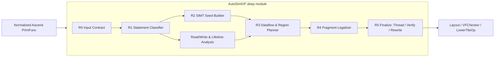

# AutoSimtVF Stage 1 设计

> 状态：待评审设计稿；本轮不实现 pass 代码。  
> 范围：Ascend 950 代际的 SimtVF 自动划分，blockify、二维 grid 展平和 SIMD 自动识别不在本 pass 内。  
> 约定：无法由当前源码或日志确认的结论标为 **[不确定]**。

## 1. 需求分析

### 1.1 整体需求

目标是在已经完成 Ascend kernel-frame 规范化的 TileLang TIR 上，识别以 `T.Parallel` 为核心的线程并行计算，自动生成与手写 `T.SimtVF` 等价的 `SIMT_VF` scope。这样可以复用现有 layout inference、`LowerTileOp`、同步插入和 Ascend codegen，使结构清晰的 CUDA TileLang kernel 不再需要手工圈 SimtVF。

三阶段按以下顺序推进：

- **Stage 1：规则划分。** 用确定性静态规则保证语义正确，覆盖 01–06 六个 MHC forward case；不使用 cost model，不引入 SIMD。
- **Stage 2：cost model。** 在 Stage 1 的合法 region 候选上选择是否融合、是否吸收 scalar，以及线程数。
- **Stage 3：SIMD/SIMT/Scalar 混合。** 先支持已知 SIMD region 周围的 Scalar/SIMT 决策，再加入 SIMD region 的自动识别与全局联合选择。

最小变换为：

```python
# 输入
for i in T.Parallel(N):
    out[i] = f(inp[i])

# Stage 1 输出
with T.SimtVF(threads=T_selected):
    for i in T.Parallel(N):
        out[i] = f(inp[i])
```

TIR 输出不是新的执行原语，而是现有 builder 已生成的结构：`SIMT_VF` SBlock、三维 `thread_extent`、`tl.simtvf_scope` 和 `tl.vf_source_index`。现有构造逻辑见 [ir.cc:474](/home/dangy/workspace/tilelang-xy/src/ir.cc:474)。

### 1.2 Stage 1 需求

#### 1.2.1 输入前提

AutoSimtVF 接收 Ascend pipeline 第一次 `Simplify` 后的 `PrimFunc`：

1. kernel launch 已被 `MaterializeKernelLaunch` 转成 Ascend kernel frame；
2. `T.Parallel`、`T.serial`、`tl.tileop.copy/fill/reduce` 尚未被 `LowerTileOp` 展开；
3. `T.Pipelined` 在该位置可能已经表现为带 `num_stages` annotation 的 serial loop；
4. 输入可能已有用户手写 VF，pass 必须保持其内容并具备幂等性；
5. blockify、二维/三维 grid 到一维 grid 的改写由前置规范化完成。

当前 pipeline 在第一次 `Simplify` 后立即运行 `UnrollLoopSkipVF`（[pipeline.py:48](/home/dangy/workspace/tilelang-xy/tilelang/ascend/pipeline.py:48)）。因此 AutoSimtVF 应插在二者之间，使新建 VF 内的 serial loop 能被 `UnrollLoopSkipVF` 正确跳过。

**前置阻塞项**：当前 Ascend DSL 前端会拒绝 `T.Kernel(..., threads=...)` 和多维 grid（[kernel.py:410](/home/dangy/workspace/tilelang-xy/tilelang/language/kernel.py:410)）。要满足“CUDA DSL 原样输入”，需在前端额外完成两项兼容：

- 将 CUDA `threads` 保存为 kernel annotation，例如提议的 `tl.cuda_thread_hint`，不在 Ascend kernel frame 中物化为 `threadIdx`；
- 将多维 grid 展平并重建原 block index 表达式。

这两项是 02/03/04/05 能从原 TileKernels DSL 进入 AutoSimtVF 的必要条件，但不属于本 pass 的 region 划分算法。

#### 1.2.2 功能范围

Stage 1 必须完成：

- 每个受支持的最外层 `T.Parallel` statement unit 都进入且仅进入一个 SimtVF；
- `T.Parallel` 内部的 `T.serial` 原样随宿主进入 VF；
- Parallel 外层的 serial/pipelined loop 留在 MainScalar，递归处理其 body；
- 统一分类 statement role：MTE/Cube 等形成 region boundary，fragment copy/reduce 按数据链与 seed 共址，cast copy 独立建 seed；
- 闭合 fragment 的 allocation、读写、初始化、copy 和 reduction 生命周期；
- 对跨 VF/跨外层 serial 生命周期的 fragment 使用 UB/shared 物化；
- 支持 `T.fill/T.clear` 和限定白名单内的 `T.reduce_sum/T.reduce_max`；
- 对必须做 dtype cast 的非 CV copy 生成 SimtVF copy region；
- 产生稳定、可测试的 thread extent 和 source index；
- 对不支持的结构给出确定的 reason code。

Stage 1 不负责：scalar profitability、loop interchange/fold、寄存器跨 VF 复用、SIMD 识别、跨 Gemm/Cube 融合、CUDA 专用 intrinsic 迁移。

#### 1.2.3 可量化验收标准

1. `mhc_stage1/01`–`06` 的规范化输入均能通过 AutoSimtVF、`LayoutInference`、`VFChecker`、`LowerTileOp` 和 Ascend codegen。
2. 生成 IR 中不存在 VF 外的 `ForKind::kParallel`；当前 `VFChecker` 对此有强制检查（[vf_checker.py:80](/home/dangy/workspace/tilelang-xy/tilelang/ascend/analysis/vf_checker.py:80)）。
3. 每个 `local.fragment` 只属于一个 VF；跨 VF 数据经 UB/shared 传递，且 shape、dtype、region slice 保持一致。
4. 同 dtype、可由 MTE/DMA 执行的 GM↔UB/CV copy 保持在 VF 外；dtype-changing UB↔GM copy 位于 SimtVF。
5. 六个算子在 Ascend 上与各自 PyTorch reference 数值一致，容差采用 case 文件当前定义。
6. 01/03/04 的自动输出与手写 log 做结构性 golden 对比：比较 region 边界、copy 归属、fragment owner 和 control nesting，不要求 `source_index` 名字或线程值逐字相同。
7. 失败路径不得生成半合法 IR；输出 `unsupported reason + source location`。由于 VF 外 Parallel 会被拒绝，“保留原 IR”只能作为明确的编译失败诊断，不能声称已完成 scalar fallback。

### 1.3 Stage 2 需求

Stage 2 保留 Stage 1 的分析摘要和 region 构造器，引入最小 cost model：

- 比较相邻合法 region 的融合/不融合成本；
- 从目标允许的少量 thread 候选中选取线程数；
- 为 Parallel 外的纯 scalar 段生成“留 MainScalar”与“吸收入 SimtVF”候选；
- 对外层 serial 做 fold/interchange/整体吸收候选，减少逐迭代 VF entry；
- 输出候选分数、置信度和回退方案。

cost model 的详细常数可由其他团队提供，但候选接口、特征抽取和校准表版本管理应在 Stage 2 框架中先固定。

### 1.4 Stage 3 需求

Stage 3 分两步：

1. **已知 SIMD region**：保持 SIMD 划分不变，为其前后计算选择 MainScalar 或 SimtVF，并建模 VF call、同步、MTE overlap、UB 与 DCache 占用。
2. **自动 SIMD/SIMT 划分**：对满足 SIMD pattern 的 region 同时生成 SIMD、SIMT、Scalar 候选，做全 kernel 联合决策。

该阶段不能把 Case 16 的单设备、小 payload 结论固化为规则；它只能用于初始化校准表和确定需测特征。

## 2. Stage 分层策略

| 阶段 | 决策依据 | 候选空间 | 核心交付 | 完成标准 |
|---|---|---|---|---|
| Stage 1 | 静态 legality、scope pair、数据依赖、fragment lifetime | MainScalar 控制流 + SimtVF；线程 hint 或 512 | AutoSimtVF 规则 pass 设计与 01–06 覆盖 | 正确编译、正确运行、诊断确定 |
| Stage 2 | Stage 1 legality + latency/resource cost | Scalar/SIMT、融合方案、thread 配置 | Cost Model 1.0 与候选排序器 | 对规则基线无显著回退，低置信度可回退 |
| Stage 3.1 | 已知 SIMD + 混合执行成本 | Scalar/SIMT 围绕固定 SIMD region | 混合 region planner | 正确计入切换、同步、UB/DCache |
| Stage 3.2 | SIMD pattern legality + 全局成本 | Scalar/SIMT/SIMD 联合划分 | 三引擎自动选择 | 典型 MHC/社区算子优于 Stage 2 基线 |

三个阶段共享同一组中间对象：`StatementSummary`、`StatementClassification`、`DependenceGraph`、`RegionPlan`、`FragmentLegalizationPlan`。Stage 1 用确定性策略选择 region；Stage 2/3 只重选 policy boundary 或增加 execution domain，不重复实现 IR 分析与 rewrite。

## 3. Stage 1 实现方案

### 3.1 Stage 1 规则集

#### 3.1.1 组织原则与术语

规则按 Pass 的运行顺序组织；statement 类型差异只在 R1 分类一次，后续规则直接消费分类结果，不再重复判断 copy、reduce 或边界类型。

```text
R0 输入契约
  → R1 Statement 分类
  → R2 SIMT seed 构造
  → R3 Region 成形
  → R4 Fragment 合法化
  → R5 线程配置、验证与提交
```

规范术语如下；跨文档词汇表同步记录在 [CONTEXT.md](/home/dangy/workspace/Private-ascend/CONTEXT.md)：

| 术语 | 定义 |
|---|---|
| **Statement role** | Stage 1 对 statement 的唯一分类：`SIMT_SEED`、`SIMT_FUSIBLE`、`REGION_BOUNDARY` 或 `UNSUPPORTED`。 |
| **Statement unit** | 当前 lexical scope 中参与分类和 region 规划的语法单元；最外层 Parallel 连同完整子树只构成一个 unit。 |
| **SIMT seed** | 必须建立 SimtVF 的最小初始单元；多个 seed 可在 R3 中融合。 |
| **Region boundary** | SimtVF 不能跨越的位置；分为不可改变的 hard boundary 和 Stage 2 可重选的 policy boundary。 |
| **MustCoLocate** | 某个 seed 与相关 fusible statement 必须位于同一 VF 的约束。普通数据依赖不自动等价于 MustCoLocate。 |
| **Fragment version** | 一次 fragment 定义及其到下一次覆盖前的 uses 所构成的逻辑值版本。 |
| **Fragment escape** | fragment version 的 def/use 跨越 R3 已固定的 partition，需要由 R4 显式 shared 化的状态。 |

Stage 1 只要求四个全局不变量：所有 seed 恰好属于一个 VF 且不嵌套；region 是同一 lexical scope 内的连续区间；每个 fragment version 只有一个 VF owner 或已显式 shared 化；PrimFunc 转换为 all-or-nothing。

#### R0：输入契约与已有 VF 保持

1. 输入必须是 Ascend `PrimFunc`，kernel frame 和一维 grid 已规范化；CUDA thread hint 若存在，已保存为静态 kernel annotation。当前前端对此仍需兼容改造（[kernel.py:410](/home/dangy/workspace/tilelang-xy/tilelang/language/kernel.py:410)）。
2. 已有 `SIMT_VF`/`SIMD_VF` 作为 opaque scope 原样保留，不进入内部建 seed，也不与自动 region 融合；因此重复运行 Pass 保持幂等。
3. 分析表示中将 `T.clear` 统一视为 `T.fill(buf, 0)`，但不提前执行 LowerTileOp（[fill_op.py:48](/home/dangy/workspace/tilelang-xy/tilelang/language/fill_op.py:48)）。
4. 仍含多维 grid、显式 CUDA thread role 或 CUDA/PTX intrinsic 的输入不满足契约，直接诊断，不进入 region 规划。

#### R1：Statement role 统一分类

R1 是 statement 语义分类的唯一来源。分类对象是当前 lexical scope 中的 **statement unit**，而不是每个 AST 子节点：visitor 一旦命中最外层 Parallel，就把完整子树作为一个 unit；对子树内部只递归做 legality 和 read/write 摘要，不再次参与 role 分类。每个 unit 恰好属于以下四类之一：

| Role | 包含内容 | Stage 1 行为 |
|---|---|---|
| `SIMT_SEED` | 最外层 `T.Parallel` 子树；受支持的非 L1 `T.fill/T.clear`；dtype-changing UB↔GM copy/store | 建立最小 SimtVF seed |
| `SIMT_FUSIBLE` | fragment allocation；fragment↔UB/GM copy；与 seed 存在必要数据链的白名单 reduce 及其状态 | 由 R3 判断是否吸收到相关 seed |
| `REGION_BOUNDARY` | hard boundary：MTE/CV copy、Gemm/Cube、engine sync、L1 zero-fill、已有 VF；policy boundary：Parallel 外 scalar，以及 serial/pipelined/if 控制节点 | 保持 VF 外；控制节点的 body/branch 作为子 lexical scope 递归分析，policy boundary 在 Stage 2 才可重选 |
| `UNSUPPORTED` | 未列入闭集的 copy/scope pair、reduce、barrier、opaque/atomic、`T.Persistent` 等 | 返回带 source location 的诊断 |

已知 SIMT-local barrier 若位于 Parallel seed 内，作为 seed body 原样保留；其它同步指令按 hard boundary 或 `UNSUPPORTED` 处理，不能从 Parallel body 中移出。

##### Copy 的三类闭集

| Copy 类别 | 精确定义 | Statement role |
|---|---|---|
| `FRAGMENT_DATAFLOW` | fragment↔UB/GM，包括受支持的 dtype cast | `SIMT_FUSIBLE`，与对应 fragment version/seed 共址 |
| `SIMT_CAST` | 非 L0C 特例的 dtype-changing UB↔GM copy，或等价 direct store | `SIMT_SEED`，独立建 seed |
| `ENGINE_BOUNDARY` | 同 dtype GM↔UB，以及 GM→L1、L1→L0A/B、L0C→UB/GM、UB→L1/NZ 中可由 DMA/CV 完整 lowering 的 copy | `REGION_BOUNDARY(hard)`，留在 VF 外 |

为消除 scope 重叠，判定优先级固定为：① GM→L1、L1→L0A/B、L0C→UB/GM、UB→L1/NZ 等专用硬件路径；② 除 L0A/B/C、L1/NZ 外的普通 fragment endpoint；③ dtype-changing UB↔GM；④ 剩余同 dtype GM↔UB；未命中即 `UNSUPPORTED`。其中“完整 lowering”同时检查 scope、dtype、`BufferRegion`、stride/contiguity 和 predicate，不能只看 `GetDMAPath`；当前 MTE 不能表示任意 ND copy（[ascend_mte_plan.h:250](/home/dangy/workspace/tilelang-xy/src/ascend/op/ascend_mte_plan.h:250)）。`VFChecker` 对 VF 外 cast copy/store 的限制见 [vf_checker.py:90](/home/dangy/workspace/tilelang-xy/tilelang/ascend/analysis/vf_checker.py:90)。

白名单 reduce 当前仅包含六个目标 case 使用的 `float32 reduce_sum/reduce_max`、静态 axis 和可解析输入输出 region。reduce 必须连接到一个 seed；孤立或不满足白名单的 reduce 为 `UNSUPPORTED`。Ascend lowering 使用 `AscendAllReduce`（[reduce.cc:19](/home/dangy/workspace/tilelang-xy/src/ascend/op/reduce.cc:19)）。

#### R2：构造最小 SIMT seed

1. 每个没有 Parallel ancestor 的最外层 `T.Parallel` 子树形成一个 seed；其内部 serial、if、scalar 和内层 Parallel 全部属于 seed body，不再单独建 seed。`Parallel → serial → Parallel` 因此只生成一个 VF。
2. Parallel 外受支持的非 L1 `T.fill/T.clear` 和 `SIMT_CAST` 各形成一个独立 seed；相邻 seed 是否融合只由 R3 决定。
3. Parallel 外的 serial/pipelined/if 只建立 lexical scope，递归分析其 body/branch；控制节点本身和独立 scalar 留在 MainScalar。
4. seed 是不可拆语法单元。若其内部包含 hard boundary 或 `UNSUPPORTED` statement，整个 PrimFunc 失败，禁止通过移动内部 statement 来规避。

Parallel 的逻辑 extent 与 VF thread 数独立；后续 layout lowering 负责逻辑迭代到 thread/slot 的映射，不要求 `product(extent) == threads`。

#### R3：数据流闭包与 region 成形

##### 数据流分析

| 分析对象 | 复用能力 |
|---|---|
| 普通 TIR 读写 | `GetSBlockReadWriteRegion` 或等价摘要 |
| TileLang copy/fill/reduce | `MemoryAccessDetector` 的 intrinsic 语义（[memory_detector.h:27](/home/dangy/workspace/tilelang-xy/src/ascend/transform/auto_schedule/memory_detector.h:27)） |
| alias/region conflict | `buffer->data` storage key 和 `RegionsMayConflict` 的保守判定（[dependency_analysis.cc:165](/home/dangy/workspace/tilelang-xy/src/ascend/transform/auto_schedule/dependency_analysis.cc:165)） |
| scalar/control/effect | synthetic dependency edge |

能力边界和复用取舍见 [tvm_dataflow_instruction_dag_research.md](/home/dangy/workspace/Private-ascend/mhc/tvm_dataflow_instruction_dag_research.md)。数据依赖只用于保持顺序；只有 fragment owner、seed 内 lane-private state、reduce state 等明确白名单关系建立 MustCoLocate。

##### Region 成形算法

1. 以 lexical scope 和 `REGION_BOUNDARY` 切出 windows，每个 seed 初始为一个 region。
2. 只在同一 window 内建立 MustCoLocate 边；沿边吸收 `SIMT_FUSIBLE` statement，并取包含闭包的最小连续 AST interval，不泛化地吸收所有 producer/consumer。没有可关联 seed 的 fusible unit 直接诊断。
3. fragment def-use 跨 window 时记录 `FragmentEscape` 交给 R4；其它原本需要共址、却被 boundary 分开的关系直接诊断。连续凸包含 boundary 同样非法。
4. 两个 region 重叠，或相邻且并集不含 boundary 时自动融合。相邻 Parallel 融合是本算法的结果，不再单列融合规则。

shared hazard 若能由后续 `ThreadSync` 表达，只在 plan 中标记 `requires_barrier`；否则诊断。R3 输出唯一的 Stage 1 partition，不比较收益，也不根据尚未得到的最终 layout/register cost 反向拆分 region。

#### R4：跨 region fragment 合法化

R4 只处理 R3 已确定 partition 后的 fragment escape，不重新选 region：

| Fragment version 状态 | 确定处理 |
|---|---|
| 全部 def/use 位于一个 region | allocation 归属该 VF，不物化 |
| 跨 region，且跨区消费 op 可保持相同 index/dtype/predicate 直接访问 shared | 在最小共同 MainScalar scope 建 shared backing；可重写的 def/use 直接访问 shared，仍需 fragment 的 owner 按精确 live-in/live-out 插 transfer；Case 03 使用此路径 |
| 跨 region，且任一跨区 op/layout 必须使用 fragment | 建 shared backing，并在每个需要 fragment 的 VF 内建 fresh fragment；按精确 live-in/live-out `BufferRegion` 插入 shared↔fragment copy |
| 无法证明 region、predicate 或 partial write 等价 | `fragment_materialization_unsupported` |

backing 保持逻辑 shape、可观察 stride/index mapping 和累加 dtype；transfer 必须保持 predicate、partial definition、read-modify-write 和动态 extent。原 fragment→GM normal copy 能与 owner 共址时保持 direct copy，不强制 shared 中转。shared handoff 后的 reduce 固定使用 shared→fragment→reduce 路径，并必须通过 U4 测试后才算覆盖 Case 06。

R4 生成的 transfer 只能附着到既有 region/boundary；它可以增加 `requires_barrier`，但不能改变 partition，因此不需要 fusion/materialization fixpoint。每个 fragment version 单 VF owner 是 AutoSimtVF 自身的强不变量，现有 `VFChecker` 只能覆盖其中一部分（[vf_checker.py:57](/home/dangy/workspace/tilelang-xy/tilelang/ascend/analysis/vf_checker.py:57)）。

#### R5：线程配置、验证与提交

##### 线程配置

| 输入 | Stage 1 决策 |
|---|---|
| 有合法静态 kernel thread hint | 所有自动 VF 使用该一维 extent |
| 无 hint | 按需求使用一维 `threads=512` |
| hint 非法或超过 target hard limit | `invalid_thread_hint` |

Stage 1 不枚举 128/256/512；候选线程及 layout/register cost 属于 Stage 2。`thread_extent` 是线程数的唯一事实来源，`tl.vf_source_index` 按 PrimFunc lexical order 确定性分配。硬件上限及 warp 约束见 [thread_architecture.md:14](/home/dangy/workspace/asc-devkit/docs/zh/guide/programming_guide/programming_model/ai_core_simt_programming/thread_architecture.md:14) 和 [thread_architecture.md:58](/home/dangy/workspace/asc-devkit/docs/zh/guide/programming_guide/programming_model/ai_core_simt_programming/thread_architecture.md:58)。

##### 验证与提交

1. 在改写前验证 seed 覆盖、region 连续性、boundary、fragment owner/materialization 和 thread extent。
2. 验证成功后一次性应用 fragment legalization，再从内到外包裹 SimtVF；任一错误均不提交部分结果。
3. 成功返回 transformed PrimFunc；失败返回 `Diagnostic{reason, source_location, recoverability, suggestion}`，并停止该 PrimFunc 的 Ascend 编译。
4. 改写后再次运行 AutoSimtVF verifier 和正式 `VFChecker`；重复运行 AutoSimtVF 必须 structural equal。

当前没有 Parallel scalarization fallback。失败时保留原 PrimFunc 只用于诊断，不能作为合法编译结果继续 lowering。

### 3.2 输入输出伪代码

以下代码展示变换语义，省略 source index、reads/writes 和 layout metadata。

#### Case 1：单 Parallel

```python
# 输入
for i in T.Parallel(N):
    a[i] = b[i] + c[i]

# 输出
with T.SimtVF(threads=512):
    for i in T.Parallel(N):
        a[i] = b[i] + c[i]
```

#### Case 2：相邻 Parallel 与 fragment normal copy

题目原输出删除了 `a→a_shared`、`e_shared→e`，并把第二段的 `e[i]` 改为 `a[i]`，不保持语义。正确变换必须保留 copy；输入还需包含 `e` 的 fragment allocation。

```python
# 输入
a, b, c, e, d = alloc_fragments(...)
T.copy(b_shared, b)
T.copy(c_shared, c)
for i in T.Parallel(N):
    a[i] = b[i] + c[i]
T.copy(a, a_shared)
T.copy(e_shared, e)
for i, j in T.Parallel(N, K):
    d[i, j] = e[i] + 1

# 输出：所有 copy 都是 fragment↔shared normal copy，可形成一个合法 region
with T.SimtVF(threads=512):
    a, b, c, e, d = alloc_fragments(...)
    T.copy(b_shared, b)
    T.copy(c_shared, c)
    for i in T.Parallel(N):
        a[i] = b[i] + c[i]
    T.copy(a, a_shared)
    T.copy(e_shared, e)
    for i, j in T.Parallel(N, K):
        d[i, j] = e[i] + 1
```

如果 `a_shared` 后面紧接 shared→GM MTE consumer，则 VF 在该 MTE copy 前结束；不能删除 `a→a_shared`。

#### Case 3：fragment→shared→fragment round-trip

```python
# 输入
for i in T.Parallel(N):
    a[i] = b[i] + c[i]
T.copy(a, a_shared)
T.copy(a_shared, a)
for i, j in T.Parallel(N, K):
    d[i, j] = a[i] + 1

# 输出：无外部 MTE/Cube consumer 时保留在同一 VF
with T.SimtVF(threads=512):
    for i in T.Parallel(N):
        a[i] = b[i] + c[i]
    T.copy(a, a_shared)
    # shared RAW 若不是 same-lane，由后续 ThreadSync 插 barrier
    T.copy(a_shared, a)
    for i, j in T.Parallel(N, K):
        d[i, j] = a[i] + 1
```

Stage 1 不删除 round-trip。若 `a_shared` 被 MTE/Cube/其它 region 观察，则由 R3 在对应 boundary 处分区，再由 R4 为第二个 VF 选择 direct shared access 或 fresh fragment reload。

#### Case 4：跨外层 serial 的 fragment

```python
# 输入
al = T.alloc_fragment((N,), T.float32)
T.clear(al)
for i in T.serial(M):
    for j in T.Parallel(N):
        al[j] += b[j] + c[i, j]
T.copy(al, out)

# 输出：shared 保存跨 entry 的 float32 累加状态
al_state = T.alloc_shared((N,), T.float32)
with T.SimtVF(threads=512):
    al0 = T.alloc_fragment((N,), T.float32)
    T.clear(al0)
    T.copy(al0, al_state)

for i in T.serial(M):
    with T.SimtVF(threads=512):
        al_i = T.alloc_fragment((N,), T.float32)
        T.copy(al_state, al_i)
        for j in T.Parallel(N):
            al_i[j] += b[j] + c[i, j]
        T.copy(al_i, al_state)

T.copy(al_state, out)  # 同 dtype 时为 VF 外 MTE；不同 dtype 时执行 Case 6
```

#### Case 5：reduce 与消费 Parallel

```python
# 输入：外层算法迭代保留在 MainScalar
for _ in T.serial(repeat - 1):
    T.reduce_sum(comb_frag, row_sum, dim=2)
    for i, j, k in T.Parallel(tb, hs, hs):
        comb_frag[i, j, k] /= row_sum[i, j] + eps

# 输出：comb_state 跨迭代保存；reduce 与 consumer 同一 VF
for _ in T.serial(repeat - 1):
    with T.SimtVF(threads=512):
        comb_frag = T.alloc_fragment((tb, hs, hs), T.float32)
        row_sum = T.alloc_fragment((tb, hs), T.float32)
        T.copy(comb_state, comb_frag)
        T.reduce_sum(comb_frag, row_sum, dim=2)
        for i, j, k in T.Parallel(tb, hs, hs):
            comb_frag[i, j, k] /= row_sum[i, j] + eps
        T.copy(comb_frag, comb_state)
```

同一 serial iteration 中连续的行、列归一化若使用相同 fragment 且没有 region boundary，应由 MustCoLocate closure 放入同一个 VF，避免不必要的 shared handoff。

#### Case 6：dtype-changing UB→GM copy

```python
# 输入：os 为 float32，o 为 bfloat16
T.copy(os, o)

# 输出：DMA 不能 cast，copy 自身成为 SIMT seed
with T.SimtVF(threads=512):
    T.copy(os, o)
```

#### Case 7：Parallel 内 serial

```python
# 输入
for i in T.Parallel(N):
    acc = init[i]
    for k in T.serial(K):
        acc += a[k, i] * b[k, i]
    out[i] = acc

# 输出：serial 是每 lane 私有链，原样保留
with T.SimtVF(threads=512):
    for i in T.Parallel(N):
        acc = init[i]
        for k in T.serial(K):
            acc += a[k, i] * b[k, i]
        out[i] = acc
```

### 3.3 Pass 设计结构

#### 3.3.1 Pipeline 位置

```text
MaterializeKernelLaunch
  → ...
  → Simplify                       # pipeline.py:48
  → AutoSimtVF                     # 新增
  → UnrollLoopSkipVF               # pipeline.py:52
  → Simplify
  → LayoutReducer / LayoutInference
  → InsertNd2Nz
  → VFChecker
  → AutoSchedule / LowerTileOp / codegen
```

选择这个位置的理由：输入 IR 与 `*_tvm.log` 的 “09 After Simplify” 一致；新 VF 已建立，Unroll pass 可识别其边界；layout、VFChecker 和 copy lowering 都消费最终 region 结构。

#### 3.3.2 外部 seam 与内部 workflow

AutoSimtVF 应是一个 deep module。调用者和端到端测试只依赖一个外部 interface：

```text
AutoSimtVF(config)(PrimFunc) → transformed PrimFunc | structured Diagnostic
```

R0–R5 是该 module 的私有 workflow，不应暴露成要求调用者逐步驱动的多个浅 interface。R 编号表达执行顺序，而不是 statement 类型；copy/reduce 等类型差异全部封装在 R1 分类器中。前端的 grid/thread-hint 规范化是上游输入契约，不作为 AutoSimtVF 内部的“假 adapter”。



规则与内部阶段一一映射：

| 规则 | 私有阶段 | 输入 | 输出 |
|---|---|---|---|
| R0 | Input Contract Validator | PrimFunc / kernel attrs | `ValidatedFunction` 或诊断 |
| R1 | Statement Classifier | validated AST | 节点摘要及 statement-unit classification |
| R2 | SIMT Seed Builder | classifications / lexical tree | `SimtSeed[]` |
| R3 | Dataflow & Region Planner | seeds / summaries / dependence graph | 唯一 `RegionPlan[]` + fragment escapes |
| R4 | Fragment Legalizer | regions / fragment versions / escapes | `FragmentLegalizationPlan[]` |
| R5 | Finalizer | 完整 plan / thread hint / 原 PrimFunc | 新 PrimFunc 或结构化诊断 |

依赖图、copy/reduce 细分和 target query 是实现内部 seam。只有未来存在第二种实际 target capability 实现时，才将其提升为独立 adapter；Stage 1 不为单一实现预先暴露额外 interface。

#### 3.3.3 建议数据结构

```cpp
enum class ExecutionDomain { kMainScalar, kSimt, kMte, kCv, kExistingVF };
enum class StatementRole {
  kSimtSeed, kSimtFusible, kRegionBoundary, kUnsupported
};
enum class BoundaryKind { kNone, kHard, kStage1Policy };
enum class CopyClass {
  kNone, kFragmentDataflow, kSimtCast, kEngineBoundary, kUnsupported
};
enum class SeedKind { kParallelSubtree, kFillOrClear, kSimtCast };

struct StatementClassification {
  StatementRole role;
  BoundaryKind boundary_kind;
  std::optional<ExecutionDomain> stage1_domain;  // policy boundary 可在 Stage 2 重选
  CopyClass copy_class;
  EffectKind effect;
  std::optional<RejectReason> reason;
};

struct StatementSummary {
  int node_id;
  Stmt stmt;
  int parent_id;
  StmtKind kind;
  bool is_statement_unit;        // false 表示 Parallel unit 内部节点
  std::optional<int> enclosing_parallel_unit;
  std::vector<BufferRegion> reads, writes;
  std::vector<Var> scalar_reads, scalar_writes;
  std::optional<StatementClassification> classification;  // 仅 statement unit 存在
  std::optional<EngineDetail> engine_detail;  // copy/reduce/CV 的分类证据
};

struct SimtSeed {
  int seed_id;
  int unit_node_id;
  int lexical_scope_id;
  SeedKind kind;
};

struct MustCoLocateEdge {
  int seed_id;
  int fusible_node_id;
  std::optional<BufferRegion> value_region;
};

struct FragmentEscape {
  FragmentVersionId version;
  int producer_region;
  std::vector<int> consumer_regions;
  BufferRegion live_region;
};

struct RegionPlan {
  int parent_id;
  int begin_node, end_node;       // AST 连续区间
  std::vector<int> seed_ids;
  std::vector<int> member_nodes;
  bool requires_barrier;
  std::vector<FragmentVersionId> owned_fragments;
};

struct FragmentTransfer {
  int region_id;
  BufferRegion region;
  PrimExpr predicate;
  TransferDirection direction;
};

struct FragmentLegalizationPlan {
  FragmentVersionId version;
  Buffer original;
  std::optional<Buffer> shared_backing;
  std::vector<Buffer> per_region_fragments;
  std::vector<DirectSharedRewrite> direct_shared_uses;
  std::vector<FragmentTransfer> transfers;
};

struct AutoSimtVFPlan {
  std::vector<RegionPlan> regions;
  std::vector<FragmentLegalizationPlan> fragments;
  ThreadExtent threads;
  ThreadSource thread_source;
};
```

#### 3.3.4 核心算法

```python
def auto_simtvf(func, target, config):
    validated = validate_input_contract(func, target, config)             # R0
    summaries = summarize_and_classify_units(validated, target)           # R1
    seeds = build_simt_seeds(validated, summaries)                         # R2
    graph = build_dependence_and_fragment_versions(summaries)

    regions = []
    fragment_escapes = []
    for lexical_scope in walk_scopes_bottom_up(validated.body):
        colocate_edges = build_must_colocate_edges(
            lexical_scope, seeds, summaries, graph)
        scope_regions, scope_escapes = form_regions_from_seeds(
            lexical_scope, seeds, summaries, colocate_edges, graph)       # R3
        regions.extend(scope_regions)
        fragment_escapes.extend(scope_escapes)

    fragments = legalize_fragment_escapes(
        regions, fragment_escapes, graph, target)                         # R4

    # R5 在局部结果上完成线程选择、验证和改写；全部成功后才返回新 PrimFunc。
    threads, thread_source = select_stage1_threads(validated, target)
    plan = AutoSimtVFPlan(regions, fragments, threads, thread_source)
    verify_complete_plan(func, plan, summaries, target)

    body = apply_fragment_legalization(func.body, plan.fragments)
    body = wrap_regions_bottom_up(body, plan.regions, plan.threads)
    result = func.with_body(body)
    verify_auto_simtvf_result(result, plan)
    return result
```

R3 partition 在进入 R4 前已经固定。R4 只能把 direct shared rewrite 或 fragment↔shared transfer 附着到既有 region/boundary，不能创建 seed、改变 interval 或重新触发融合。因此算法没有 fusion/materialization fixpoint，也不依赖 seed 遍历顺序。

#### 3.3.5 IR 构造细节

pass 不应调用 Python script builder。建议把 [ir.cc:479](/home/dangy/workspace/tilelang-xy/src/ir.cc:479)–515 的公共构造部分抽成 C++ helper：

```text
MakeSimtVFBlock(body, alloc_buffers, [tx, ty, tz], source_index, latency=0)
```

helper 负责：

- 创建 `threadIdx.x/y/z` extent，缺省维为 1；
- 把 `tl.simtvf_scope` 放在线程 extent 内；
- 把 region-owned fragment 附着到 `SIMT_VF.alloc_buffers`；
- 按 PrimFunc lexical order 写入确定性的 `tl.vf_source_index`；
- 保持 span/source location，便于诊断；
- 不复制已有 VF 的 source index。

#### 3.3.6 Pass 后置验证

AutoSimtVF 在事务式提交前验证 plan，提交后再复用正式 `VFChecker`：

1. 所有 Parallel 都有且只有一个 VF ancestor；
2. 不存在嵌套 VF；
3. 每个 fragment version 的 owner 唯一，所有跨 region edge 已合法化；
4. direct shared rewrite 与 transfer 的 `BufferRegion`、predicate、dtype 和版本一致；
5. VF 外无非法 dtype-changing copy/store；
6. VF 内没有 hard `REGION_BOUNDARY` 或 `UNSUPPORTED` statement unit；
7. region interval 连续且 lexical control、statement 顺序保持；
8. source index 唯一且确定，thread extent 合法。

### 3.4 测试与六个目标算子

#### 3.4.1 测试分层

- **规则单测**：每个 R0–R5 至少一个正例、一个拒绝例；statement role、copy 三分类、MustCoLocate 和 fragment escape 使用参数化测试。
- **fragment 合法化单测**：分别覆盖 direct shared rewrite、fresh fragment reload、partial predicate/region 和不能合法化的跨-boundary use。
- **IR golden**：取 01/03/04 `*_tvm.log` 的 09 After Simplify 输入，验证结构输出；golden 对 thread extent 参数化。
- **negative golden**：未知 copy、thread-role serial、fragment escape、nested VF、CV cast 产生稳定 reason code。
- **pipeline 集成**：确认 pass 位于首次 Simplify 与 `UnrollLoopSkipVF` 之间，并通过 LayoutInference/VFChecker。
- **Ascend 端到端**：六个 case 编译、运行、对 PyTorch reference；记录 compiler commit、target、shape、dtype 和 tolerance。
- **幂等性**：`AutoSimtVF(AutoSimtVF(f))` 与一次运行 structural equal。

#### 3.4.2 01–06 覆盖矩阵

| Case | 原始结构 | Stage 1 关键变换 | 主要规则 | 前置/风险 |
|---|---|---|---|---|
| 01 head_compute_mix | 单二维 Parallel，直接 GM | 单 SimtVF | R1/R2/R3/R5 | 日志 golden 为 128，自动规则默认 512 |
| 02 normw_merge | 单 Parallel，直接 GM | 单 SimtVF | R0/R1/R2/R3/R5 | 原 TileKernels 是二维 grid，必须先展平 |
| 03 expand | GM→fragment；外层 serial 包 Parallel | fragment 改为只读 shared；serial 外、每迭代一个 VF | R0/R1/R2/R3/R4/R5 | 原始二维 grid 需展平；以 `auto_simtvf_pass_io.md` 结构为准 |
| 04 post | threads hint；pipelined GM↔UB；fragment；Parallel 内 serial | a/c 跨 tile 值物化 shared；每 tile 一个 VF；内层 serial 保留 | R0–R5 | 当前前端会拒绝 kernel threads，需 hint adapter |
| 05 pre_apply_mix | pipeline；外层 serial 包 Parallel；float32 acc→bf16 output | float32 shared 保存 acc；每 i_mhc 一个 VF；末尾 SIMT cast | R1–R5 | 多次 VF entry；dtype/舍入必须保持 |
| 06 sinkhorn | 多 reduce/Parallel；外层算法 serial；fragment 跨迭代 | float32 shared 保存 comb；初始段一个 VF，每 repeat 迭代一个 VF；reduce+consumer 融合 | R1–R5 | U4 reduce 路径；当前 `06_sinkhorn_fwd.py` 有嵌套 VF，不能直接当 golden |

01/03/04 已有完整 pass log。02/05/06 暂无同等完整的自动输入/手写输出 log，端到端结果仍是验收项而非现状结论。

## 4. Stage 2/3 初步方案

### 4.1 Stage 2：Cost Model 1.0

Cost model 只对通过 Stage 1 legality 的候选排序，不能跨 hard `REGION_BOUNDARY`、改变 lexical scope 或破坏 fragment ownership，也不能把 `UNSUPPORTED` 变成候选。它复用 R1 的 classification：hard boundary 固定，policy boundary 可生成“留 MainScalar”与“吸收入 SimtVF”候选；线程数从 kernel hint 或 `{128, 256, 512}` 等目标允许集合中枚举。

**输入：**

- IR：trip count、动态 shape bucket、op/dtype histogram、依赖链、branch divergence、访问 scope/stride/alignment、reduction；
- candidate：region 数、thread 数 `T`、每线程元素 `q`、`rounds=ceil(N/(T*q))`、tail、VF entry、sync、copy/handoff bytes、峰值 fragment/UB；
- target：SIMT call/sync/reduce 固定成本、opcode throughput、带宽、cache line、寄存器台阶、UB/DCache 预算；
- calibration：compiler/firmware/device 版本和误差范围。

**输出：** region partition、Scalar/SIMT 指派、thread 配置、预测 latency/delta、置信度、主要成本项、回退 candidate。

**决策：**

1. 沿用 Stage 1 的 lexical scope 和 hard boundary 切窗口，把 policy boundary 转为可选决策点；
2. 枚举窗口内合法连续 interval、policy boundary 选择与少量 thread 候选；
3. 用区间 DP/最短路保留 top-K partition；
4. 对 top-K 做较晚 lowering，取得实际 task DAG 和资源估计；
5. 只有预计收益大于“误差上界 + 收益门槛”才替换稳定 Stage 1 baseline，否则保留 baseline 或有限 autotune。

一阶成本可写为：

```text
C_region = C_call + rounds * C_iter(op_DAG, memory, divergence)
         + C_tail + C_sync + C_spill + C_handoff
```

### 4.2 Stage 3：加入 SIMD

Stage 3.1 把已知 SIMD region 当固定节点，在 task DAG 中加入：

- Scalar↔SIMD、SIMT↔SIMD 的 call/sync/handoff；
- MTE 与 VF 的可 overlap 区间；
- UB 静态/动态空间和 SIMT DCache 的共享容量；
- MainScalar、SIMT leader、SIMT redundant 三类 metadata placement。

Stage 3.2 再为满足 pattern 的连续 elementwise/reduce region 生成 SIMD 候选，加入 SIMD 指令依赖链、throughput、执行端口和 issue queue 特征，与 Scalar/SIMT 候选共同排序。

### 4.3 待评审和验证项

| ID | 不确定项 | 对 Stage 1 的影响 | 建议验证 |
|---|---|---|---|
| U1 | kernel thread hint 应在哪个前端阶段保存 | 04/05 与原 DSL 兼容 | 接受 threads 后写 kernel annotation，检查 Materialize 后仍存在 |
| U2 | 二维 grid 规范化归属与接口 | 02/03 原 DSL 进入 pass | 独立 kernel-frame adapter golden |
| U3 | 默认 512 在六个 case 的编译资源上限 | 可能 register/fragment 超限 | 扫 128/256/512，Stage 1 规则仍固定 512，失败则回报资源诊断 |
| U4 | sinkhorn reduce 在 shared handoff 形态的完整 lowering | 06 正确性 | 使用 shared→fragment→reduce→fragment→shared 的非嵌套手写版本验证 |
| U5 | pipeline annotation 下物化 buffer 的作用域和双缓冲版本 | 04/05 | 对比 04 手写 log 的 buffer owner 与 schedule dump |
| U6 | UB→GM dtype cast 的尾部 predicate 与动态 shape | 05 输出 | 独立 cast-copy SIMT-seed 测试 |
| U7 | VF 参数、fragment/register/UB 静态预算的公开 validator | late resource 诊断与 Stage 2 cost 特征 | 复用/抽取 AutoSchedule 资源估计接口 |
| U8 | shared round-trip 是否需要 barrier 的精确判定 | Case 3 | 复用 ThreadSync 并增加 same-lane/cross-lane golden |
| U9 | 当前 06 手写文件的 nested SimtVF | 不能作为正确输出依据 | 改为两个同级 VF 后重新生成完整 log |

## 附录 A：MHC Stage 1 案例汇总

Stage 1 交付范围固定为以下 forward kernels：

1. `01_head_compute_mix_fwd.py`
2. `02_normw_merge_fwd.py`
3. `03_expand_fwd.py`
4. `04_post_fwd.py`
5. `05_pre_apply_mix_fwd.py`
6. `06_sinkhorn_fwd.py`

输入/输出结构依据 [auto_simtvf_pass_io.md](/home/dangy/workspace/Private-ascend/mhc_stage1/auto_simtvf_pass_io.md)，serial 决策依据 [auto_simtvf_serial_analysis.md](/home/dangy/workspace/TileKernels/docs/auto_simtvf_serial_analysis.md)，copy/总体分析依据 [auto_simtvf_analysis.md](/home/dangy/workspace/TileKernels/docs/auto_simtvf_analysis.md) 与 [auto_simtvf_analysis_trae.md](/home/dangy/workspace/TileKernels/docs/auto_simtvf_analysis_trae.md)。

Stage 1 完成定义：六个规范化 CUDA 输入无需手写 SimtVF 即可得到合法 Ascend IR，并在目标设备上通过现有 reference correctness test；任何未覆盖输入产生稳定诊断，不生成可能误编译的 region。
