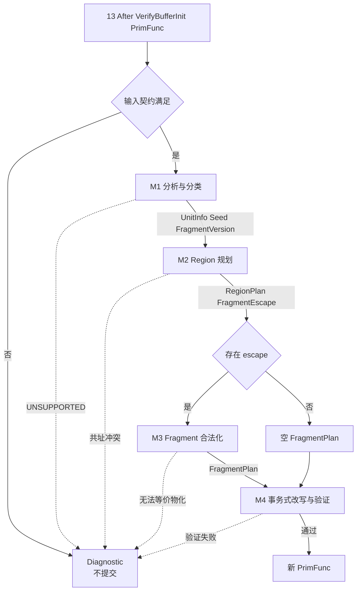
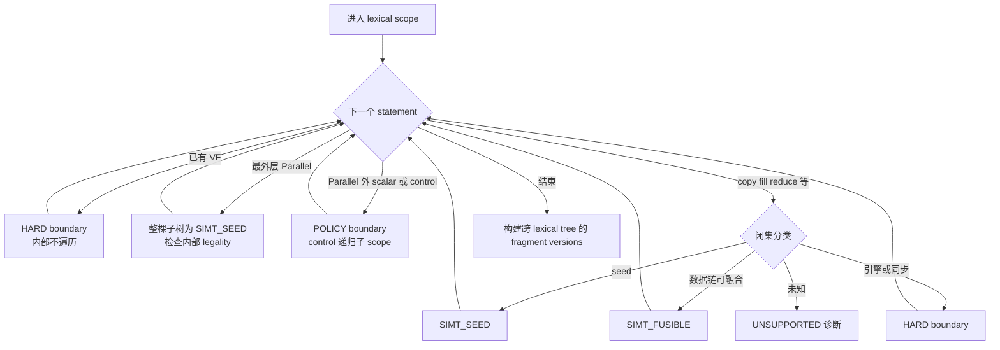
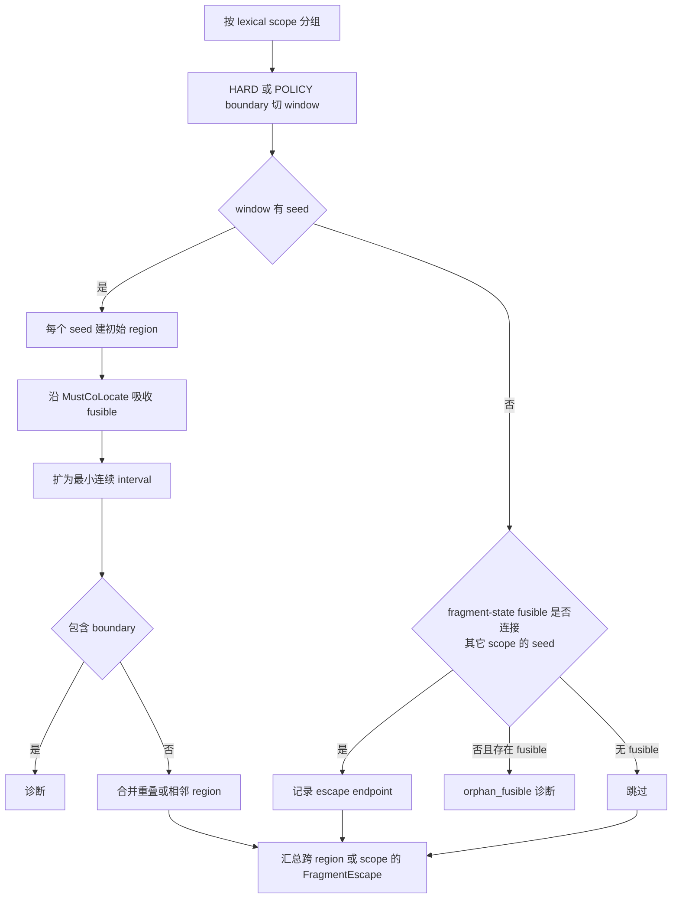
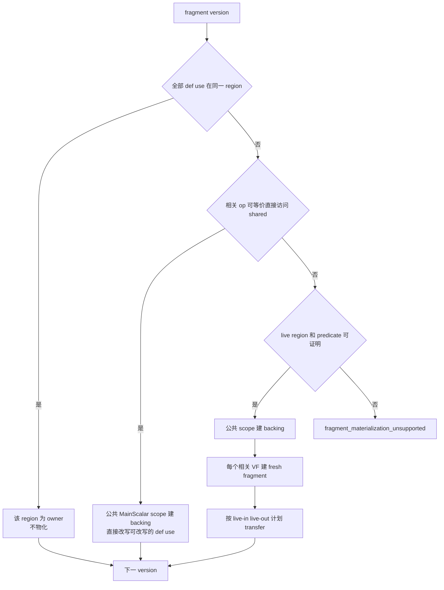
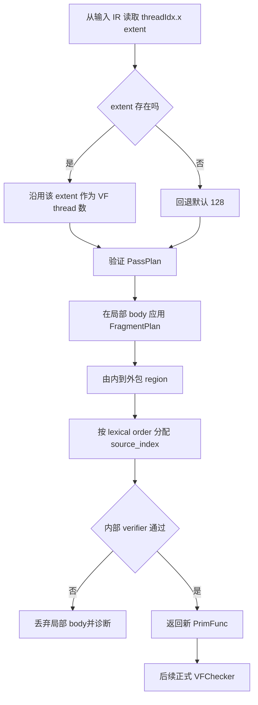

# AutoSimtVF Pass Stage1 轻量实现设计

> 依据：[AutoSimtVF_design.md](/home/dangy/workspace/Private-ascend/mhc_stage1/AutoSimtVF_design.md)、[auto_simtvf_pass_io.md](/home/dangy/workspace/Private-ascend/mhc_stage1/auto_simtvf_pass_io.md)；结构参考：[设计文档写作参考.md](/home/dangy/workspace/Private-ascend/mhc_stage1/设计文档写作参考.md)。  
> 本文服务于快速实现和验证。文中的模块名、函数名均为伪代码称谓，不声明代码库已有同名接口。

## 1. 目标与范围

AutoSimtVF 在规范化后的 Ascend TileLang TIR 上，以 `T.Parallel` 为核心规划连续 SimtVF region，并生成与手写 `T.SimtVF` 等价的 `SIMT_VF` SBlock。输出继续交给现有 layout、`VFChecker`、`LowerTileOp` 和 codegen。

| 范围 | Stage1 处理 |
|---|---|
| 做 | Parallel 子树入 VF；外层 serial/pipelined/if 保持；fill/clear 与 cast 建 seed；fragment copy/reduce 按数据链融合；跨 region fragment shared 化；确定性 thread/source index；失败不提交 |
| 不做 | cost model、SIMD、scalar profitability、loop interchange/fold、通用重排、跨 Gemm/Cube 融合、CUDA intrinsic 迁移、Parallel scalarization、多维 grid 展平 |

核心实现可以控制在几百行量级，条件是复用现有读写分析、copy lowering 能力查询、VF 构造逻辑和 `VFChecker`。若从零实现通用 alias、任意动态 `BufferRegion` 或 predicate 等价证明，则不再是轻量 Stage1。

## 2. Pipeline 位置与输入输出 IR

### 2.1 Pipeline 位置


该位置上 Parallel、serial、copy/fill/reduce 尚未展开；新建 VF 又能在 unroll 前成为明确边界。插入点对应 [pipeline.py](/home/dangy/workspace/tilelang-xy/tilelang/ascend/pipeline.py) 中 `VerifyBufferInit`(13) 与 `UnrollLoopSkipVF`(14) 之间。

### 2.2 输入 IR / 输出 IR

| 项目 | 约束或变化 |
|---|---|
| 输入 | 13 After VerifyBufferInit 的 Ascend `PrimFunc`；`launch_thread("blockIdx.x/y/z")` 与 `launch_thread("threadIdx.x/y/z")` 已物化，thread 数直接从 `threadIdx.x` extent 读取 |
| 已有 VF | 作为 opaque hard boundary 原样保留，只跳过其内部，不跳过 sibling statement |
| 输出 | 连续 region 包入 `SIMT_VF`；包含 `threadIdx.x/y/z`、`tl.simtvf_scope`、确定性 `tl.vf_source_index` |
| Fragment | region-owned allocation 移入 VF；跨 region/scope 的值经 shared backing 与精确 transfer 传递 |
| VF 外 | MTE/CV、Gemm/Cube、engine sync、L1 zero-fill 和外层 scalar control 保持原顺序 |
| 失败 | 返回带位置的诊断，不返回半合法改写 |

指定 IO 文档中可直接做结构 golden 的三个 case：

| Case | 输入特征 | 输出要点 |
|---|---|---|
| 01 | 二维 Parallel nest，直接读写 GM | 完整 Parallel 子树进入一个 VF |
| 03 | GM→fragment；`for m` 包 Parallel | fragment 改 shared；GM→shared 留外；每次 serial 迭代建 VF 并直接读 shared |
| 04 | pipelined serial、GM↔UB、多个 fragment、Parallel 内 serial | GM↔UB 留外；shared↔fragment 与计算入 VF；a/c 用外层 shared 保存并逐 VF reload |

## 3. Pass 整体结构

### 3.1 主流程



调用方只依赖一个 Pass interface：`PrimFunc → PrimFunc 或编译诊断`。四个一级模块均为同一 implementation 内的私有步骤。

### 3.2 模块划分

| 一级模块 | 二级职责 | 对应规则 |
|---|---|---|
| M1 分析与分类 | 输入检查；statement-unit visitor；copy/reduce 分类；seed、读写与 fragment version | R0–R2 |
| M2 Region 规划 | lexical window；MustCoLocate；连续区间；fragment escape | R3 |
| M3 Fragment 合法化 | fragment owner；direct-shared；per-region fragment/transfer | R4 |
| M4 事务式改写与验证 | thread/source index；fragment rewrite；VF 包裹；verifier | R5 |

建议仅保留“一处 Pass 入口 + 一份 per-PrimFunc 状态 + 四个私有步骤”，不为每种 copy、reduce 或规则建立类层级。

### 3.3 最小共享数据

```text
Role       = SIMT_SEED | SIMT_FUSIBLE | REGION_BOUNDARY | UNSUPPORTED
Boundary   = NONE | HARD | STAGE1_POLICY
CopyClass  = NONE | FRAGMENT_DATAFLOW | SIMT_CAST | ENGINE_BOUNDARY | UNSUPPORTED
UnitInfo   = {stmt, scope, order, role, boundary, copy_class, reads, writes, location}
Seed       = {unit_id, scope, kind}
RegionPlan = {scope, begin, end, seed_ids, member_ids, owned_fragments}
FragmentEscape = {version, producer_site, consumer_sites, live_region}
FragmentPlan   = {version, shared_backing, local_fragments, transfers, rewrites}
PassPlan       = {regions, fragment_plans, thread_extent}
```

Stage1 不建立通用 fusion/DAG 框架；普通依赖只保序，只有 fragment owner、lane-private state 和白名单 reduce state 等明确关系生成 MustCoLocate。

## 4. 模块详细设计

### 4.1 M1：分析与分类

**职责**：校验输入；按 lexical scope 收集 statement unit；聚合读写/effect；唯一确定 role；建立 seed 和 fragment version。最外层 Parallel 连同完整子树是一个 unit，内部仅做 legality 与读写检查。

**输入 / 输出**：规范化 `PrimFunc` → `UnitInfo[]`、`Seed[]`、fragment version 摘要，或首个诊断。

**核心流程**



Copy 是三类闭集，按下表首个命中项返回：

| 顺序 | 条件 | 分类 / role |
|---|---|---|
| 1 | GM→L1、L1→L0A/B、L0C→UB/GM、UB→L1/NZ 等专用路径，可完整 lowering | `ENGINE_BOUNDARY` / boundary |
| 2 | 普通 fragment↔UB/GM，排除上述专用 scope | `FRAGMENT_DATAFLOW` / fusible |
| 3 | dtype-changing UB↔GM 或等价 direct store | `SIMT_CAST` / seed |
| 4 | 同 dtype GM↔UB，可完整 lowering | `ENGINE_BOUNDARY` / boundary |
| 默认 | 未命中或 lowering 条件无法证明 | `UNSUPPORTED` |

完整 lowering 判定至少覆盖 scope、dtype、`BufferRegion`、stride/contiguity 和 predicate，不能只看 scope-pair。

**关键数据结构**：M1 写 `UnitInfo`、`Seed`、fragment access/version。普通 TIR 读写优先复用 `GetSBlockReadWriteRegion` 或等价能力；TileLang intrinsic 优先复用现有 `MemoryAccessDetector` 语义；实际可调用 interface 为【待确认】。

**伪代码**

```text
analyze_function(func):
  units = analyze_scope(func.body)
  versions = build_fragment_versions_over_lexical_tree(units)
  return units, collect_seeds(units), versions

analyze_scope(scope):
  for stmt in direct_children_in_order(scope):
    if existing_vf(stmt): emit_hard_boundary(stmt); continue
    if outermost_parallel(stmt):
      summary = summarize_subtree(stmt)
      if summary.has_unsupported_or_hard_effect: fail_at(stmt)
      emit_unit(stmt, SIMT_SEED, summary); continue
    if outside_scalar_or_control(stmt):
      emit_policy_boundary(stmt)
      for child_scope in child_scopes(stmt): analyze_scope(child_scope)
      continue
    c = classify_copy_fill_reduce_or_other(stmt)
    if c.role == UNSUPPORTED: fail(c.reason, stmt.location)
    emit_unit(stmt, c, summarize(stmt))
```

**边界与异常**

- 已有 VF 只跳过自身；其 sibling 仍分析。Parallel 内含 hard boundary 时整棵 seed 非法。
- 非 L1 fill/clear 是 seed；L1 zero-fill、Gemm/Cube、engine sync 是 hard boundary。
- reduce 先只支持目标 case 的 float32 sum/max、静态 axis、可解析 region；其它诊断。

**最小测试点**

- 单 Parallel 和 `Parallel → serial → Parallel` 均只有一个 seed；
- fill/clear、UB↔GM cast 独立建 seed；copy 三分类与默认拒绝全覆盖；
- 已有 VF 前后 sibling 可继续变换；Parallel 内 boundary 稳定拒绝。

### 4.2 M2：Region 规划

**职责**：boundary 先切 window；以 seed 建 region；沿 MustCoLocate 吸收 fusible unit；取最小连续 interval；合法即合并；记录 fragment escape。

**输入 / 输出**：`UnitInfo[]`、`Seed[]`、fragment versions → `RegionPlan[]`、`FragmentEscape[]`，或共址冲突诊断。

**核心流程**



**关键数据结构**

- `RegionPlan` 是同一 lexical scope 内的 `[begin,end]` 连续区间，禁止带洞。
- MustCoLocate 只在同一 window 建立；普通 RAW/WAR/WAW 不自动共址。
- Case 03 的 GM→fragment producer 虽不在 seed window，但与子 scope seed 的 fragment version 相连，应记录 escape endpoint，而不是当成孤立 fusible 拒绝。

**伪代码**

```text
plan_regions(scopes, units, seeds, versions):
  for scope in scopes_bottom_up:
    for window in split_at_boundaries(units[scope]):
      if no_seed(window):
        for fusible in window:
          if belongs_to_fragment_version(fusible) and
             version_reaches_any_seed(fusible, versions): mark_escape_endpoint(fusible)
          else fail("orphan_fusible", fusible.location)
        continue

      local = one_region_per_seed(window)
      for edge in whitelisted_must_colocate(window, versions):
        region_of(edge.seed).include(edge.fusible)
      expand_each_to_continuous_interval(local)
      if any_interval_contains_boundary(local): fail("region_crosses_boundary")
      regions += merge_overlapping_or_adjacent(local)

  return regions, collect_fragment_escapes(versions, regions, escape_endpoints)
```

Stage1 不枚举候选、不打分，也不在 fragment materialization 后反向拆分 region。

**边界与异常**

- region 不跨 lexical scope；外层 serial 每次迭代执行 body 中的 VF。
- policy boundary 在 Stage1 与 hard boundary 一样切 window，Stage2 才可重选。
- 非 fragment 的 MustCoLocate 跨 boundary 直接诊断；shared hazard 的同步责任为【待确认】。

**最小测试点**

- 01 单 region；相邻 Parallel 无 boundary 融合、有 MTE boundary 分离；
- 04 的 VF 位于 pipelined serial body；reduce 与消费 Parallel 共址；
- 03 producer 形成 escape endpoint；真正孤立的 fragment copy 被拒绝。

### 4.3 M3：Fragment 合法化

**职责**：在固定 partition 上确定 fragment version owner；跨 region/scope 时生成 direct-shared 或 per-region fragment/transfer plan，不改变 region。

**输入 / 输出**：regions、escapes、精确 def/use `BufferRegion` → `FragmentPlan[]`，或物化诊断。

**核心流程**



**关键数据结构**：`FragmentPlan` 保存 backing 的 shape/dtype/可观察 stride-index mapping、per-region fragment、transfer 方向、`BufferRegion` 和 predicate；累加状态保持累加 dtype。

**伪代码**

```text
legalize_fragments(regions, escapes, versions):
  for version in versions:
    owner = single_region_containing_all_defs_and_uses(version)
    if owner: assign_owner(version, owner); continue

    common = nearest_common_main_scalar_scope(version)
    if all_cross_region_sites_can_use_shared(version):
      plans += direct_shared_plan(version, common); continue

    if not exact_live_regions_and_predicates_known(version):
      fail("fragment_materialization_unsupported", version.location)
    plan = shared_backing_plan(version, common)
    for region in regions_touching(version):
      plan.add_fresh_fragment(region)
      if live_in(version, region):  plan.add_exact_reload(region)
      if live_out(version, region): plan.add_exact_writeback(region)
    plans += plan
  return plans
```

**边界与异常**

- 不得把 partial/predicated write 静默扩大成无条件整 buffer copy。
- normal fragment→GM 能与 owner 共址时保持 direct copy。
- shared handoff 后 reduce 的完整 lowering 为【待确认】；M3 若需改变 partition 则诊断。

**最小测试点**

- 单 region fragment 不物化；03 的 `xl` 走 direct-shared；
- 04 的 a/c 外层保存并逐 VF reload；05 累加 backing 保持 float32；
- 无法证明 partial write 等价时拒绝且不产生改写。

### 4.4 M4：事务式改写与验证

**职责**：选择 thread extent；先应用 fragment plan，再由内到外包 region；验证完整结果后一次性返回新 `PrimFunc`。

**输入 / 输出**：原 `PrimFunc`、`RegionPlan[]`、`FragmentPlan[]` → 新 `PrimFunc` 或诊断。

**核心流程**



**关键数据结构**：`PassPlan` 是唯一 rewrite 输入。发射结构与 IO golden 一致：`SIMT_VF` SBlock、`tl.vf_source_index`、有效 `threadIdx.x`、extent 为 1 的 y/z 维及 `tl.simtvf_scope`。

**伪代码**

```text
rewrite_transactionally(func, plan):
  threads = inherit_threadidx_x_extent(func) or 128
  verify_plan_before_rewrite(func, plan)

  body = apply_fragment_plans_to_copy(func.body, plan.fragment_plans)
  for region in regions_inner_to_outer(plan.regions):
    interval = extract_continuous_interval(body, region)
    interval = attach_owned_fragments(interval, region)
    body = replace_with_simtvf(body, region, interval, threads,
                               next_unused_source_index_in_lexical_order())

  result = func_copy_with_body(func, body)
  verify_parallel_coverage_and_no_nested_vf(result)
  verify_fragment_owners_transfers_and_boundaries(result, plan)
  return result
```

**边界与异常**

- thread 数继承输入 IR 顶层已物化的 `threadIdx.x` extent（即源 kernel 的 blockDim.x），缺失时回退 128——不再使用固定 512，也不依赖 `T.Kernel(threads=...)` 参数（该参数在 Ascend 后端当前无作用，见待确认清单 3/4）。
- 已有 VF 的 source index 不复制、不改写；allocator 先记录已占用值，再按 lexical order 为新增 VF 选择未占用 index。
- 任一前置/后置验证失败都丢弃局部结果；正式 `VFChecker` 仍保留。

**最小测试点**

- 01 输出包含完整 VF/thread/scope 属性；嵌套 lexical scope 无 nested VF；
- 继承 `threadIdx.x` extent；缺失时回退 128；
- 验证失败时原函数不变；重复运行 structural equal。

## 5. Stage1 实现约束

| 约束 | 轻量实现决策 |
|---|---|
| 模块 | 单 Pass、单状态对象、4 个私有步骤；不建策略类、adapter 层或候选框架 |
| 分析 | lexical ordered unit + buffer access + fragment version；不建通用优化 DAG |
| Region | boundary 先切、合法即合并；无 cost model 或 fixpoint |
| Fragment | 仅处理可证明精确 live region/predicate 的路径；否则诊断 |
| Rewrite | plan/rewrite 分离；完整验证后提交；无 scalar fallback |

优先复用 read/write region、TileLang memory effect、alias/region conflict、VF SBlock 构造和正式 `VFChecker`。Stage2/3、grid/thread 前置 adapter、通用 partial/dynamic materialization、未知 copy/reduce/barrier、精确 barrier placement 和资源模型均后置。所谓“占位”必须是明确诊断或已确认的下游处理，不能生成半合法 IR。

## 6. 测试建议

### 6.1 分层

- **单元测试**：构造最小 TIR，测试分类、region、fragment plan、rewrite 和负例诊断；只断言可观察结果，不绑定私有 helper 名称。
- **集成测试**：以 01/03/04 的 13 IR 为输入，AutoSimtVF 后继续通过 unroll、layout、`VFChecker`、`LowerTileOp`；与手写 log 比较 region、copy 归属、fragment owner 和 control nesting。
- **端到端测试**：01–06 编译运行并与各 case 的 PyTorch reference 比较，沿用 case 当前容差；Stage1 不设性能阈值。
- **稳定性测试**：幂等、同输入确定性、reason code 稳定、失败不提交。

### 6.2 模块到用例映射

| 模块 | 测试用例 | 预期验证点 |
|---|---|---|
| M1 | 01；copy 三分类；已有 VF+sibling；未知 reduce/copy | seed；分类优先级；opaque 保持；稳定拒绝 |
| M2 | 01、03、04；相邻 Parallel；reduce+Parallel | 单 region；03 escape endpoint；serial 内 VF；融合与 MustCoLocate |
| M3 | 03 xl；04 a/c；05 float32 acc；partial-write 负例 | direct-shared；reload；dtype；不能证明即拒绝 |
| M4 | 01/03/04 golden；thread 继承；二次运行 | VF 结构、copy 归属、thread 继承、事务性、幂等 |
| 集成 | 01/03/04 的 13 IR | Pipeline 位置正确，后续 Pass 通过 |
| 端到端 | 01–06 | 无 VF 外 Parallel、无 nested VF、数值正确 |

## 7. 待确认清单

1. 【已完成】实现语言 C++、源码目录 `tilelang-xy/src/ascend/transform/`、Pass 注册与接入 pipeline 的三层流程见 [pass注册指南.md](/home/dangy/workspace/Private-ascend/mhc_stage1/docs/pass注册指南.md)。非 Ascend `PrimFunc`：Stage1 判 target 非 Ascend 即原样返回，不改写。
2. 【已确认】`SIMT_VF` SBlock 与 thread binding 的构造在前端 C++ frame `tl.SimtVFFrame`（`tilelang/ascend/language/frame.py` → `_ffi_api.SimtVF`）的 eager 构建期生成，不含可供 transform 直接复用的接口。AutoSimtVF 作为 pipeline 上的 transform，直接用 TIR 构造 API 生成该 block（`launch_thread` + `tl.simtvf_scope` + `tl.vf_source_index`）。目标结构固定，写成 pass 内私有 helper 即可，无需单独评审 interface。
3. 【已确认】不存在专门的 thread hint annotation key。`T.Kernel(..., threads=n_thr)` 的 `threads` 形参在 Ascend 后端当前不产生任何 IR 差异（加与不加 TVMIR 相同），故不依赖它。
4. 【已确认】无 target thread hard limit 查询接口。Stage1 直接继承输入 IR 顶层已物化的 `threadIdx.x` extent（源 kernel 的 blockDim.x），缺失回退 128，取消原“hint 优先 / 无 hint 512”。
5. 【已确认】多维 grid（如 `T.Kernel(T.ceildiv(n, blk_n), T.ceildiv(h, blk_h))`）已被 Ascend 后端支持并物化为 `blockIdx.x/y/z`，无需前置展平 pass；区域规划是 lexical 的，与 grid 维数无关。
6. 【已确认】在 13 After VerifyBufferInit，copy 仍为通用 `T.copy(T.region(src), T.region(dst))`，尚无 MTE/CV 注解（07_gpu.log 中 GM→shared、shared→fragment、fragment→fragment 于此阶段形同）。故无“MTE/CV 完整 lowering 查询”可复用；M1 按 scope-pair（global/shared.dyn/local.fragment）+ dtype + region 形状/stride/predicate 自分类，不满足即 UNSUPPORTED，真正的 MTE/CV 物化发生在下游 LowerTileOp/codegen。
7. 【待确认】`GetSBlockReadWriteRegion` / `MemoryAccessDetector` / region-conflict 的具体可调用接口名未在代码库核实；M1/M2 只需 per-statement 的读写 buffer 集合与冲突判定，现成接口不可用时用最小自实现替代。
8. 【已确认】shared hazard 的 barrier 无需 AutoSimtVF 处理：下游已有 `ThreadSync("shared")` / `ThreadSync("shared.dyn")`（pipeline.py 76/77）。AutoSimtVF 只保证 shared backing 的读写顺序正确。
9. 【部分确认】06 的 `comb_ub→comb_frag`(shared→fragment)→reduce→`comb_frag→comb_ub`(fragment→shared) 链在 06_simt_new.log 中确在同一 SIMT_VF 内，证明该 lowering 链可行。但 06_gpu_new.log 与 06_simt_new.log 除时间戳外完全相同、均含 SIMT_VF（两者编译的都是带 `T.SimtVF` 的 `main`，非 gpu 版 `gpu_mhc_sinkhorn_kernel`），且外层 `threadIdx.x=128` 与 VF `threadIdx.x=256` 不一致。故 06 仍缺无 VF 的干净输入 golden，需用 gpu 版重跑生成 13 IR。
10. 【已确认】partial/dynamic `BufferRegion`：Stage1 只处理可证明等价的静态整 buffer、无 predicate（或全幅静态 predicate）copy/reduce，否则 UNSUPPORTED；不做部分写入的静默扩展。原“默认 512 资源校验与 reason code”随条目 4 取消，仅在实测需要时再补资源校验。
11. 【已确认】完整设计中“无同 window seed 的 fusible 直接诊断”需加 Case 03 例外：连到其它 lexical scope seed 的 fragment-state unit（如 03 的 GM→fragment producer）记 escape endpoint，不当作孤立 fusible 拒绝；该例外已写入 M2 流程。

## 8. 自检结果

- 编号连续，模块统一为 M1–M4；每个模块都有职责、输入输出、Mermaid、数据结构、伪代码、异常和最小测试点。
- Pipeline、statement/copy 分类、region/fragment workflow 与完整设计一致。
- 01/03/04 来自指定 IO；02/05/06 仅作为端到端目标，未伪造 golden。
- 未确认的源码 interface、前端 annotation、同步、资源和 reduce lowering 均已标【待确认】。
